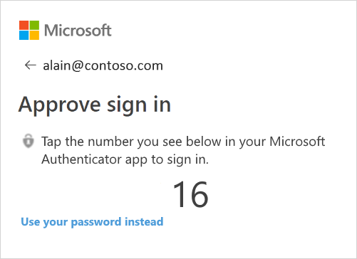
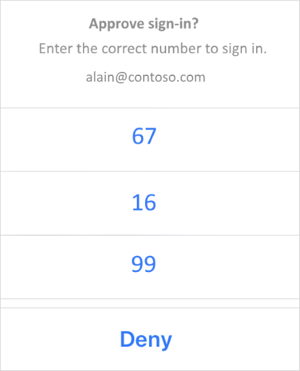

# Sign in to your apps using the Microsoft Authenticator app
Two-factor verification helps you more securely access your accounts, especially while viewing sensitive information. Because passwords can be forgotten, stolen, or compromised, two-factor verification is an additional security step that helps protect your account by making it harder for other people to break in.

The Microsoft Authenticator app helps you sign in to your work or school account or to your personal Microsoft and non-Microsoft accounts, using either:

 - **Two-factor verification.** Requires you to enter your username and password for an account, and then when prompted, to provide another verification method.

 - **Phone sign-in.** Requires you to enter your username for an account, and then when prompted, your fingerprint, face, or PIN. This method is passwordless.
 
 ## Prerequisites
 Before you can use the Microsoft Authenticator app, you must:

 1. Download and install the Microsoft Authenticator app. If you haven't done this yet, see [Download and install the app](microsoft-authenticator-app-how-to.md).

 2. Turn on two-factor verification for your work or school account and your personal Microsoft and non-Microsoft accounts and then add them to the Microsoft Authenticator app. If you haven't done this yet, see [Add your work or school account](microsoft-authenticator-app-add-work-account.md) and [Add your personal accounts](microsoft-authenticator-app-add-personal-account.md).

## What is two-factor verification?
[TEXT]

## Turn on and use phone sign-in with your work or school account
Phone sign-in is a type of two-step verification. You must still verify your identity by providing a thing you know and a thing you have, but phone sign-in lets you skip entering your account password and performs all of your identity verification on your mobile device.

Phone sign-in is only available on iOS and Android devices running Android 6.0 or above.

### Turn on phone sign-in 
If your organization has turned on this feature, you’ll be able to turn on and use phone sign-in from the Microsoft Authenticator app.

1. Open the Microsoft Authenticator app, go to your work or school account, and turn on phone sign-in:

    - **If you see this icon .** If this icon appears next to your work or school account name, it means that you've already set up phone sign-in for the account. You might be asked to add push notifications for your account, so you can be notified about authentication requests outside of the app.

    - **If you've been using the app for two-factor verification.** If you've already been using the app and two-factor verification, you can choose the drop-down arrow next to the account name, and then select **Enable phone sign-in**.

    - **If you can't find your work or school account.** If you can't find your work or school account on the **Accounts** screen of the app, it means that you haven't added it to the app yet. Add your work or school account by following the steps in the [Add your work or school account](microsoft-authenticator-app-add-work-account.md) article.

### Sign in to your account using phone sign-in 

1. Sign in to your work or school account, as you would normally. 

    After typing your username, a screen appears showing you a two-digit number and asking you to sign-in through the Microsoft Authenticator app. If you don’t want to use this sign in method, you can select **Use your password instead**, and sign in using your password.

    

## Turn on and use phone sign-in with your personal Microsoft accounts <!--does this work with non-Microsoft accounts? It wasn't for me, but I want to make sure-->
You can turn on phone sign-in for your personal Microsoft account, such as the account you use to sign in to Outlook.com, Xbox, or Skype.

### Turn on phone sign-in
If your organization has turned on this feature, you’ll be able to turn on and use phone sign-in from the Microsoft Authenticator app.

1. Open the Microsoft Authenticator app, go to the personal account you want to set up, and then turn on phone sign-in:

    - **If you haven't used the Microsoft Authenticator app.** Before you can turn on and use phone sign-in, you must download and install the Microsoft Authenticator app, turn on two-factor verification for your account, and finally, add the account to the app. For more information, see the [Prerequisites](#prerequisites) section of this article.

    - **If you've been using the app for two-factor verification.** If you've already been using the app and two-factor verification, you can choose the drop-down arrow next to the account name, and then select **Enable phone sign-in**.

    >[!NOTE]
    >To help protect your account, the app requires a PIN or biometric lock on your device. If you keep your phone unlocked, the app requires you to set up a security lock before turning on phone sign-in.

2. In the Microsoft Authentication app, you'll get a notification asking you to **Approve sign-in**. Choose **Approve** if you recognize the sign-in attempt. Otherwise, choose **Deny**. 

3. Tap the same number you see on the **Approve sign-in** screen. Use your phone’s PIN or your biometric key to complete the authentication.

    

## Turn on phone sign-in for your personal account 
You can turn on phone sign-in for your personal Microsoft account, such as the account you use to sign in to Outlook.com, Xbox, or Skype.

### To turn on phone sign-in for your personal account

- **If you don’t use the Microsoft Authenticator app.** Download and install the Microsoft Authenticator app, and then add your personal Microsoft account by signing in to the account from the Add accounts screen of the Microsoft Authenticator app. For more information, see [Get started with the Microsoft Authenticator app](microsoft-authenticator-app-how-to.md).

    New accounts are automatically turned on, so you can immediately start using phone sign-in. 

- **If you already use the Microsoft Authenticator app for two-step verification.** Go to the **Accounts** screen of the app, select the drop-down arrow for your work or school account, and then select **Enable phone sign-in**.

    >[!NOTE]
    >To help protect your account, the app requires a PIN or biometric lock on your device. If you keep your phone unlocked, the app requires you to set up a security lock before turning on phone sign-in.

### To use phone sign-in to sign in to your personal account 

1. Go to your personal Microsoft account sign-in page, and then instead of typing your password, select the **Use the Microsoft Authenticator app instead** link. 

    Microsoft sends a notification to your phone. 

2. Approve the notification. 

## Phone sign-in FAQ
|**Question**|**Solution**|
|--------------|-------------|
|**How is signing in with my phone more secure than typing a password?**|Today most people sign in to web sites or apps using a username and password. Unfortunately, passwords can be lost, stolen, or guessed by hackers.  After you set up the Microsoft Authenticator app, it creates a key on your phone to unlock your account that’s protected by your phone’s PIN or biometric lock. This key is then used to prove your identity while signing in.  **Important** Your data is only used to protect your key locally. It’s never sent to, or stored in, the cloud.|
|**Does this replace two-step verification? Should I turn it off?**| We're working to expand the scope of phone sign-in, but for now there are still places in the Microsoft ecosystem that don't support it. In those places, we're still using two-step verification for secure sign-in. For that reason, no, you shouldn't turn off two-step verification for your account.|
|**If I keep two-step verification turned on for my account, do I have to approve two notifications?**| No. Signing in to your Microsoft account using your phone also counts as two-step verification, so there is no second approval required.|
|**What if I lose my phone or don’t have it with me? How do I access my account?**| You can always select the Use a password instead link on the sign-in page to switch back to using your password. However, if you use two-step verification you’ll still need to use a second method to verify your identity.  **Important** We strongly encourage you to make sure you have more than one, up-to-date, verification method associated with your account.  You can manage your verification methods for personal accounts from your [Security settings](https://account.live.com/proofs/manage) page. For work or school accounts, you can go to your organization’s [Additional security verification](https://aka.ms/MFASetup) page or the **Keep your account secure** page if your administrator has turned on security info. For more information about security info, see [Manage your security info](security-info-manage-settings.md).  If you’re unable to manage your verification methods, you must contact your administrator.|
|**How do I stop using this feature and go back to using my password?**|For personal accounts, select the **Use a password instead** link during sign in. Your most recent choice is remembered and offered by default the next time you sign in. If you ever want to go back to using phone sign-in, select the **Use an app instead** link during sign in.  For work or school accounts, you must remove the account by opening the Microsoft Authenticator app, selecting the **Edit accounts** menu, and then deleting your account.|
|**Why can’t I use more than one work or school account for phone sign-in?**| A phone must be registered to a single work or school account. If you want to turn on phone sign-in for a different work or school account, you must first unregister the old device through the **Settings** page.|
|**Can I sign in to my PC using my phone?**| For your PC, we recommend signing in using Windows Hello on Windows 10. Windows Hello lets you use your face, fingerprint, or PIN to sign in.|
|**Can I use phone sign-in with my Windows Phone?**| No. This feature isn’t supported by the Microsoft Authenticator app on Windows Phone.|

## Next steps
- If you have more general questions about the app, see the [Microsoft Authenticator FAQs](microsoft-authenticator-app-faq.md)

- If you want more information about two-step verification, see [Set up my account for two-step verification](multi-factor-authentication-end-user-first-time.md)

- If you want more information about security info, see [Manage your security info](security-info-manage-settings.md)
