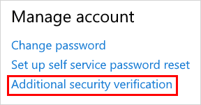
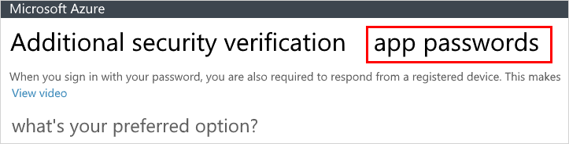
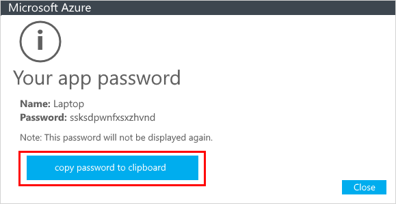
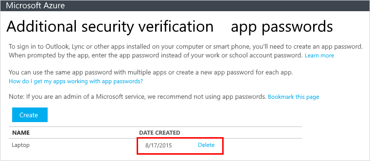
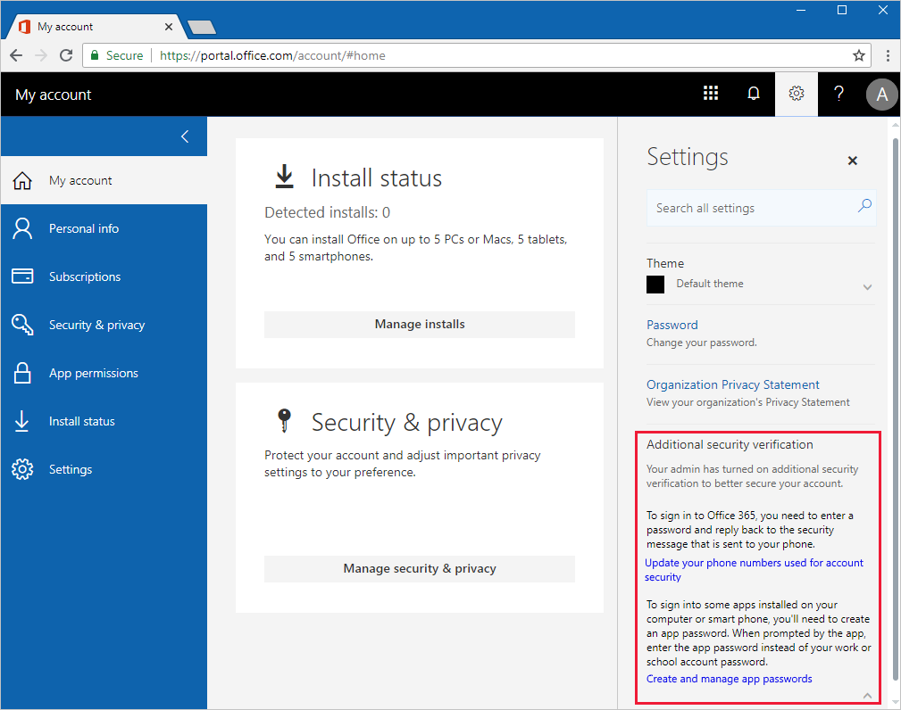

# Manage app passwords for two-step verification

Certain non-browser apps, such as Outlook 2010, doesn't support two-step verification. This lack of support means that if you're using two-step verification, the app won't work. To get around this problem, you can create an auto-generated password to use with each non-browser app, separate from your normal password.

When using app passwords, it's important to remember:

- App passwords are auto-generated and only entered once per app.

- There's a limit of 40 passwords per user. If you try to create one after that limit, you'll be prompted to delete an existing password before being allowed to create the new one.

- Use one app password per device, not per app. For example, create a single password for all the apps on your laptop, and then another single password for all the apps on your desktop.

    >[!Note]
    >Office 2013 clients (including Outlook) support new authentication protocols and can be used with two-step verification. This support means that after two-step verification is turned on, you'll no longer need app passwords for Office 2013 clients. For more info, see the [How modern authentication works for Office 2013 and Office 2016 client apps](https://support.office.com/article/how-modern-authentication-works-for-office-2013-and-office-2016-client-apps-e4c45989-4b1a-462e-a81b-2a13191cf517) article.

## Where to create and delete your app passwords

You're given an app password during your initial two-step verification registration. If you need more than that one password, you can create additional passwords, based on how you use two-step verification:

- **You use two-step verification with your work or school account and the MyApps portal.** Create and delete your app passwords using the instructions in the Create and delete app passwords using the MyApps portal section of this article. For more info about the MyApps portal and how to use it, see [What is the MyApps portal in Azure Active Directory?](active-directory-saas-access-panel-introduction.md).

- **You use two-step verification with your work or school account and the Office 365 portal.** Create and delete your app passwords using the instructions in the [Create and delete app passwords using the Office 365 portal](#create-and-delete-app-passwords-using-the-office-365-portal) section of this article.

- **You use two-step verification with your personal Microsoft account.** Create and delete your app passwords using the [Security basics](https://account.microsoft.com/account/) page with your personal Microsoft account. For more info, see the [App passwords and two-step verification](https://support.microsoft.com/help/12409/microsoft-account-app-passwords-two-step-verification) article.

## Create and delete app passwords using the MyApps portal
You can create and delete app passwords through the MyApps portal.

### To create an app password using the MyApps portal

1. Sign in to [https://myapps.microsoft.com](https://myapps.microsoft.com).

2. Select your name at the top right, and choose **Profile**.

3. Select **Additional Security Verification**.

   

4. Select **App passwords**.

   

5. Click **Create**.

6. Type a name for the app password, and then select **Next**.

7. Copy the app password to the clipboard and paste it into your app.
   
    

### To delete an app password using the MyApps portal

1. Go to your profile, and then select **Additional Security Verification**.

2. Select **App passwords**, and then select **Delete** next to the app password you want to delete.

   

3. Select **Yes** to confirm you want to delete the password, and then select **Close**.

## Create and delete app passwords using the Office 365 portal

If you use two-step verification with your work or school account and your Office 365 apps, you can create and delete your app passwords using the Office 365 portal. You can have a maximum of 40 app passwords at any one time. If you need another app password after that limit, you'll have to delete one of your existing app passwords.

### To create app passwords using the Office 365 portal

1. Sign in to your work or school account.

2. Go to [https://portal.office.com](https://portal.office.com), select the **Settings** icon from the upper right of the **Office 365 portal** page, and then expand **Additional security verification**.

    

3. Select the text that says, **Create and manage app passwords** to open the **app passwords** page.

4. Select **Create**, type a friendly name for the app that needs the app password, and then select **Next**.

5. Select **Copy password to clipboard**, and then select **Close**.

6. Use the copied app password to sign in to your non-browser app. You only need to enter this password once and it's remembered for the future.

### To delete app passwords using the Office 365 portal

1. Sign in to your work or school account.

2. Go to [https://portal.office.com](https://portal.office.com), select the **Settings** icon from the upper right of the **Office 365 portal** page, and then select **Additional security verification**.

3. Select the text that says, **Create and manage app passwords** to open the **app passwords** page.

4. Select **Delete** for the app password to delete, select **Yes** in the confirmation box, and then select **Close**.

    The app password is successfully deleted.

5. Follow the steps for creating an app password to create your new app password.

## If your app passwords aren't working properly

Make sure you typed your password correctly. If you're sure you entered your password correctly, you can try to sign in again and create a new app password. If neither of those options fix your problem, contact your company support so they can delete your existing app passwords, letting you create brand-new ones. 

## Next steps

- [Manage your two-step verification settings](multi-factor-authentication-end-user-manage-settings.md)

- Try out the [Microsoft Authenticator app](user-help-auth-app-download-install.md) to verify your sign-ins with app notifications, instead of receiving texts or calls.
