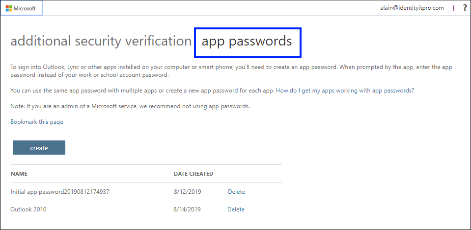
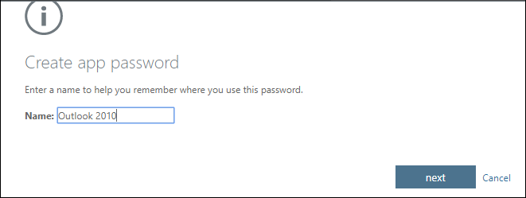
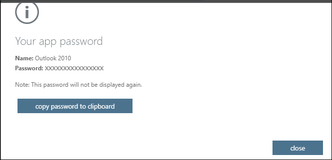
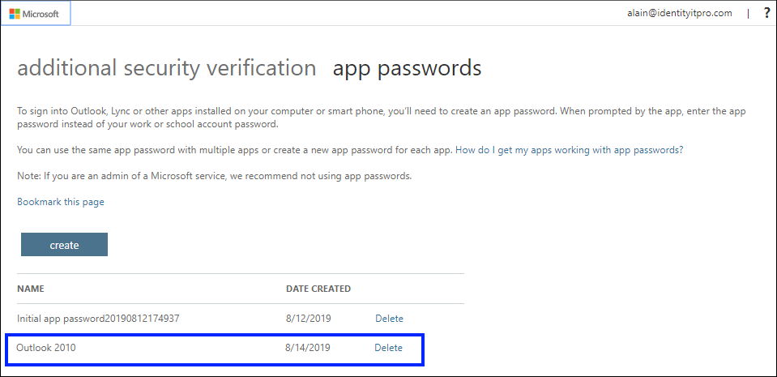
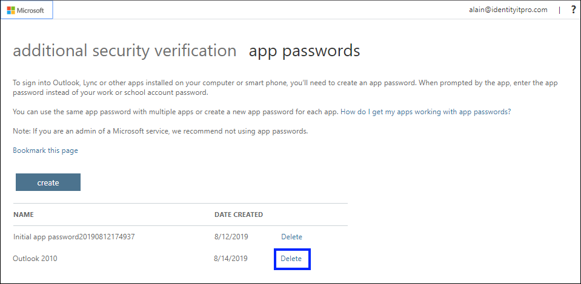

# Manage app passwords for two-step verification

>[!Important]
>Your administrator may not allow you to use app passwords. If you don't see **App passwords** as an option, they're not available in your organization.

When using app passwords, it's important to remember:

- App passwords are auto-generated, and should be created and entered once per app.

- There's a limit of 40 passwords per user. If you try to create one after that limit, you'll be prompted to delete an existing password before being allowed to create the new one.

    >[!Note]
    >Office 2013 clients (including Outlook) support new authentication protocols and can be used with two-step verification. This support means that after two-step verification is turned on, you'll no longer need app passwords for Office 2013 clients. For more info, see the [How modern authentication works for Office 2013 and Office 2016 client apps](https://support.office.com/article/how-modern-authentication-works-for-office-2013-and-office-2016-client-apps-e4c45989-4b1a-462e-a81b-2a13191cf517) article.

## Create new app passwords

During your initial two-factor verification registration process, you're provided with a single app password. If you require more than one, you'll have to create them yourself. You can create app passwords from multiple areas, depending on how two-factor verification is set up in your organization. For more information about registering to use two-factor verification with your work or school account, see [Overview for two-factor verification and your work or school account](multi-factor-authentication-end-user-first-time.md) and its related articles.

### Where to create and delete your app passwords

You can create and delete app passwords, based on how you use two-factor verification:

- **Your organization uses two-factor verification and the Additional security verification page.** If you're using your work or school account (such as, alain@contoso.com) with two-factor verification in your organization, you can manage your app passwords from the [Additional security verification page](https://account.activedirectory.windowsazure.com/Proofup.aspx). For detailed instructions, see [Create and delete app passwords using the Additional security verification page](#create-and-delete-app-passwords-from-the-additional-security-verification-page) in this article.

- **Your organization uses two-factor verification and the Office 365 portal.** If you're using your work or school account (such as, alain@contoso.com), two-factor verification, and Office 365 apps in your organization, you can manage your app passwords from the [Office 365 portal page](https://www.office.com). For detailed instructions, see [Create and delete app passwords using the Office 365 portal](#create-and-delete-app-passwords-using-the-office-365-portal) in this article.

- **You're using two-factor verification with a personal Microsoft account.** If you're using a personal Microsoft account (such as, alain@outlook.com) with two-factor verification, you can manage your app passwords from the [Security basics page](https://account.microsoft.com/security/). For detailed instructions, see [Using app passwords with apps that don't support two-step verification](https://support.microsoft.com/help/12409/microsoft-account-app-passwords-and-two-step-verification).

## Create and delete app passwords from the Additional security verification page

You can create and delete app passwords from the **Additional security verification** page for your work or school account.

1. Sign in to the [Additional security verification page](https://account.activedirectory.windowsazure.com/Proofup.aspx), and then select **App passwords**.

    

2. Select **Create**, type the name of the app that requires the app password, and then select **Next**.

    

3. Copy the password from the **Your app password** page, and then select **Close**.

    

4. From the **App passwords** page, make sure your app is listed.

       

5. Open the app you created the app password for (for example, Outlook 2010), and then paste the app password when asked for it. You should only have to do this once per app.

### To delete an app password using the App passwords page

1. From the **App passwords** page, select **Delete** next to the app password you want to delete.

   

2. Select **Yes** to confirm you want to delete the password, and then select **Close**.

    The app password is successfully deleted.

## Create and delete app passwords using the Office 365 portal

If you use two-step verification with your work or school account and your Office 365 apps, you can create and delete your app passwords using the Office 365 portal.

### To create app passwords using the Office 365 portal

1. Sign in to Office 365 and then go to the [My account page](https://portal.office.com), select **Security & privacy**, and then expand **Additional security verification**.

    

2. Select the text that says, **Create and manage app passwords** to open the **App passwords** page.

    

3. Select **Create**, type the name of the app that requires the app password, and then select **Next**.

    

4. Copy the password from the **Your app password** page, and then select **Close**.

    

5. From the **App passwords** page, make sure your app is listed.

       

6. Open the app you created the app password for (for example, Outlook 2010), and then paste the app password when asked for it. You should only have to do this once per app.

### To delete app passwords using the App passwords page

1. From the **App passwords** page, select **Delete** next to the app password you want to delete.

   

2. Select **Yes** in the confirmation box, and then select **Close**.

    The app password is successfully deleted.

## If your app passwords aren't working properly

Make sure you typed your password correctly. If you're sure you entered your password correctly, you can try to sign in again and create a new app password. If neither of those options fix your problem, contact your organization's Help desk so they can delete your existing app passwords, letting you create brand-new ones.

## Next steps

- [Manage your two-step verification settings](multi-factor-authentication-end-user-manage-settings.md)

- Try out the [Microsoft Authenticator app](user-help-auth-app-download-install.md) to verify your sign-ins with app notifications, instead of receiving texts or calls.
