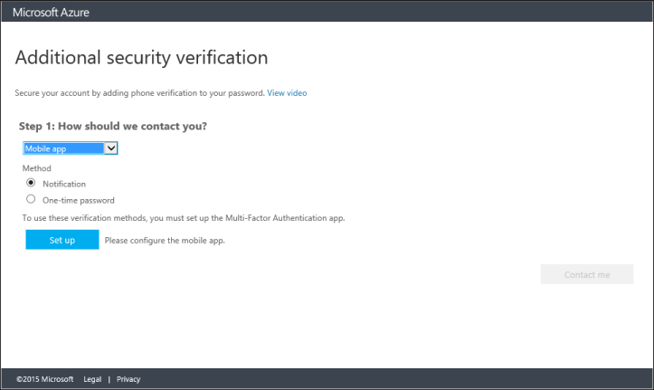
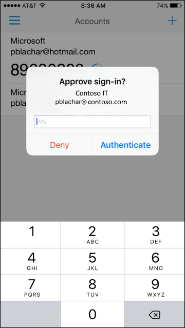
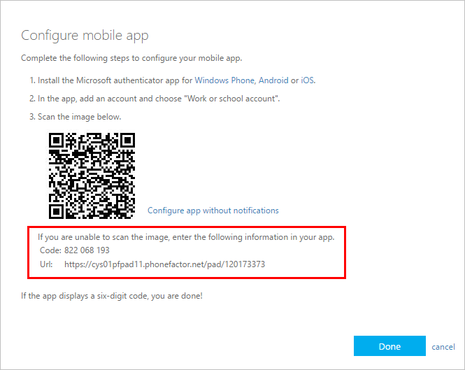

# Set up my account for two-step verification
Two-step verification is an additional security step that helps protect your account by making it harder for other people to break in. If you're reading this article, you probably got an email from your work or school admin about Multi-Factor Authentication. Or maybe you tried to sign in and got a message asking you to set up additional security verification. If that's the case, **you cannot sign in until you have completed the auto-enrollment process**.

This article helps you set up your **work or school account**. If you want to enable two-step verification for your own, personal Microsoft account, see [About two-step verification](https://support.microsoft.com/help/12408/microsoft-account-about-two-step-verification).

## Set up your account

When your company support requires you to start using two-step verification, you'll see a screen that says **Your admin has required that you set up this account for additional security verification**:

To get started, select **Set it up now.**

If you do not see a screen like this when you sign in, follow the directions in [Manage your settings for two-step verification](multi-factor-authentication-end-user-manage-settings.md#where-to-find-the-settings-page) to find the settings page where you can manage your verification options.

## Decide how you want to verify your sign-ins

The first question in the enrollment process is how you want us to contact you. Take a look at the options in the table, and use the links to go to the setup steps for each method.

| Contact method | Description |
| --- | --- |
| [Mobile app](#use-a-mobile-app-as-the-contact-method) |- **Receive notifications for verification.** This option pushes a notification to the authenticator app on your smartphone or tablet. View the notification and, if it is legitimate, select **Authenticate** in the app. Your work or school may require that you enter a PIN before you authenticate. - **Use verification code.** In this mode, the authenticator app generates a verification code that updates every 30 seconds. Enter the most current verification code in the sign-in interface. The Microsoft Authenticator app is available for [Android](https://go.microsoft.com/fwlink/?linkid=866594), [iOS](https://go.microsoft.com/fwlink/?linkid=866594), and [Windows Phone](http://go.microsoft.com/fwlink/?Linkid=825071). |
| [Mobile phone call or text](#use-your-mobile-phone-as-the-contact-method) |- **Phone call** places an automated voice call to the phone number you provide. Answer the call and press # in the phone keypad to authenticate. - **Text message** ends a text message containing a verification code. Following the prompt in the text, either reply to the text message or enter the verification code provided into the sign-in interface. |
| [Office Phone Call](#use-your-office-phone-as-the-contact-method) |Places an automated voice call to the phone number you provide. Answer the call and presses # in the phone keypad to authenticate. |

## Use a mobile app as the contact method
Using this method requires that you install an authenticator app on your phone or tablet. The steps in this article are based on the Microsoft Authenticator app, which is available for [Windows Phone](http://go.microsoft.com/fwlink/?Linkid=825071), [Android](http://go.microsoft.com/fwlink/?Linkid=825072), and [iOS](http://go.microsoft.com/fwlink/?Linkid=825073).

>[!NOTE]
>You don’t have to use the Microsoft Authenticator app. If you’re already using another authenticator app, you can continue to use it.

1. Select **Mobile app** from the drop-down list.
2. Select either **Receive notifications for verification** or **Use verification code**, then select **Set up**.

   

3. On your phone or tablet, open the app and select **+** to add an account. (On Android devices, select the three dots, then **Add account**.)
4. Specify that you want to add a work or school account. The QR code scanner on your phone opens. If your camera is not working properly, you can select to enter your company information manually. For more information, see [Add an account manually](#add-an-account-manually).  
5. Scan the QR code picture that appeared with the screen for configuring the mobile app.  Select **Done** to close the QR code screen.  

   

6. When activation finishes on the phone, select **Contact me**.  This step sends either a notification or a verification code to your phone. Select **Verify**.  
7. If your company requires a PIN for approving sign-in verification, enter it.

   

8. After PIN entry is complete, select **Close**. At this point, your verification should be successful.
9. We recommend that you enter your mobile phone number in case you lose access to your mobile app. Specify your country from the drop-down list, and enter your mobile phone number in the box next to the country name. Select **Next**.
10. At this point, you are prompted to set up app passwords for non-browser apps such as Outlook 2010 or older, or the native email app on Apple devices. This is because some apps don't support two-step verification. If you do not use these apps, click **Done** and skip the rest of the steps.
11. If you are using these apps, copy the app password provided and paste it into your application instead of your regular password. You can use the same app password for multiple apps. For more info, [help with app passwords].
12. Click **Done**.

### Add an account manually
If you want to add an account to the mobile app manually, instead of using the QR reader, follow these steps.

1. Select the **Enter account manually** button.  
2. Enter the code and the URL that are provided on the same page that shows you the barcode. This info goes in the **Code** and **URL** boxes on the mobile app.

    
3. When the activation has finished, select **Contact me**. This step sends either a notification or a verification code to your phone. Select **Verify**.

## Use your mobile phone as the contact method
1. Select **Authentication Phone** from the drop-down list.  

      
2. Choose your country from the drop-down list, and enter your mobile phone number.
3. Select the method you would prefer to use with your mobile phone - text or call.
4. Select **Contact me** to verify your phone number. Depending on the mode you selected, we send you a text or call you. Follow the instructions provided on the screen, then select **Verify**.
5. At this point, you are prompted to set up app passwords for non-browser apps such as Outlook 2010 or older, or the native email app on Apple devices. This is because some apps don't support two-step verification. If you do not use these apps, click **Done** and skip the rest of the steps.
6. If you are using these apps, copy the app password provided and paste it into your application instead of your regular password. You can use the same app password for multiple apps. For more info, [help with app passwords].
7. Click **Done**.

## Use your office phone as the contact method
1. Select **Office Phone** from the drop-down  

      
2. The phone number box is automatically filled with your company contact information. If the number is wrong or missing, ask your admin to make changes.
3. Select **Contact me** to verify your phone number, and we will call your number. Follow the instructions provided on the screen, then select **Verify**.
4. At this point, you are prompted to set up app passwords for non-browser apps such as Outlook 2010 or older, or the native email app on Apple devices. This is because some apps don't support two-step verification. If you do not use these apps, click **Done** and skip the rest of the steps.
5. If you are using these apps, copy the app password provided and paste it into your application instead of your regular password. You can use the same app password for multiple apps. For more info, see [What are App Passwords](multi-factor-authentication-end-user-app-passwords.md).
6. Click **Done**.

## Next steps
* Change your preferred options and [manage your settings for two-step verification](multi-factor-authentication-end-user-manage-settings.md)
* Set up [app passwords](multi-factor-authentication-end-user-app-passwords.md) for native device apps that don't support two-step verification.
* Check out the [Microsoft Authenticator app](microsoft-authenticator-app-how-to.md) for fast, secure authentication even when you don't have cell service.
