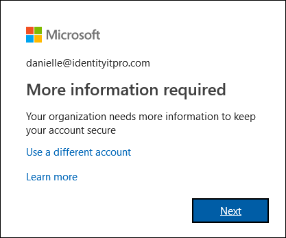

# What is the Additional verification page?

Your organization is taking extra steps to make sure you are who you say you are when you sign in. This extra security verification is also known as two-factor verification. It consists of a combination of your username, password, and a mobile device or phone. If all you want to do is turn off two-factor verification for a Microsoft account such as alain@outlook.com, use the instructions in [Turning two-factor verification on or off for your Microsoft account](https://support.microsoft.com/help/4028586/microsoft-account-turning-two-step-verification-on-or-off).

Two-factor verification is more secure than just a password because it relies on two forms of authentication:

- Something you know, like your password.
- Something you have, like a phone or other device that you carry.

Two-factor verification can help stop malicious hackers from pretending to be you. Even if they have your password, the odds are that they don't have your device, too.

>[!Important]
>If you're an administrator looking for information about how to turn on two-factor verification for your employees or other users, see the [Azure Active Directory Authentication documentation](https://docs.microsoft.com/azure/active-directory/authentication/). This article is intended for users trying to use two-factor verification with a work or school account (such as alain@contoso.com).

## Who decides if you use this feature?

Who decides whether you use two-factor verification depends on what type of account you have:

- **Work or school account.** If you're using a work or school account (such as alain@contoso.com), it's up to your organization whether you use two-factor verification, along with the specific verification methods. Because your organization has decided you must use this feature, there's no way for you to individually turn it off.

- **Personal Microsoft account.** You can choose to set up two-factor verification for your personal Microsoft accounts (such as alain@outlook.com). You can turn it on or off whenever you want, using the simple instructions in [Turning two-factor verification on or off for your Microsoft account](https://support.microsoft.com/help/4028586/microsoft-account-turning-two-step-verification-on-or-off).

    >[!Note]
    >If you're having other problems with two-factor verification and one of your personal Microsoft accounts, there are more suggestions in [How to use two-step verification with your Microsoft account](https://support.microsoft.com/help/12408/microsoft-account-how-to-use-two-step-verification).

## Open the Additional security verification page

After your organization turns on two-factor verification, every time you sign in you’ll get a prompt telling you to provide more information to help keep your account secure.

### To access the Additional security verification page

1. Select **Next** from the **More information required** prompt.

    The **Additional security verification** page appears.

2. On the **Additional security verification** page, select the two-factor verification method to use to verify you are who you say you are when you sign into your work or school account. You can select:

    | Contact method | Description |
    | --- | --- |
    | Mobile app | <ul><li>**Receive notifications for verification.** This option pushes a notification to the authenticator app on your smartphone or tablet. View the notification and, if it is legitimate, select **Authenticate** in the app. Your work or school may require that you enter a PIN before you authenticate.</li><li>**Use verification code.** In this mode, the app generates a verification code that updates every 30 seconds. Enter the most current verification code in the sign-in screen. The Microsoft Authenticator app is available for [Android](https://go.microsoft.com/fwlink/?linkid=866594) and [iOS](https://go.microsoft.com/fwlink/?linkid=866594).</li></ul> |
    | Authentication phone | <ul><li>**Phone call** places an automated voice call to the phone number you provide. Answer the call and press the pound key (#) on the phone keypad to authenticate.</li><li>**Text message** ends a text message containing a verification code. Following the prompt in the text, either reply to the text message or enter the verification code provided into the sign-in interface.</li></ul> |
    | Office phone | Places an automated voice call to the phone number you provide. Answer the call and press the pound key (#) on the phone keypad to authenticate. |

## Next steps

After you've selected a two-factor verification method on the **Additional security verification** page, you must set it up:

- [Set up your mobile device as your verification method](multi-factor-authentication-setup-phone-number.md)

- [Set up your office phone as your verification method](multi-factor-authentication-setup-office-phone.md)

- [Set up the Microsoft Authenticator app as your verification method](multi-factor-authentication-setup-auth-app.md)

## Related resources

- [Sign-in using two-factor verification](multi-factor-authentication-end-user-signin.md)

- [Get help with two-factor verification](multi-factor-authentication-end-user-troubleshoot.md)
