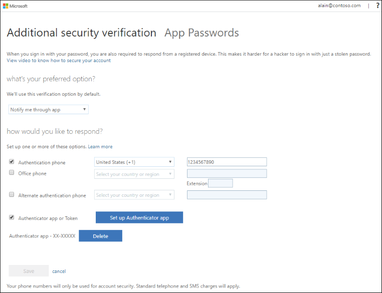
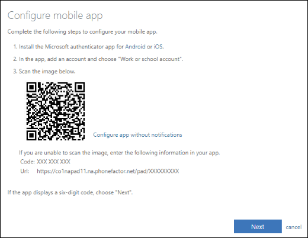

# Change your two-factor verification method and settings

After you set up your security verification methods for your work or school account, you can update any of the related details, including:

- Default security verification method

- Security verification method details, like your phone number

- Authenticator app setup or deleting a device from the authenticator app

## Using the Additional security verification page

If your organization provided you with specific steps about how to turn on and manage your two-factor verification, you should follow those instructions first. Otherwise, you can get to your security verification method settings from the [Additional security verification](https://docs.microsoft.com/azure/active-directory/user-help/multi-factor-authentication-end-user-first-time) page.

>[!Note]
>If what you're seeing on your screen doesn't match what's being covered in this article, it means that either your administrator has turned on the **Security info (preview)** experience or that your organization has provided your own custom portal. For more information about the new security info experience, see [Security info (preview) overview](user-help-security-info-overview.md). For more information about your organization's custom portal, you must contact your organization's Help desk.

### To get to the Additional security verification page

You can follow this link to the [Additional security verification page](https://account.activedirectory.windowsazure.com/proofup.aspx?proofup=1).

You can also get to the **Additional security verification** page by following these steps:

1. Sign in to [https://myapps.microsoft.com](https://myapps.microsoft.com).

1. Select your account name in the top right, then select **profile**.

1. Select **Additional security verification**.  

    

>[!Note]
>For information about using the **App passwords** section of **Additional security verification** page, see [Manage app passwords for two-factor verification](multi-factor-authentication-end-user-app-passwords.md). App passwords should be used only for apps that don't support two-factor verification.

## Change your default security verification method

After you sign in to your work or school account with your user name and password, you'll automatically be presented with your chosen security verification method. Depending on your organization's requirements, this can be a notification or verification code through an authenticator app, a text message, or a phone call.

If you decide that you want to change the default security verification method you're using, you can do it from here.

### To change your default security verification method

1. From the **Additional security verification** page, select the method to use from the **What's your preferred option** list. You'll see all of the options, but you can select only the ones that are made available to you by your organization.

    - **Notify me through app**: You'll be notified through your authenticator app that you have a waiting verification prompt.

    - **Call my authentication phone**: You'll get a phone call on your mobile device, asking you to verify your information.

    - **Text code to my authentication phone**: You'll get a verification code as part of a text message on your mobile device. You must enter this code into the verification prompt for your work or school account.

    - **Call my office phone**: You'll get a phone call on your office phone, asking you to verify your information.

    - **Use verification code from app**: You'll use your authenticator app to get a verification code you'll type into the prompt from your work or school account.

2. Select **Save**.

## Add or change your phone number

You can add new phone numbers, or update existing numbers, from the **Additional security verification** page.

>[!Important]
>We strongly recommend that you add a secondary phone number to help prevent being locked out of your account if your primary phone is lost or stolen, or if you get a new phone and no longer have your original, primary phone number.

### To change your phone numbers

1. From the **How would you like to respond?** section of the **Additional security verification** page, update the phone number information for your **Authentication phone** (your primary mobile device) and your **Office phone**.

1. Select the box next to the **Alternate authentication phone** option, and then type in a secondary phone number where you can receive text messages or phone calls if you can't access your primary device.

1. Select **Save**.

## Add a new account to the Microsoft authenticator app

You can set up your work or school account on the Microsoft Authenticator app for [Android](https://play.google.com/store/apps/details?id=com.azure.authenticator) or [iOS](https://apps.apple.com/app/microsoft-authenticator/id983156458).

If you already set up your work or school account in the Microsoft Authenticator app, you don't need to do it again.

1. From the **How would you like to respond?** section of the **Additional security verification** page, select **Set up Authenticator app**.

    

1. Follow the on-screen instructions, including using your mobile device to scan the QR code, and then select **Next**.

    You'll be asked to approve a notification through the Microsoft Authenticator app, to verify your information.

1. Select **Save**.

## Delete your account or device from the Microsoft Authenticator app

You can delete your account from the Microsoft Authenticator app, and you can delete your device from your work or school account. Typically you delete your device to permanently remove a lost, stolen, or old device from your account, and you delete your account to try to fix some connection issues or to address an account change, such as a new user name.

### To delete your device from your work or school account

1. From the **How would you like to respond?** section of the **Additional security verification** page, select the **Set up Authenticator app** button.

1. Select **Save**.

### To delete your account from the Microsoft Authenticator app

From the Microsoft Authenticator app, select the **Delete** button next to the device you want to delete.

## Turn on two-factor verification prompts on a trusted device

Depending on your organization settings, you may see a check box that says **Don't ask again for X days** when you perform two-factor verification on your browser. If you've selected this option to stop two-factor verification prompts, and then you lose your device or your device is potentially compromised, you should turn two-factor verification prompts back on to help protect your account. You must turn the prompts on for all of your devices at the same time. Unfortunately, you can't turn the prompts back on for only a specific device.

### To turn two-factor verification prompts back on for your devices

From the [**Additional security verification** page](#to-get-to-the-additional-security-verification-page), select **Restore multi-factor authentication on previously trusted devices**. The next time you sign in on any device, you'll be prompted to perform two-factor verification.

## Next steps

After you add or update your two-factor verification settings, you can manage your app passwords, sign in, or get help with some common two-factor verification-related problems.

- [Manage app passwords for two-factor verification](multi-factor-authentication-end-user-app-passwords.md) for any apps that don't support two-factor verification.

- [How to sign in using two-factor verification](multi-factor-authentication-end-user-signin.md)

- [Solve common problems with two-factor verification](multi-factor-authentication-end-user-troubleshoot.md)
