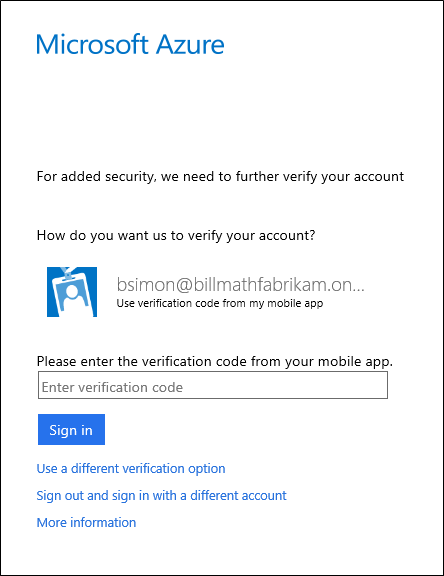
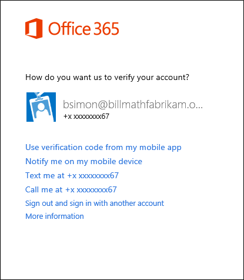

# Sign in to your work or school account using your two-factor verification method

> [!NOTE]
> The purpose of this article is to walk through a typical sign-in experience. For help with signing in, or to troubleshoot problems, see [Having trouble with Azure Multi-Factor Authentication](multi-factor-authentication-end-user-troubleshoot.md).

## What will your sign-in experience be?
Your sign-in experience differs depending on what you choose to use as your second factor: a phone call, an authentication app, or texts. Choose the option that best describes what you are doing:

| How do you sign in? |
| --- |
| [With a phone call to my mobile or office phone](#signing-in-with-a-phone-call) |
| [With a text to my mobile phone](#signing-in-with-a-text-message)
| [With notifications from the Microsoft Authenticator app](#to-sign-in-with-a-notification-from-the-microsoft-authenticator-app) |
| With verification codes from the Microsoft Authenticator app |
| [With an alternate method, because I can't use my preferred method right now](#signing-in-with-an-alternate-method) |

## Signing in with a phone call
The following information describes the two-step verification experience with a call to your mobile or office phone.

1. Sign in to an application or service such as Office 365 using your username and password.  
2. Microsoft calls you.  
3. Answer the phone and hit the # key.  

## Signing in with a text message
The following information describes the two-step verification experience with a text message to your mobile phone:

1. Sign in to an application or service such as Office 365 using your username and password.
2. Microsoft sends you a text message that contains a number code.
3. Enter the code in the box provided on the sign-in page.

## Signing in with the Microsoft Authenticator app
The following information describes the experience of using the Microsoft Authenticator app for two-step verifications. There are two different ways to use the app. You can receive push notifications on your device, or you can open the app to get a verification code.

### To sign in with a notification from the Microsoft Authenticator app
1. Sign in to an application or service such as Office 365 using your username and password.
2. Microsoft sends a notification to the Microsoft Authenticator app on your device.

   

3. Open the notification on your phone and select the **Verify** key. If your company requires a PIN, enter it here.
4. You should now be signed in.

### To sign in using a verification code with the Microsoft Authenticator app

If you use the Microsoft Authenticator app to get verification codes, then when you open the app you see a number under your account name. This number changes every 30 seconds so that you don't use the same number twice. When you're asked for a verification code, open the app and use whatever number is currently displayed.

1. Sign in to an application or service such as Office 365 using your username and password.
2. Microsoft prompts you for a verification code.

   

3. Open the Microsoft Authenticator app on your phone and enter the code in the box where you are signing in.

## Signing in with an alternate method
Sometimes you don't have the phone or device that you set up as your preferred verification method. This situation is why we recommend that you set up backup methods for your account. The following section shows you how to sign in with an alternate method when your primary method may not be available.

1. Sign in to an application or service such as Office 365 using your username and password.
2. Select **Use a different verification option**. You see different verification options based on how many you have setup.
3. Choose an alternate method and sign in.

   

## Next steps
- If you have problems signing in with two-step verification, get more information at [Having trouble with Azure Multi-Factor Authentication](multi-factor-authentication-end-user-troubleshoot.md).

- Learn how to [Manage your two-step verification settings](multi-factor-authentication-end-user-manage-settings.md).

- Find out how to [Get started with the Microsoft Authenticator app](user-help-auth-app-download-install.md) so that you can use notifications to sign in, instead of texts and phone calls.
