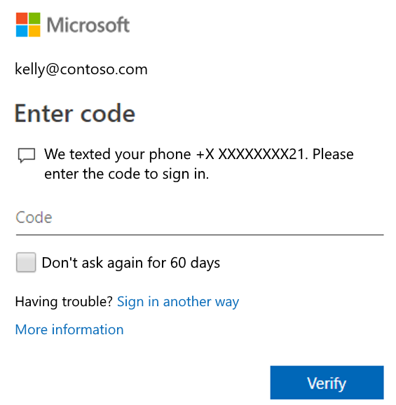

# Common problems with two-factor verification and your work or school account

When your Azure Active Directory (Azure AD) organization turns on two-factor verification, your work or school account sign-in requires a combination of your user name, your password, and a mobile device or phone. It's more secure than just a password, relying on two forms of authentication: something you know, and something you have with you. Two-factor verification can help to stop malicious hackers from pretending to be you, because even if they have your password, the odds are that they don't have your device, too.

There are some common two-factor verification problems that seem to happen more frequently than any of us would like. We've put together this article to address the most common problems and some possible fixes.

>[!Important]
>If you're an administrator, you can find more information about how to set up and manage your Azure AD environment in the [Azure AD documentation](https://docs.microsoft.com/azure/active-directory).
>
>This content is also intended only for use with your work or school account, which is the account provided to you by your organization (for example, alain@contoso.com). If you're having problems with two-factor verification and your personal Microsoft account, which is an account that you set up for yourself (for example, danielle@outlook.com), see [Turning two-factor verification on or off for your Microsoft account](https://support.microsoft.com/help/4028586/microsoft-account-turning-two-step-verification-on-or-off).

## I don't have my mobile device with me

It happens. You left your mobile device at home and now you can't use your phone to verify who you are. If you previously added another method to sign in to your account, such as your office phone, you should be able to use that method now. If you never added an additional verification method, you'll have to contact your organization's Help desk and have them help you get back into your account.

### To sign in to your work or school account using another verification method

1. Sign in to your account but select the **Sign in another way** link on the **Two-factor verification** page.

    

    If you don't see the **Sign in another way** link, it means that you haven't set up any other verification methods. You'll have to contact your administrator for help signing into your account.

2. Choose your alternative verification method, and continue with the two-factor verification process.

## I lost my mobile device or it was stolen

If you've lost or had your mobile device stolen, you can either sign in using a different method or you can ask your organization's Help desk to clear your settings. We strongly recommend letting your organization's Help desk know if your phone was lost or stolen, so the appropriate updates can be made to your account. After your settings are cleared, you'll be prompted to [register for two-factor verification](multi-factor-authentication-end-user-first-time.md) the next time you sign in.

## I'm not getting the verification code sent to my mobile device

Not getting your verification code is a common problem and it's typically related to your mobile device and its settings. Some possible things to try:

Try this | Guidance info
--------- | ------------
Restart your mobile device | Sometimes your device just needs a refresh. Restarting your device ends any background processes or services that are currently running and could cause problems, along with refreshing your device's core components, restarting them in case they crashed at some point.
Verify your security information is correct | Make sure your security verification method information is accurate, especially your phone numbers. If you put in the wrong phone number, all of your alerts will go to that incorrect number. Fortunately, that user won't be able to do anything with the alerts, but it also won't help you sign in to your account. To make sure your information is correct, see the instructions in the [Manage your two-factor verification method settings](multi-factor-authentication-end-user-manage-settings.md) article.
Verify your notifications are turned on | Make sure your mobile device has notifications turned on and that you've selected a notification method that allows phone calls, your authentication app, and your messaging app (for text messages) to send visible alert notifications to your mobile device.
Make sure you have a device signal and Internet connection | Make sure your phone calls and text messages are getting through to your mobile device. Have a friend call you and send you a text message to make sure you receive both. If you don't, first check to make sure your mobile device is turned on. If your device is turned on, but you're still not getting the call or text, it's most likely a problem with your network and you'll need to talk to your provider. If you often have signal-related problems, we recommend you install and use the [Microsoft Authenticator app](user-help-auth-app-download-install.md) on your mobile device. The authenticator app can generate random security codes for sign-in, without requiring any cell signal or Internet connection.
Turn off Do not disturb | Make sure you haven't turned on the **Do not disturb** feature for your mobile device. When this feature is turned on, notifications aren't allowed to alert you on your mobile device. Refer to your mobile device's manual for instructions about how to turn off this feature.
Unblock phone numbers | In the United States, voice calls from Microsoft come from the following numbers: +1 (866) 539 4191, +1 (855) 330 8653, and +1 (877) 668 6536.
Check your battery-related settings | This one seems a bit odd on the surface, but if you've set up your battery optimization to stop lesser-used apps from remaining active in the background, your notification system has most-likely been affected. To try to fix this problem, turn off battery optimization for your authentication app and your messaging app, and then try signing in to your account again.
Disable third-party security apps | If you have an app that protects text messages or phone calls to minimize unknown callers, they may prevent the verification code being received. Try disabling any third-party security apps on your phone, then request another verification code be sent.

## I'm not getting prompted for my second verification information

If you've signed in to your work or school account using your user name and password, but haven't been prompted about your additional security verification information, maybe you haven't set up your device yet. Your mobile device must be set up to work with your specific additional security verification method. To make sure you've turned on your mobile device and that it's available to use with your verification method, see the [Manage your two-factor verification method settings](multi-factor-authentication-end-user-manage-settings.md) article. If you know you haven't set up your device or your account, you can do it now by following the steps in the [Set up my account for two-step verification](multi-factor-authentication-end-user-first-time.md) article.

## I got a new phone number and I want to add it

If you've gotten a new phone number, you'll need to update your security verification method details so your verification prompts go to the right location. To do update your verification method, follow the steps in the **Add or change your phone number** section of the [Manage your two-factor verification method settings](multi-factor-authentication-end-user-manage-settings.md#add-or-change-your-phone-number) article.

## I got a new mobile device and I want to add it

If you've gotten a new mobile device, you'll need to set it up to work with two-factor verification. This is a multi-step solution:

1. Set up your device to work with your work or school account by following the steps in the [Set up my account for two-step verification](multi-factor-authentication-end-user-first-time.md) article.

1. Update your account and device information in the **Additional security verification** page, deleting your old device and adding your new one. For more information, see the [Manage your two-factor verification method settings](multi-factor-authentication-end-user-manage-settings.md) article.

Optional steps:

- Download, install, and set up the Microsoft Authenticator app on your mobile device by following the steps in the [Download and install the Microsoft Authenticator app](user-help-auth-app-download-install.md) article.

- Turn on two-factor verification for your trusted devices by following the steps in the **Turn on two-factor verification prompts on a trusted device** section of the [Manage your two-factor verification method settings](multi-factor-authentication-end-user-manage-settings.md#turn-on-two-factor-verification-prompts-on-a-trusted-device) article.

## I'm having problems signing in on my mobile device while traveling

You might find it more difficult to use a mobile device-related verification method, like a text messaging, while you're in an international location. It's also possible that your mobile device can cause you to incur roaming charges. For this situation, we recommend you use the Microsoft Authenticator app, with the option to connect to a Wi-Fi hotspot. For more information about how to download, install, and set up the Microsoft Authenticator app on your mobile device, see the [Download and install the Microsoft Authenticator app](user-help-auth-app-download-install.md) article.

## I can't get my app passwords to work

App passwords replace your normal password for older desktop applications that don't support two-factor verification. First, make sure you typed the password correctly. If that doesn't fix it, try creating a new app password for the app by following the steps in the **Create and delete app passwords using the My Apps portal** section of the [Manage app passwords for two-step verification](multi-factor-authentication-end-user-app-passwords.md#create-and-delete-app-passwords-from-the-additional-security-verification-page) article.

## I can't turn two-factor verification off

If you're using two-factor verification with your work or school account (for example, alain@contoso.com), it most likely means that your organization has decided you must use this added security feature. Because your organization has decided you must use this feature, there is no way for you to individually turn it off. If, however, you're using two-factor verification with a personal account, like alain@outlook.com, you have the ability to turn the feature on and off. For instructions about how to control two-factor verification for your personal accounts, see [Turning two-factor verification on or off for your Microsoft account](https://support.microsoft.com/help/4028586/microsoft-account-turning-two-step-verification-on-or-off).

If you can't turn off two-factor verification, it could also be because of the security defaults that have been applied at the organization level. For more information about security defaults, see [What are security defaults?](../fundamentals/concept-fundamentals-security-defaults.md)

## I didn't find an answer to my problem

If you've tried these steps but are still running into problems, contact your organization's Help desk for assistance.

## Related articles

- [Manage your two-factor verification method settings](multi-factor-authentication-end-user-manage-settings.md)

- [Set up my account for two-step verification](multi-factor-authentication-end-user-first-time.md)

- [Microsoft Authenticator app FAQ](user-help-auth-app-faq.md)
