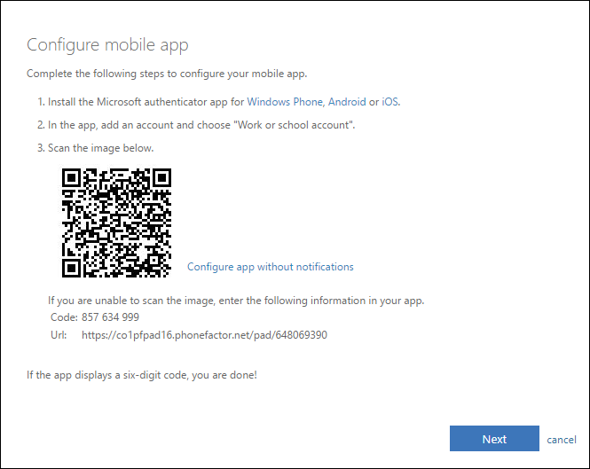
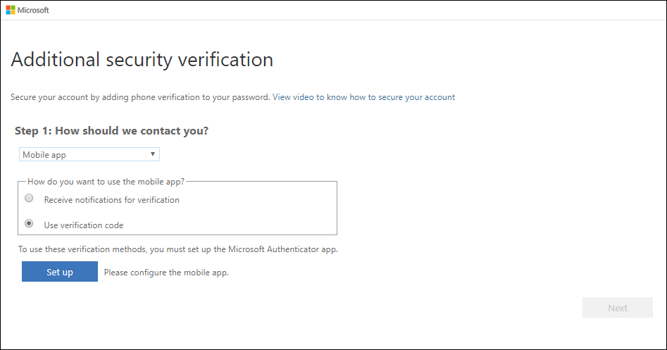
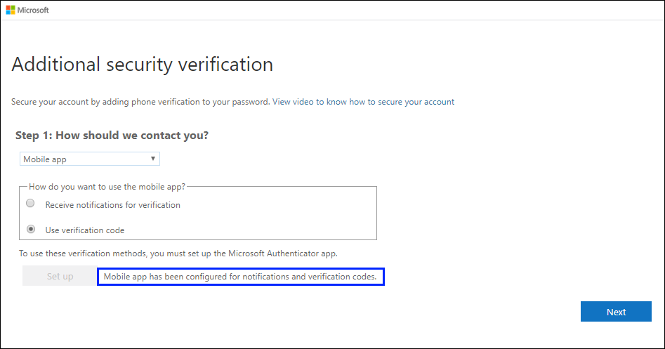
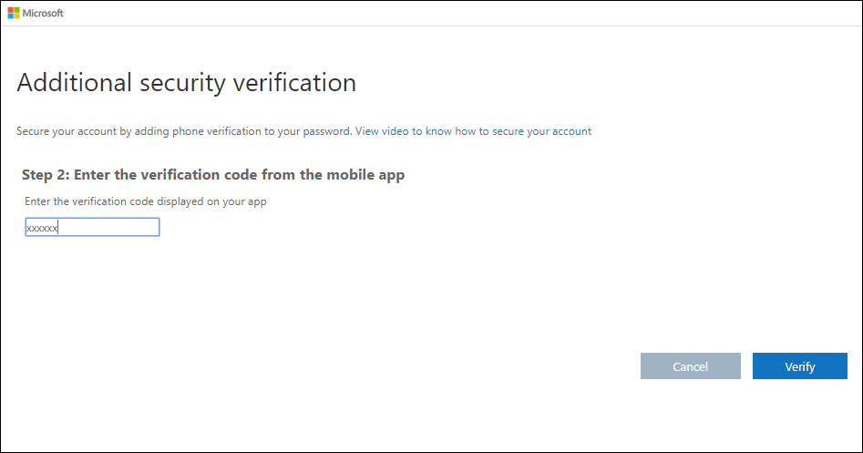

# Set up an authenticator app as your two-factor verification method

You can set up an authenticator app to send a notification to your mobile device or to send you a verification code as your security verification method. You aren't required to use the Microsoft Authenticator app, and you can select a different app during the set up process. However, this article uses the Microsoft Authenticator app.

>[!Important]
>Before you can add your account, you must download and install the Microsoft Authenticator app. If you haven't done that yet, follow the steps in the [Download and install the app](user-help-auth-app-download-install.md) article.

>[!Note]
> If the Mobile app option is greyed out, it's possible that your organization doesn't allow you to use an authentication app for verification. In this case, you'll need to select another method or contact your administrator for more help.

## Set up the Microsoft Authenticator app to send notifications

1. On the [Additional security verification page](https://account.activedirectory.windowsazure.com/proofup.aspx?proofup=1), select **Mobile app** from the **Step 1: How should we contact you** area.

2. Select **Receive notifications for verification** from the **How do you want to use the mobile app** area, and then select **Set up**.

    

    The **Configure mobile app** page appears.

    

3. Open the Microsoft Authenticator app, select **Add account** from the **Customize and control** icon in the upper-right, and then select **Work or school account**.

    >[!Note]
    >If this is the first time you're setting up the Microsoft Authenticator app, you might receive a prompt asking whether to allow the app to access your camera (iOS) or to allow the app to take pictures and record video (Android). You must select **Allow** so the authenticator app can access your camera to take a picture of the QR code in the next step. If you don't allow the camera, you can still set up the authenticator app, but you'll need to add the code information manually. For information about how to add the code manually, see see [Manually add an account to the app](user-help-auth-app-add-account-manual.md).

4. Use your device's camera to scan the QR code from the **Configure mobile app** screen on your computer, and then choose **Next**.

5. Return to your computer and the **Additional security verification** page, make sure you get the message that says your configuration was successful, and then select **Next**.

    

    The authenticator app will send a notification to your mobile device as a test.

6. On your mobile device, select **Approve**.

7. On your computer, add your mobile device phone number to the **Step 3: In case you lose access to the mobile app** area, and then select **Next**.

    We strongly suggest adding your mobile device phone number to act as a backup if you're unable to access or use the mobile app for any reason.

8. From the **Step 4: Keep using your existing applications** area, copy the provided app password and paste it somewhere safe.

    

    >[!Note]
    >For information about how to use the app password with your older apps, see [Manage app passwords](multi-factor-authentication-end-user-app-passwords.md). You only need to use app passwords if you're continuing to use older apps that don't support two-factor verification.

9. Select **Done**.

## Set up the Microsoft Authenticator app to use verification codes

1. On the **Additional security verification** page, select **Mobile app** from the **Step 1: How should we contact you** area.

2. Select **Use verification code** from the **How do you want to use the mobile app** area, and then select **Set up**.

    

    The **Configure mobile app** page appears.

    

3. Open the Microsoft Authenticator app, select **Add account** from the **Customize and control** icon in the upper-right, and then select **Work or school account**.

    >[!Note]
    >If this is the first time you're setting up the Microsoft Authenticator app, you might receive a prompt asking whether to allow the app to access your camera (iOS) or to allow the app to take pictures and record video (Android). You must select **Allow** so the authenticator app can access your camera to take a picture of the QR code in the next step. If you don't allow the camera, you can still set up the authenticator app, but you'll need to add the code information manually. For information about how to add the code manually, see see [Manually add an account to the app](user-help-auth-app-add-account-manual.md).

4. Use your device's camera to scan the QR code from the **Configure mobile app** screen on your computer, and then choose **Next**.

5. Return to your computer and the **Additional security verification** page, make sure you get the message that says your configuration was successful, and then select **Next**.

    

    The authenticator app will ask for a verification code as a test.

6. From the Microsoft Authenticator app, scroll down to your work or school account, copy and paste the 6-digit code from the app into the **Step 2: Enter the verification code from the mobile app** box on your computer, and then select **Verify**.

    

7. On your computer, add your mobile device phone number to the **Step 3: In case you lose access to the mobile app** area, and then select **Next**.

    We strongly suggest adding your mobile device phone number to act as a backup if you're unable to access or use the mobile app for any reason.

8. From the **Step 4: Keep using your existing applications** area, copy the provided app password and paste it somewhere safe.

    

    >[!Note]
    >For information about how to use the app password with your older apps, see [Manage app passwords](multi-factor-authentication-end-user-app-passwords.md). You only need to use app passwords if you're continuing to use older apps that don't support two-factor verification.

9. Select **Done**.

## Next steps

After you've set up your two-factor verification method, you can add additional methods, manage your settings and app passwords, sign-in, or get help with some common two-factor verification-related problems.

- [Manage your two-factor verification method settings](multi-factor-authentication-end-user-manage-settings.md)

- [Manage app passwords](multi-factor-authentication-end-user-app-passwords.md)

- [Sign-in using two-factor verification](multi-factor-authentication-end-user-signin.md)

- [Get help with two-factor verification](multi-factor-authentication-end-user-troubleshoot.md)
