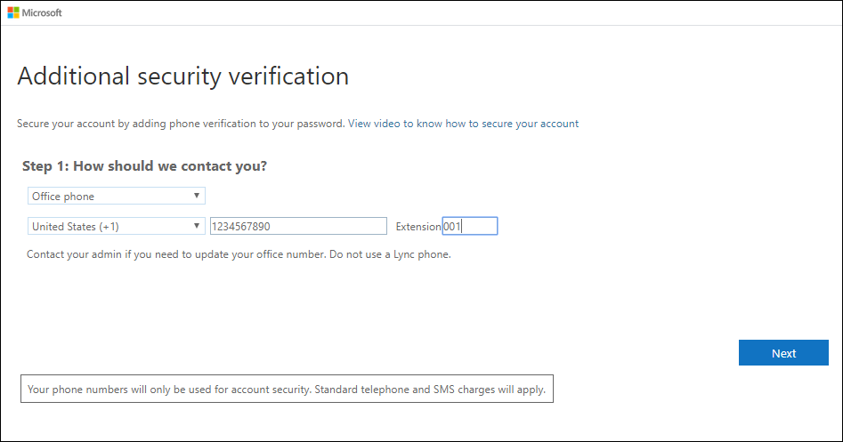
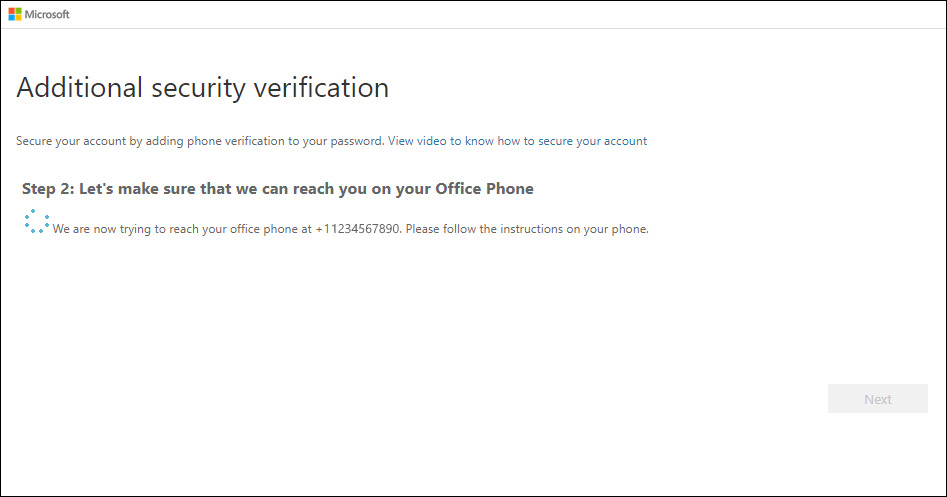

# Set up an office phone as your two-factor verification method

You can set up your office phone to act as your two-factor verification method.

>[!Note]
> If the Office phone option is greyed out, it's possible that your organization doesn't allow you to use an office phone number for verification. In this case, you'll need to select another method or contact your administrator for more help.

## Set up your office phone number as your verification method

1. On the **Additional security verification** page, select **Office phone** from the **Step 1: How should we contact you** area, select your country or region from the drop-down list, type your office phone number, and then type your extension, if you have one.

    

2. You'll receive a phone call from Microsoft, asking you press the pound (#) sign on your office phone to verify your identity.

    

3. From the **Step 3: Keep using your existing applications** area, copy the provided app password and paste it somewhere safe.

    

    >[!Note]
    >For information about how to use the app password with your older apps, see [Manage app passwords](multi-factor-authentication-end-user-app-passwords.md). You only need to use app passwords if you're continuing to use older apps that don't support two-factor verification.

4. Select **Done**.

## Next steps

After you've set up your two-factor verification method, you can add additional methods, manage your settings and app passwords, sign-in, or get help with some common two-factor verification-related problems.

- [Manage your two-factor verification method settings](multi-factor-authentication-end-user-manage-settings.md)

- [Manage app passwords](multi-factor-authentication-end-user-app-passwords.md)

- [Sign-in using two-factor verification](multi-factor-authentication-end-user-signin.md)

- [Get help with two-factor verification](multi-factor-authentication-end-user-troubleshoot.md)
