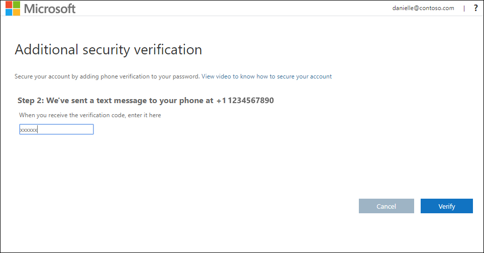
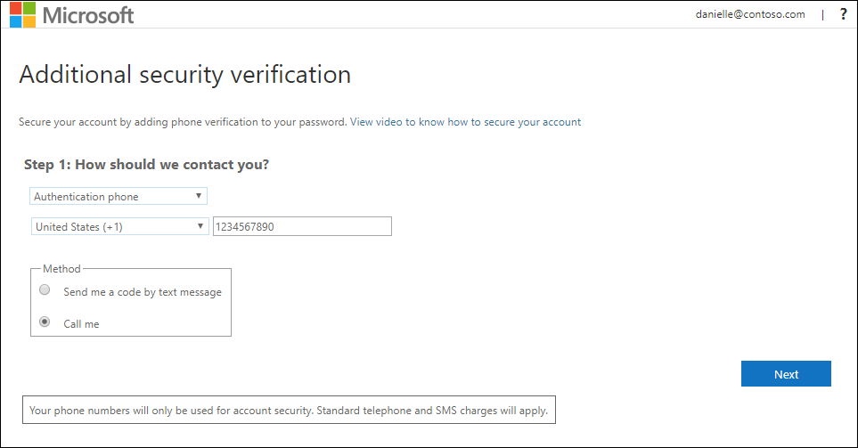
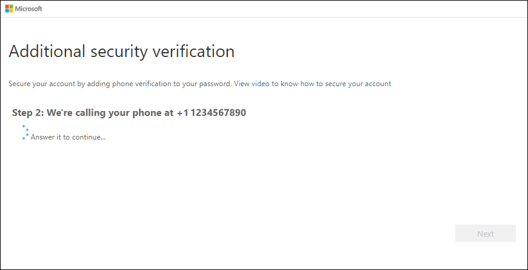

# Set up a mobile device as your two-factor verification method

You can set up your mobile device to act as your two-factor verification method. Your mobile phone can either receive a text message with a verification code or a phone call.

>[!Note]
> If the authentication phone option is greyed out, it's possible that your organization doesn't allow you to use a phone number or text message for verification. In this case, you'll need to select another method or contact your administrator for more help.

## Set up your mobile device to use a text message as your verification method

1. On the **Additional security verification** page, select **Authentication phone** from the **Step 1: How should we contact you** area, select your country or region from the drop-down list, and then type your mobile device phone number.

2. Select **Send me a code by text message** from the **Method** area, and then select **Next**.

    

3. Type the verification code from the text message sent from Microsoft into the **Step 2: We've sent a text message to your phone** area, and then select **Verify**.

    

4. From the **Step 3: Keep using your existing applications** area, copy the provided app password and paste it somewhere safe.

    

    >[!Note]
    >For information about how to use the app password with your older apps, see [Manage app passwords](multi-factor-authentication-end-user-app-passwords.md). You only need to use app passwords if you're continuing to use older apps that don't support two-factor verification.

5. Select **Done**.

## Set up your mobile device to receive a phone call

1. On the **Additional security verification** page, select **Authentication phone** from the **Step 1: How should we contact you** area, select your country or region from the drop-down list, and then type your mobile device phone number.

2. Select **Call me** from the **Method** area, and then select **Next**.

    

3. You'll receive a phone call from Microsoft, asking you press the pound (#) sign on your mobile device to verify your identity.

    

4. From the **Step 3: Keep using your existing applications** area, copy the provided app password and paste it somewhere safe.

    

    >[!Note]
    >For information about how to use the app password with your older apps, see [Manage app passwords](multi-factor-authentication-end-user-app-passwords.md). You only need to use app passwords if you're continuing to use older apps that don't support two-factor verification.

5. Select **Done**.

## Next steps

After you've set up your two-factor verification method, you can add additional methods, manage your settings and app passwords, sign-in, or get help with some common two-factor verification-related problems.

- [Manage your two-factor verification method settings](multi-factor-authentication-end-user-manage-settings.md)

- [Manage app passwords](multi-factor-authentication-end-user-app-passwords.md)

- [Sign-in using two-factor verification](multi-factor-authentication-end-user-signin.md)

- [Get help with two-factor verification](multi-factor-authentication-end-user-troubleshoot.md)
