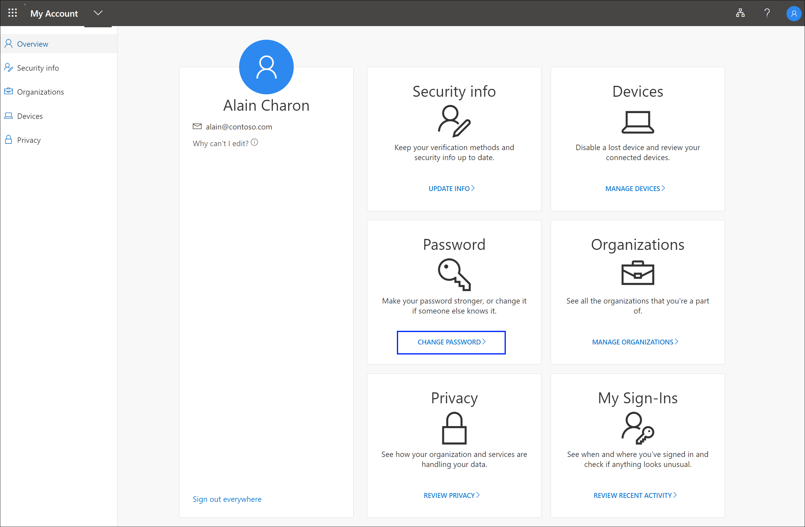
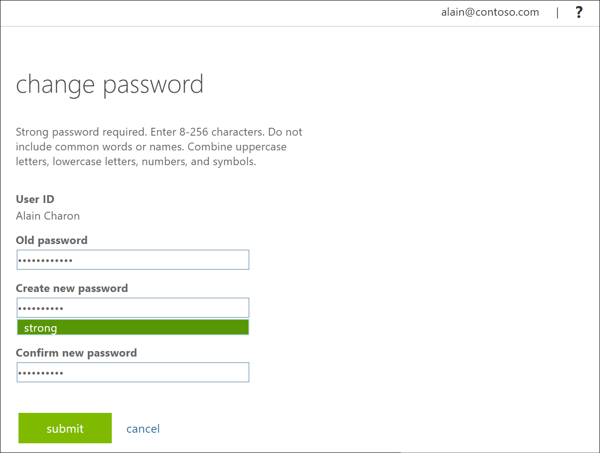

# Change your work or school account password from the Change Password page

The **Change password** page of the **My Account** portal helps you to update an existing password for your work or school account, assuming you remember the password and that you're not locked out of your account. If you don't remember your password, if you're locked out of your account, or if you never got a password from your organization, you can use your security info and your mobile device to reset your password.

>[!Important]
>This article is intended for users trying to update a known password for an existing work or school account. If you're a user trying to get into a personal account, such as for Xbox, Hotmail, or Outlook.com, try the suggestions in the [When you can't sign in to your Microsoft account](https://support.microsoft.com/help/12429/microsoft-account-sign-in-cant) article. If you're an administrator trying to find more information about how to test up self-service password reset for your employees or other users, see [Self-service password reset](https://docs.microsoft.com/azure/active-directory/authentication/quickstart-sspr).

## Update a password from the Change password page

1. Sign in to your work or school account, using your existing password, and then go to the **My Account** (https://myprofile.microsoft.com/) page.

2. Select **Password** from the left navigation pane or select the **Change password** link from the **Password** block.

    

3. Type your old password, and then create and confirm your new password.

    

4. Select **Submit**.

    Your password will be changed and you'll be asked to sign in to your work or school account again.

## Next steps

After changing your password, you can:

- View or manage your [security info](user-help-security-info-overview.md).

- View or manage your connected [devices](my-account-portal-devices-page.md).

- View or manage your [organizations](my-account-portal-organizations-page.md).

- View your [sign-in activity](my-account-portal-sign-ins-page.md).

- View how your organization [uses your privacy-related data](my-account-portal-privacy-page.md).
