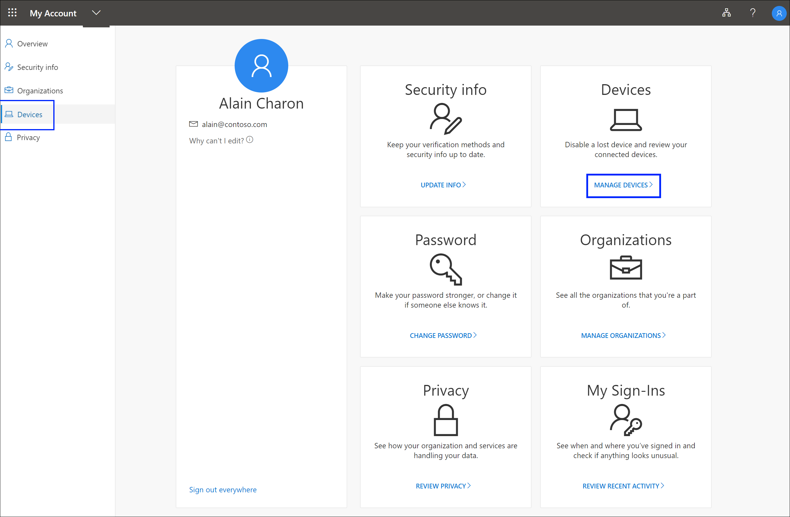
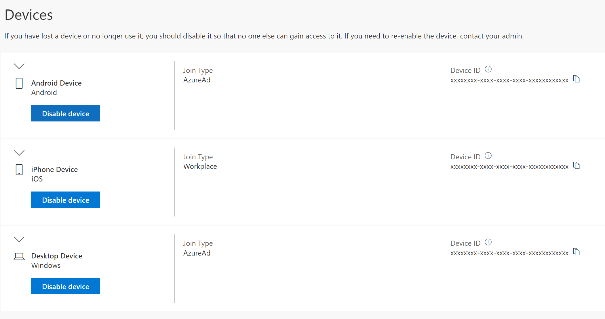
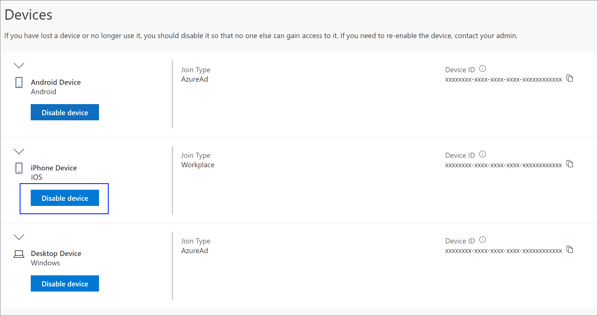
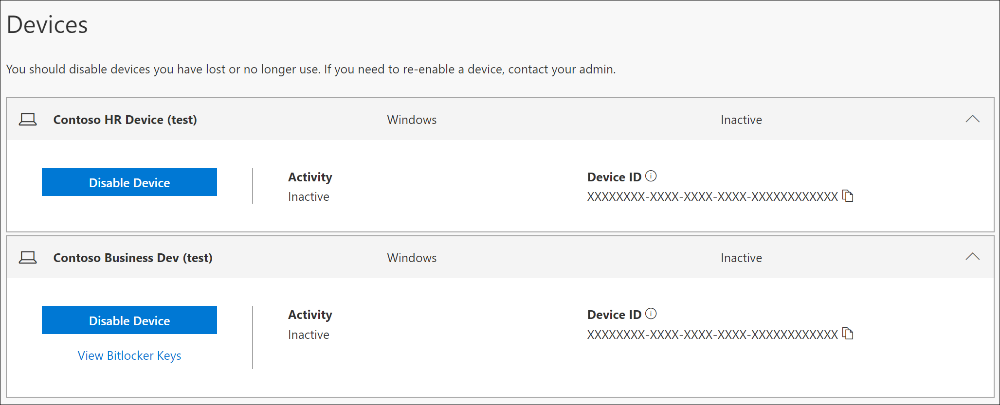

# Manage your connected devices from the My Account portal

From the **Devices** page of the **My Account** portal, you can:

- View your work or school account-connected devices.

- Disable any devices you no longer own, have lost, or that have been stolen.

## View your connected devices

1. Sign in to your work or school account and then go to your https://myprofile.microsoft.com/ page.

2. Select **Devices** from the left navigation pane or select the **Manage devices** link from the **Devices** block.

    

3. Review the information for your connected devices, making sure you recognize them all.

    

## Disable a device

You can disable any of your connected devices at any time. This is especially important if a device isn't familiar to you or if a device is lost or stolen. After you disable a device, it can no longer be authenticated by your organization, and will be unable to access any of your organization's resources.

>[!Important]
>If you disable a device by mistake, there's no way to undo it. You'll have to contact your organization's administrator to add the device again.

1. Select **Disable** from the device you want to remove.

    

2. Select **Yes** to confirm you want to disable the device.

## View a BitLocker key

If you're locked out of your device or have a fatal error, you can go to another device and view your BitLocker key from the **My Account** portal.

1. On another device, where you're not locked out, go to the **Devices** page of the **My Account** portal.

    

2. Select **View Bitlocker Keys** for the locked out device and write down the BitLocker key for your locked device.

## Next steps

After viewing your connected devices, you can:

- Select to view or manage your [security info](user-help-security-info-overview.md).

- View and manage your [organizations](my-account-portal-organizations-page.md).

- View your [sign-in activity](my-account-portal-sign-ins-page.md).

- View how your organization [uses your privacy-related data](my-account-portal-privacy-page.md).
