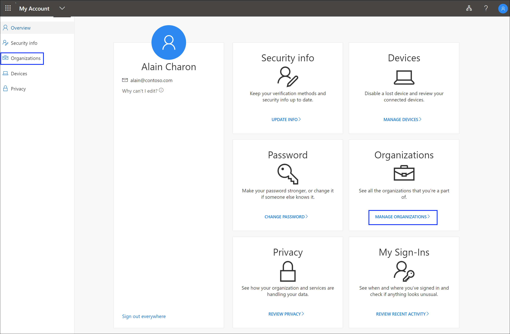
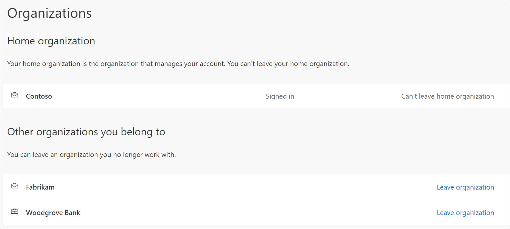
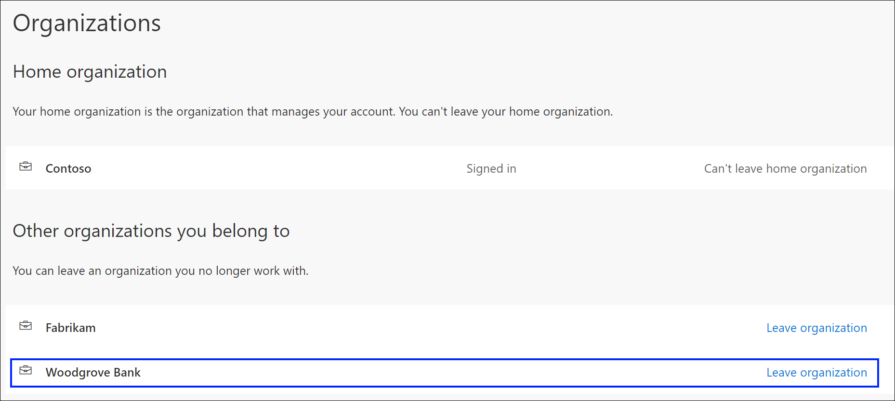

# Manage your connected organizations from the Organizations page

The **Organizations** page of the **My Account** portal helps you to manage the organizations (typically, your organization's name) connected to your work or school account. There are two types of organizations shown on the **Organizations** page:

- **Home organization.** Your home organization is the organization that owns your work or school account. You can't leave your home organization.

    >[!NOTE]
    > If you don't have an assigned Home organization, you'll just see a single heading that says Organizations with the list of your associated organizations.

- **Other organizations.** The other organizations are any group that you've signed in to previously using your work or school account. You can leave any of these organizations at any time.

>[!Important]
>This article is intended for users trying to update the organization info connected to a work or school account. If you're an administrator looking for information about group and user management for your employees and other uses, see the [Enterprise user management documentation](https://docs.microsoft.com/azure/active-directory/users-groups-roles/index).

## View your organizations

1. Sign in to your work or school account, and then go to the **My Account** (https://myprofile.microsoft.com/) page.

2. Select **Organizations** from the left navigation pane or select the **Manage organizations** link from the **Organizations** block.

    

3. Review the information for your **Home organization**.

    

4. Review your other associated organizations, making sure you recognize all of the organizations connected to your account.

## Leave an organization

You can leave any organization that isn't your Home organization.

>[!Important]
>If you leave an organization by mistake, there's no way to undo it. You'll have to wait for the administrator of that organization to invite you again.

- Select **Leave organization** next to the organization you want to leave, and then select **Leave** to confirm you want to leave.

    

## Next steps

After viewing your organizations, you can:

- View or manage your [security info](user-help-security-info-overview.md).

- View or manage your connected [devices](my-account-portal-devices-page.md).

- View your [sign-in activity](my-account-portal-sign-ins-page.md).

- View how your organization [uses your privacy-related data](my-account-portal-privacy-page.md).
