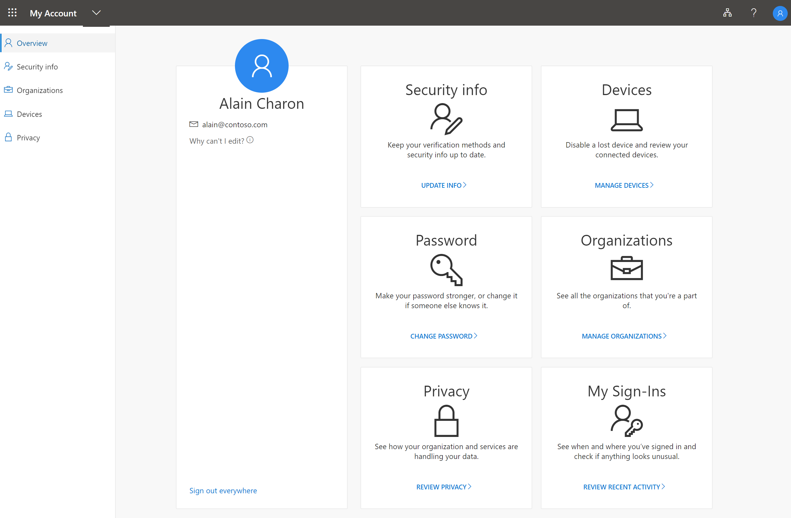

# What is the My Account portal?

The **My Account** portal helps you to manage your work or school account by setting up and managing your security info, managing your connected organizations and devices, viewing how your organization uses your data.

You can get to the **My Account** portal (https://myprofile.microsoft.com), from the current version of any of the following browsers:

- Chrome
- Microsoft Edge
- Safari
- Firefox
- Internet Explorer 11

>[!Important]
>This article is intended for users trying to get to the My Account portal to update their security info, device info, password, connected organizations, privacy, or previous sign-in information. If you're an administrator looking for information about how to turn on authentication and other Azure Active Directory (Azure AD) features for your employees and other uses, see the [Azure AD documentation for administrators](https://docs.microsoft.com/azure/active-directory/).

## Next steps

- Select to view or manage your [security info](user-help-security-info-overview.md)

- View or manage your connected [devices](my-account-portal-devices-page.md)

- View and manage your [organizations](my-account-portal-organizations-page.md)

- View your [sign-in activity](my-account-portal-sign-ins-page.md)

- View how your organization [uses your privacy-related data](my-account-portal-privacy-page.md)

## Related Microsoft Office content

- [Sign in to manage your Office product](https://support.office.com/article/sign-in-to-manage-your-office-product-959ac957-8d37-4ae4-b1b6-d6e4874e013f)

- [Go to the Office **My Account** page](https://portal.office.com/account/)

- [Go to the Office **My installs** page](https://portal.office.com/account/#installs)

- [Go to the Office **Subscriptions** page](https://portal.office.com/account/#subscriptions)