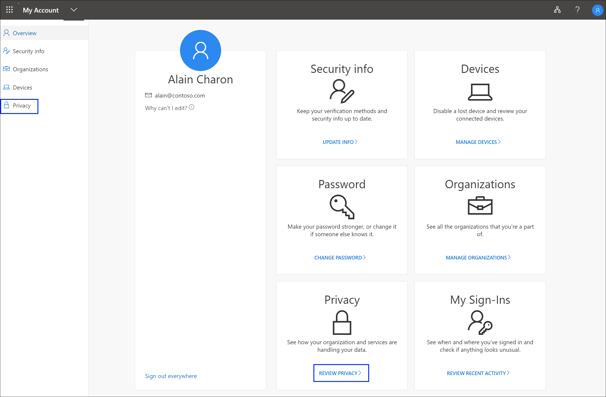

# View how your organization uses your privacy-related data

You can view how your organization uses your data from the **Privacy** page of the **My Account** portal.

## View your privacy-related info

1. Sign in to your work or school account and then go to your https://myprofile.microsoft.com/ page.

2. Select **Privacy** from the left navigation pane or select the **Review privacy** link from the **Privacy** block.

    

3. Review the information, including:

    - **Services.** A list of online services you're connected to using your work or school account.

    - **Terms of use**. Your organization's terms of use.

## Next steps

After viewing how your organization uses your data, you can:

- View or manage your [security info](user-help-security-info-overview.md).

- View or manage your connected [devices](my-account-portal-devices-page.md).

- View or manage your [organizations](my-account-portal-organizations-page.md).

- View your [sign-in activity](my-account-portal-sign-ins-page.md).

- You can also view your Microsoft Office-related contact preferences and privacy information from the [Office portal, Security & privacy page](https://portal.office.com/account/#security).
