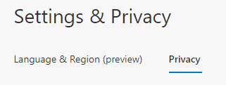

# View how your organization uses your privacy-related data

You can view how your organization uses your data from the **Settings & Privacy** page of the **My Account** portal.

>[!Note]
> If you see an error while signing in with a personal Microsoft account, you can still sign in by using the domain name for your organization (such as contoso.com) or the **Tenant ID** of your organization from your administrator in one of the following URLs:
>
>   - https://myaccount.microsoft.com?tenantId=*your_domain_name*
>   - https://myaccount.microsoft.com?tenant=*your_tenant_ID*

## View your privacy-related info

1. Sign in to your work or school account and then go to your https://myaccount.microsoft.com/ page. If you are signing in with a personal Microsoft account, you can still sign in by using the domain name for your organization (such as contoso.com) or the **Tenant ID** of your organization from your administrator in one of the following URLs:

   - https://myaccount.microsoft.com?tenantId=*your_domain_name*
   - https://myaccount.microsoft.com?tenant=*your_tenant_ID*

2. Select **Settings & Privacy** from the left navigation pane or select the **View Settings and Privacy** link from the **Settings & Privacy** block.

    

3. Select **Privacy**, as shown in the following example screenshot, then review the information, including:

    

    - **Services.** A list of online services you're connected to using your work or school account.

    - **Terms of use**. Your organization's terms of use.

## Next steps

After viewing how your organization uses your data, you can:

- View or manage your [security info](./security-info-setup-signin.md).

- View or manage your connected [devices](my-account-portal-devices-page.md).

- View or manage your [organizations](my-account-portal-organizations-page.md).

- View your [sign-in activity](my-account-portal-sign-ins-page.md).

- Change your [My Account portal settings](my-account-portal-settings.md)

- You can also view your Microsoft Office-related contact preferences and privacy information from the [Office portal, Security & privacy page](https://portal.office.com/account/#security).