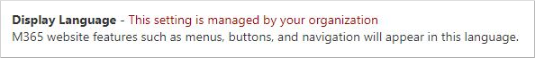

# View or change your settings in the My Account portal

You can view or change your account settings in the My Account portal, such as language or time zone, from the **Settings & Privacy** page of the **My Account** portal.

## View and manage your language and regional settings

1. Sign in to your work or school account and then go to your https://myaccount.microsoft.com/ page.

1. Select **Settings & Privacy** from the left navigation pane or select the **View Settings And Privacy** link from the **Settings & Privacy** block.

    

1. Under *Language & Region (preview)*, review or change the following settings:
    * *Display language*: The language used for buttons, menus, and some content in Microsoft websites.
    * *Preferred languages*: Languages you understand and use to create or consume content.
    * *Regional format*: Microsoft websites use this setting to format dates and times.
    * *Time zone*: Used to effectively schedule meetings in your Microsoft calendar.

After you change your display language, it's recommended to sign out and sign in to your work or school account to make sure your display language is refreshed.

> [!NOTE]
> In some organizations, you can't manage the *Display Language* setting. If your display language is disabled, as shown in the following example screenshot, reach out to your IT admin for assistance:
>
> 

## Next steps

After changing your My Account portal settings, you can:

- View or manage your [security info](./security-info-setup-signin.md).

- View or manage your connected [devices](my-account-portal-devices-page.md).

- View or manage your [organizations](my-account-portal-organizations-page.md).

- View your [sign-in activity](my-account-portal-sign-ins-page.md).

- View the [M365 web applications that currently use the language and regional format settings](https://support.microsoft.com/office/change-your-display-language-and-time-zone-in-microsoft-365-for-business-6f238bff-5252-441e-b32b-655d5d85d15b).