# View and search your recent sign-in activity from the My Sign-ins page

You can view all of your recent work or school account sign-in activity, from the **My Sign-ins** page of the **My Account** portal. Reviewing your sign-in history helps you to check for unusual activity by helping you to see:

- If someone is trying to guess your password.
- If an attacker successfully signed in to your account, and from what location.
- What apps the attacker tried to access.

>[!Note]
> If you see an error while signing in with a personal Microsoft account, you can still sign in by using the domain name for your organization (such as contoso.com) or the **Tenant ID** of your organization from your administrator in one of the following URLs:
>
>   - https://myaccount.microsoft.com?tenantId=*your_domain_name*
>   - https://myaccount.microsoft.com?tenant=*your_tenant_ID*

## View your recent sign-in activity

1. Sign in to your work or school account and then go to your https://myaccount.microsoft.com/ page.

1. Select **My Sign-ins** from the left navigation pane or select the **Review recent activity** link from the **My sign-ins** block.

    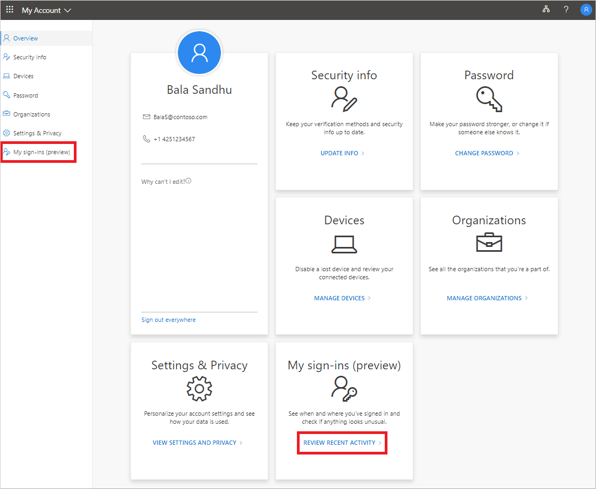

1. Expand and review each of the sign-in items, making sure that you recognize each one. If you find a sign-in item that doesn't look familiar, change your password to protect the account in case it's compromised.

    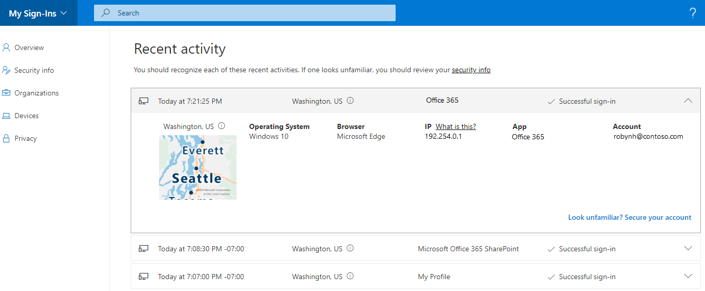

### If you see a successful sign-in

Sometimes, while reviewing your own normal sign-in activity, you might see a successful sign-in from an unfamiliar location, browser, or operating system. Unfamiliar sign-ins can mean an attacker has gained access to your account. If you see activity that you didn't authorize, we recommend you immediately change your password, and then go to [Security info](https://mysignins.microsoft.com/security-info) to update your security settings.

Before you determine something is incorrect, make sure you're not seeing a false positive (where the item looks questionable, but is okay). For example, we determine your approximate location and map based on your IP address. Mobile networks are especially hard to pinpoint since they sometimes route traffic through distant locations. Even if you sign in using your mobile device in Washington state, the location might show the sign-in coming from California. We strongly suggest that you check details beyond just the location. Make sure the operating system, browser, and app all make sense, too.

### If you see an unsuccessful sign-in

If you see an unsuccessful sign-in, it could mean that you mistyped your credentials. It could also mean that an attacker was trying to guess your password. To respond to this risk, you don't have to change your password, but we recommend that you register for Azure AD Multi-Factor Authentication (MFA). With multi-factor authentication, even if the hacker guesses your password, it won't be enough to access the account.

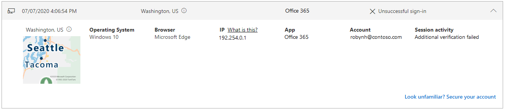

If you see an unsuccessful sign-in, with a note under **Session activity** that says, `Additional verification failed, invalid code`, it means that your primary authentication credentials succeeded, but multi-factor authentication failed. This condition could mean that an attacker correctly guessed your password but was unable to pass the multi-factor authentication challenge. We recommend that you still change your password, because the attacker might have that already, and go to the [Security info](https://mysignins.microsoft.com/security-info) page to update your security settings.

## Search for specific sign-in activity

You can search your recent sign-in activity by any of the available information. For example, you can search for your recent sign-in activity by operating system, location, app, and so on.

1. On the **Review recent activity** page, type the information you want to search for into the **Search** bar. For example, type `Unsuccessful` to search for all unsuccessful sign-in activity collected by the My Account app.

2. Select the **Search** button to begin searching.

    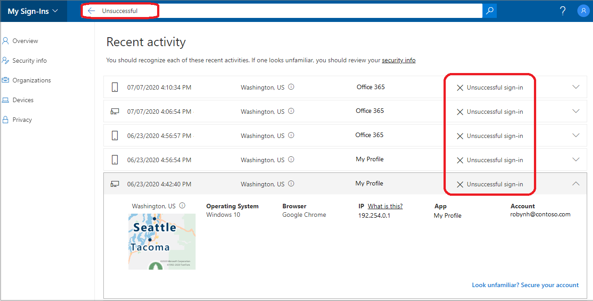

### Confirm unusual activity

Sign-ins that are flagged as unusual activity can be confirmed in the tile for that activity in the **My sign-ins** page.

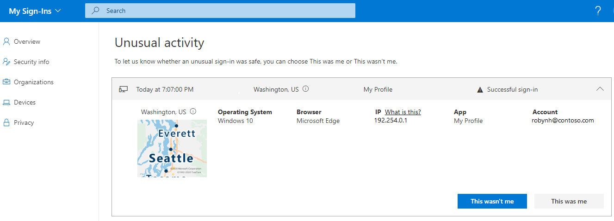

## View sign-in activity on Android

Each time you view or change security information, you must sign in to your work or school account to continue.

1. Open the Microsoft Authenticator app, and select the home page for your work or school account.

1. Select **Recent account activity**.

    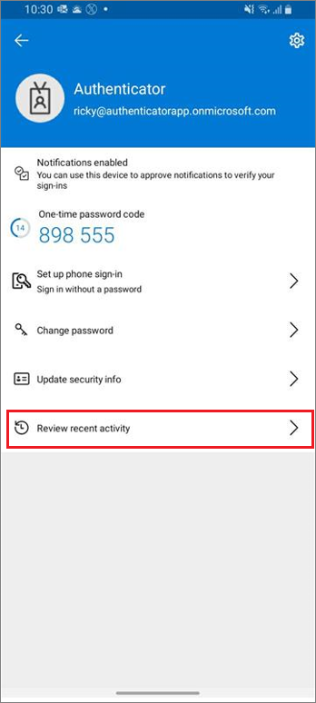

1. If your sign-in is successful, review each of the sign-in items, making sure that you recognize each one. If you find a sign-in item that doesn't look familiar, change your password to protect the account in case it's compromised.

    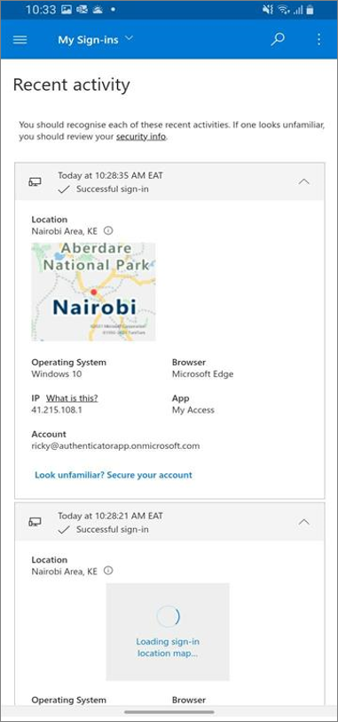

## Change your password on Android

Your administrator can make it possible for you to reset your password from the Authenticator app. Each time you sign in to view or change security information, you must sign in to your work or school account to continue.

1. Open the Microsoft Authenticator app, and select the home page for your work or school account.

1. Select **Change password**.

    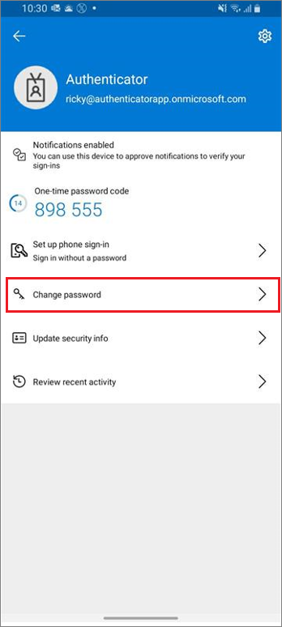

1. If your sign-in is successful, you can update your password info on the **Change password** page.

    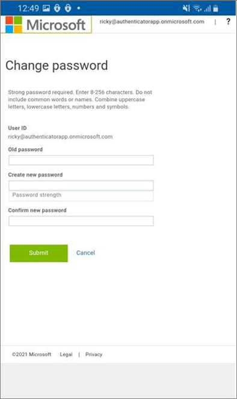

## Update security info on Android

Each time you sign in to view or change security information, you must sign in to your work or school account to continue.

1. Open the Microsoft Authenticator app, and select the home page for your work or school account.

1. Select **Update security info**.

    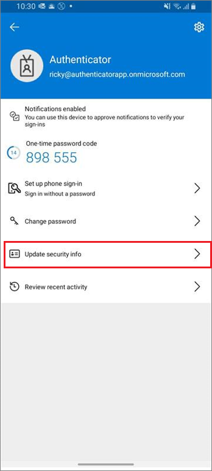

1. If your sign-in is successful, you can update your security details the **Security info** page.

    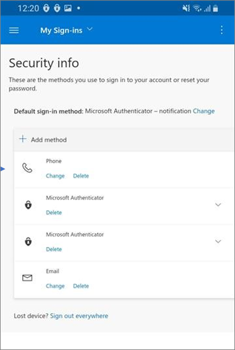

## Next steps

After viewing your recent sign-in info, you can:

- View or manage your [security info](./security-info-setup-signin.md).

- View or manage your connected [devices](my-account-portal-devices-page.md).

- View or manage your [organizations](my-account-portal-organizations-page.md).

- View how your organization [uses your privacy-related data](my-account-portal-privacy-page.md).

- Change your [My Account portal settings](my-account-portal-settings.md)