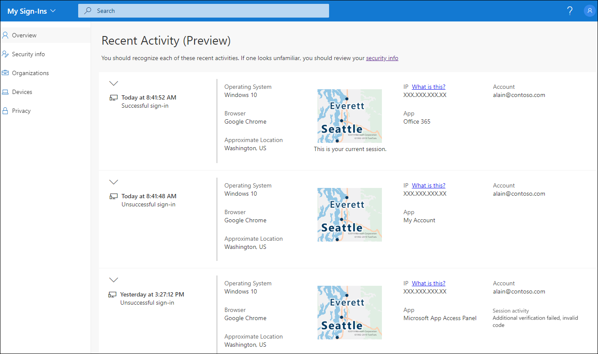
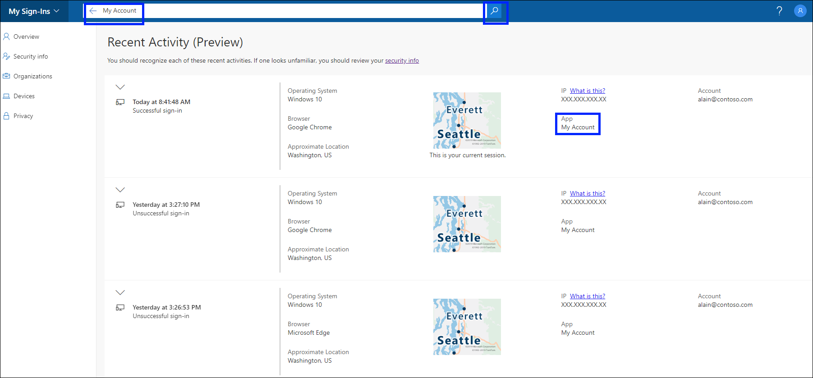

# View and search your recent sign-in activity from the My Sign-ins (preview) page

You can view all of your recent work or school account sign-in activity, from the **My Sign-ins** page of the **My Account** portal. Reviewing your sign-in history helps you to check for unusual activity by helping you to see:

- If someone is trying to guess your password.

- If an attacker successfully signed in to your account, and from what location.

- What apps the attacker tried to access.

## View your recent sign-in activity

1. Sign in to your work or school account and then go to your https://myaccount.microsoft.com/ page.

2. Select **My Sign-ins (preview)** from the left navigation pane or select the **Review recent activity** link from the **My sign-ins (preview)** block.

    

3. Expand and review each of the sign-in items, making sure that you recognize each one. If you find a sign-in item that doesn't look familiar, we highly recommend you change your password to help protect your account if it was compromised.

    

### If you see a Successful sign-in

You should recognize your own activity as being normal. However, if you notice a Successful sign-in from strange location, browser, or operating system, it could mean that an attacker has gained access to your account. In this situation, we recommend you immediately change your password, and then go to the [Security info](https://mysignins.microsoft.com/security-info) page to update your security settings.

Before you determine something is incorrect, make sure you're not seeing a false positive (where the item looks questionable, but is okay). For example, we determine your approximate location and map based on your IP Address. Mobile networks are especially hard to pinpoint since they sometimes route traffic through distant locations. So, if you signed in using your mobile device in Washington state, the location might show the sign-in coming from California. Because of this, we strongly suggest that you check more details, beyond just the location. You should also make sure the operating system, browser, and app all make sense, too.

### If you see an Unsuccessful sign-in

An unsuccessful sign-in, with no session activity, means that your primary verification method (username/password) failed. This could mean that you mistyped your username or password, but it could also mean that an attacker was trying to guess your password. If you think it was attacker trying unsuccessfully to guess your password, you don't have to change your password, but we strongly suggest that you register for Azure Multi-Factor Authentication (MFA). With MFA, even if the hacker eventually guesses your password, it won't be enough to access your account.

If you see an unsuccessful sign-in, with a note under Session activity that says, **Additional verification failed, invalid code**, it means that your primary authentication (username/password) succeeded, but MFA failed. If this was an attacker, they correctly guessed your password but were still unable to pass the MFA challenge. In this case, we recommend that you still change your password, since the attacker got that part right, and then go to the [Security info](https://mysignins.microsoft.com/security-info) page to update your security settings.

## Search for specific sign-in activity

You can search your recent sign-in activity by any of the available information. For example, you can search for your recent sign-in activity by operating system, location, app, and so on.

1. On the **Review recent activity** page, type the information you want to search for into the **Search** bar. For example, type `My Account` to search for all activity collected by the My Account app.

2. Select the **Search** button to begin searching.

    

## Next steps

After viewing your recent sign-in activity, you can:

- View or manage your [security info](user-help-security-info-overview.md).

- View or manage your connected [devices](my-account-portal-devices-page.md).

- View or manage your [organizations](my-account-portal-organizations-page.md).

- View how your organization [uses your privacy-related data](my-account-portal-privacy-page.md).
