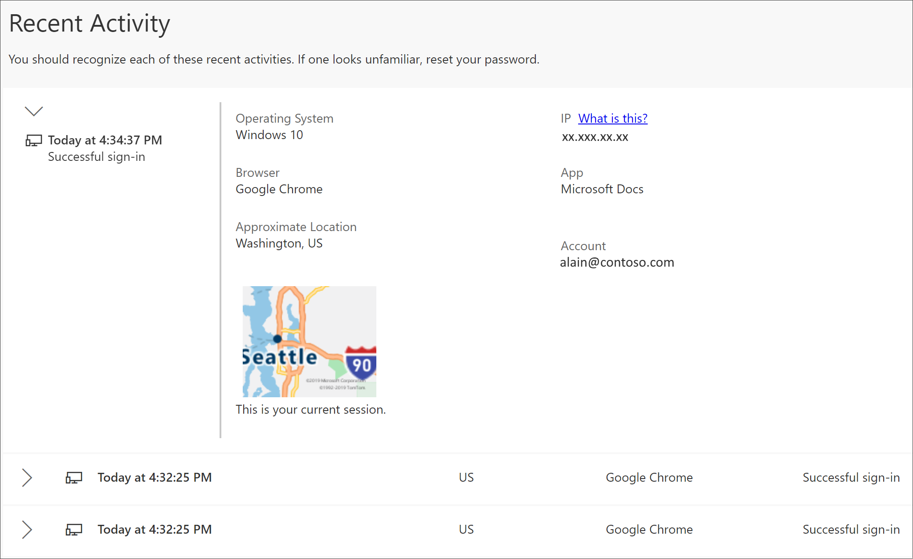

# View recent sign-in activity from the My Sign-ins (preview) portal

You can view all of your recent work or school account sign-in activity, from the **My Sign-ins** portal.

[!INCLUDE [preview-notice](../../../includes/active-directory-end-user-preview-notice-myprofile.md)]

## View your recent sign-in activity

1. Sign in to your work or school account and then go to your https://myprofile.microsoft.com/ page.

2. Select **My Sign-ins** from the left navigation pane or select the **Review activity** link from the **Recent activity** block.

    

3. Expand and review each of the sign-in items, making sure that you recognize each one. If you find an sign-in item that doesn't look familiar, we highly recommend you change your password to help protect your account if it was compromised.

    

    >[!Note]
    >If you believe your account was compromised, see [How to access a compromised Microsoft account](https://support.microsoft.com/help/10494/microsoft-account-how-to-access-a-compromised-account) for more help with resetting your password or unblocking your account.

## Next steps

- After viewing your recent sign-in activity, you can select to view or manage your [security info](user-help-security-info-overview.md), connected [devices](myprofile-portal-devices-page.md) or [organizations](myprofile-portal-organizations-page.md), or to view how your organization [uses your data](myprofile-portal-privacy-page.md).