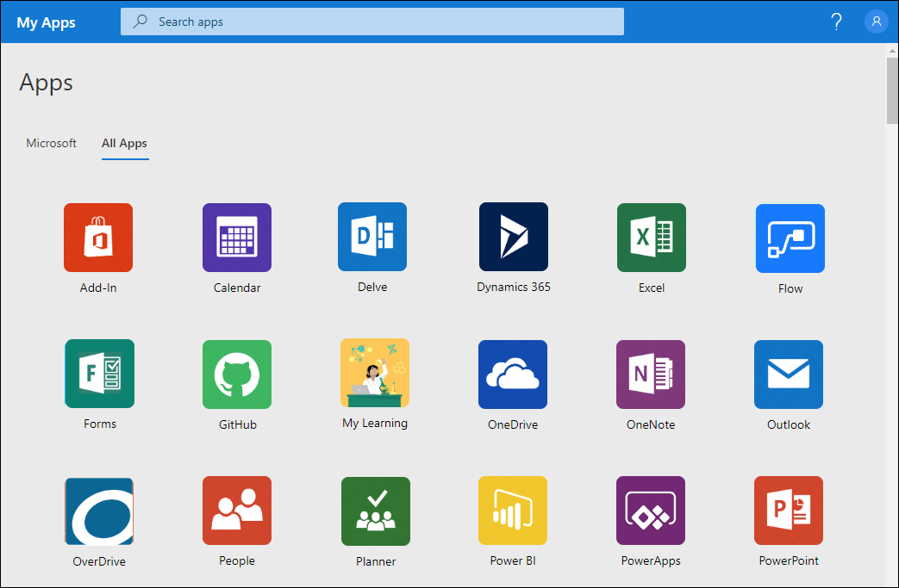

# Access and start apps from the My Apps (preview) portal

You can use your work or school account with the web-based **My Apps** (preview) portal, to view, organize, and start many of your organization’s cloud-based apps. If you don’t have access to the **My Apps** portal, contact your organization's Helpdesk for permission.

[!INCLUDE [preview-notice](../../../includes/active-directory-end-user-my-apps-and-workspaces.md)]

>[!Important]
>This content is intended for users. If you're an administrator, you can find more information about how to set up and manage your cloud-based apps in the [Application Management Documentation](https://docs.microsoft.com/azure/active-directory/manage-apps/access-panel-workspaces).

## Supported browsers

You can get to the **My Apps** portal from any of the following web browsers:

- Google Chrome

- Mozilla Firefox, version 26.0 or later

- Microsoft Edge

- Internet Explorer, version 11 (limited support)

## Access the My Apps portal by device type

You can access and use the **My Apps** portal on your work or school computer, from an Intune-managed browser, or from an iOS or Android mobile device.

### Access the My Apps portal on a computer

If you have permission to access and use your organization's cloud-based apps, you can get to them through the **My Apps** portal.

1. Sign in to your work or school account on your computer.

2. Open a supported web browser and go to https://myapps.microsoft.com, or use the link provided by your organization. For example, you might be directed to use a customized page for your organization, such as `https://myapps.microsoft.com/contoso.com`.

    The **Apps** page appears, showing all the cloud-based apps owned by your organization and available for you to use.

### Access the My Apps portal from the Intune Managed Browser app

View and use your organization's apps from the Intune Managed Browser app on your iOS or Android devices.

1. On your mobile device, download and install the Intune Managed Browser app from the [Apple App Store](https://itunes.apple.com/us/app/microsoft-intune-managed-browser/id943264951?mt=8) or the [Google Play Store](https://play.google.com/store/apps/details?id=com.microsoft.intune.mam.managedbrowser).

2. Open the Intune Managed Browser app, go to https://myapps.microsoft.com, or use the link provided by your organization. For example, you might be directed to a customized page for your organization, such as https://myapps.microsoft.com/contoso.com.

    The **Apps** page appears, showing all the cloud-based apps owned by your organization and available for you to use.

### Access the My Apps portal on an iOS device

View and use the **My Apps** portal from an iPhone or iPad device, running iOS version 7 or later. You can also install the [My Apps mobile app](https://itunes.apple.com/us/app/my-apps-azure-active-directory/id824048653?mt=8) to access your organization's apps on your iOS devices.

1. On your mobile device, start a web browser app, such as Safari.

2. Go to https://myapps.microsoft.com, or use the link provided by your organization. For example, you might be directed to a customized page for your organization, such as https://myapps.microsoft.com/contoso.com.

    The **Apps** page appears, showing all the cloud-based apps owned by your organization and available for you to use.

### Access the My Apps portal on an Android device

View and use the **My Apps** portal on an Android device.

1. On your mobile device, start a web browser app, such as Google Chrome.

2. Go to https://myapps.microsoft.com, or use the link provided by your organization. For example, you might be directed to a customized page for your organization, such as https://myapps.microsoft.com/contoso.com.

    The **Apps** page appears, showing all the cloud-based apps owned by your organization and available for you to use.

## Start a cloud-based app

You can start any of the available cloud-based apps from the **My Apps** portal. You'll only see apps you have permission to use.

- From the **Apps** page, select the app you want to start using.

    A new page opens for the app, where you can sign in (if necessary) or begin using the app.

## Next steps

After you get to the **My Apps** portal, you can:

- Organize your apps into the various categories created and provided by your organization. For more information, see [Access and use workspaces in the My Apps (preview) portal](my-applications-portal-workspaces.md).

- Review, update, or revoke permissions granted to applications. For more information, see [Edit or revoke application permissions in the My Apps (preview) portal](my-applications-portal-permissions-saved-accounts.md).

>[!Note]
>If you don't see any workspaces or categories available, it means that your administrator hasn't set up or shared any with you. Contact your organization's Helpdesk for additional assistance or permissions to see shared workspaces.

## Related articles

- [Update your profile and account info](my-account-portal-overview.md). Instructions about how to update your personal information that appears on the **My Profile** (preview) portal.

- [Manage your organizations](my-account-portal-organizations-page.md). Instructions about how to view and manage your organization-related information on the **Organizations** page of the **My Profile** portal.

- [Manage your connected devices](my-account-portal-devices-page.md). Instructions about how to manage the devices you're connected to using your work or school account, on the **Devices** page of the **My Profile** portal.
