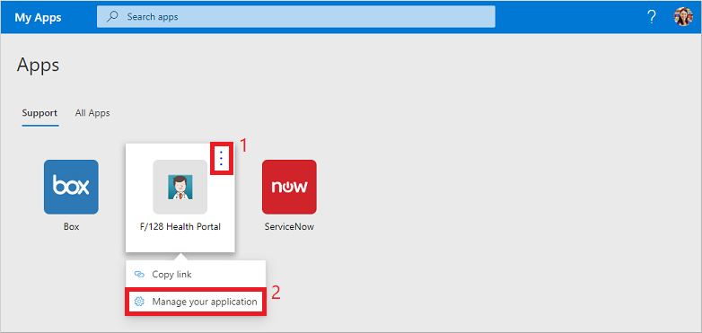
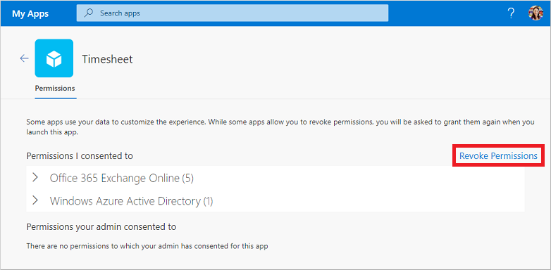

# Edit or revoke application permissions in the My Apps (preview) portal

When you use organizational applications in the **My Apps** (preview) portal, you often grant permissions and save account information. To keep your data secure, you may want to review and revoke permissions or clear saved account credentials. Removing permissions or accounts may break some app functionality. If you have problems after you remove permissions or accounts, contact your organization's Helpdesk for additional assistance.

[!INCLUDE [preview-notice](../../../includes/active-directory-end-user-my-apps-and-workspaces.md)]

>[!Important]
>This content is intended for users. If you're an administrator, you can find more information about how to set up and manage your cloud-based apps in the [Application Management Documentation](https://docs.microsoft.com/azure/active-directory/manage-apps/access-panel-workspaces).

## Manage app permissions

To view the permissions consented to by you or your administrator, select **...** when you hover over an app in the **My Apps** portal, then select **Manage your application**:

The top part of permissions window shows what you personally consented to. Examples of apps permissions include the ability to access your calendar, contacts, or camera.

You can revoke any of the permissions you consented to by selecting **Revoke Permissions**, however removing a permission may break some of the apps functionality. If you have problems after you remove permissions or accounts, contact your organization's Helpdesk for additional assistance.

The bottom part of the permissions window shows what your administrator consented to on your behalf. This section isn't shown if there are no admin-consented permissions. You can't revoke these permissions because the administrator consented to them, and they're often required for your organization's policy.

## Next steps

After you manage app permissions and saved accounts in the **My Apps** portal, you can:

- Organize your apps into the various categories created and provided by your organization. For more information, see [Access and use workspaces in the My Apps (preview) portal](my-applications-portal-workspaces.md).

## Related articles

- [Update your profile and account info](my-account-portal-overview.md). Instructions about how to update your personal information that appears on the **My Profile** (preview) portal.

- [Manage your organizations](my-account-portal-organizations-page.md). Instructions about how to view and manage your organization-related information on the **Organizations** page of the **My Profile** portal.

- [Manage your connected devices](my-account-portal-devices-page.md). Instructions about how to manage the devices you're connected to using your work or school account, on the **Devices** page of the **My Profile** portal.