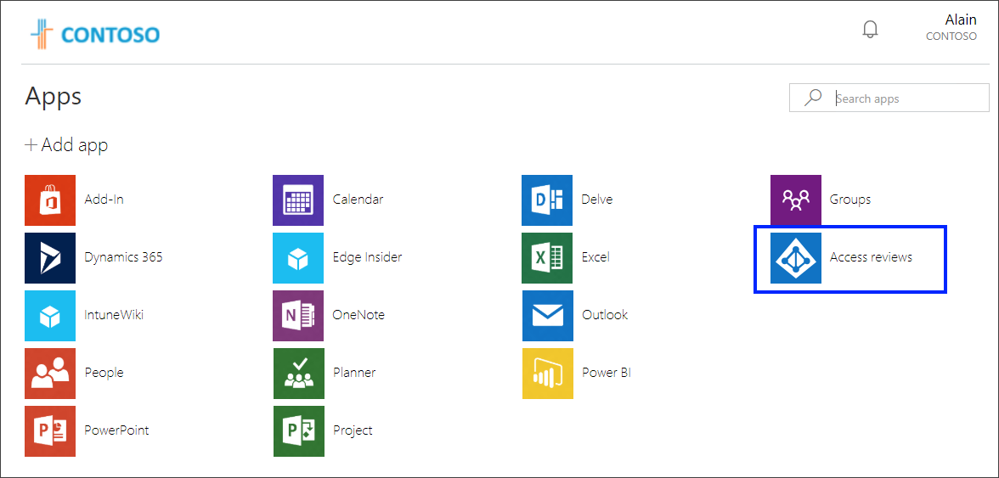
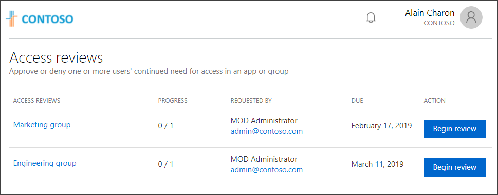
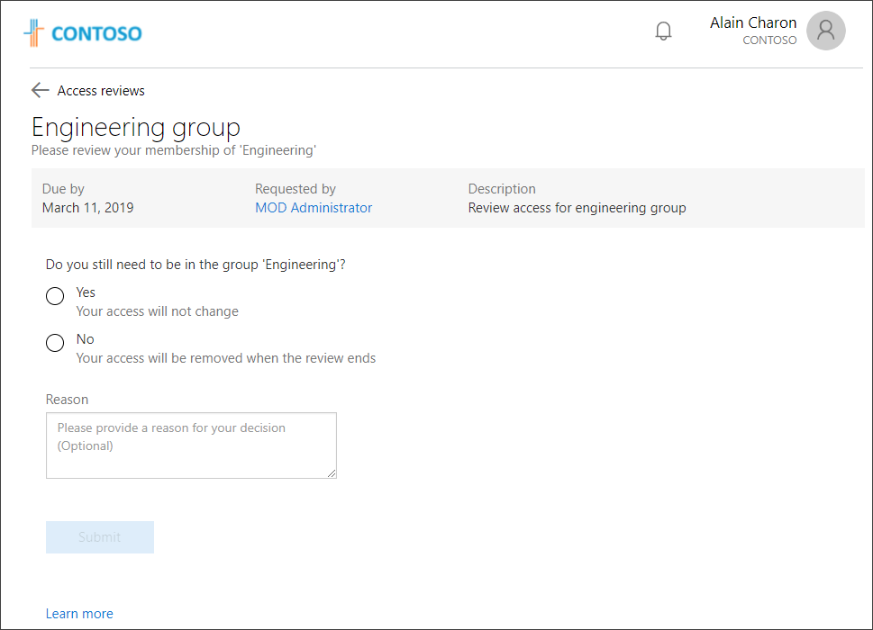
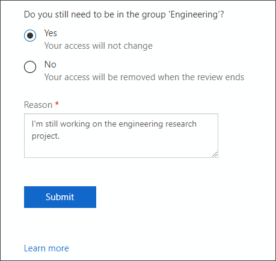

# Perform an access review from the My Apps portal

You can use your work or school account with the web-based **My Apps** portal to perform access reviews for your apps and groups. Access reviews help you manage outdated access or changing access requirements and ensure that they are reviewed and updated.

If you don’t have access to the **My Apps** portal, contact your Helpdesk for permission.

[!INCLUDE [preview-notice](../../../includes/active-directory-end-user-my-apps-portal.md)]

>[!Important]
>This content is intended for **My Apps** users. If you're an administrator, you can find more information about how to set up and manage your cloud-based apps in the [Application Management Documentation](https://docs.microsoft.com/azure/active-directory/manage-apps).

## Manage access reviews

If your administrator has given you permission to perform your own access reviews, you can manage your groups or apps access from the **Access reviews** tile on the **My Apps** portal page.

>[!Note]
>If you don't see the **Access reviews** tile, it either means that you don't have permission to perform access reviews, or that you don't have any pending reviews waiting for your approval. If you think you should have access to the tile, contact your Helpdesk for assistance.

## To perform your access reviews

1. Sign in to your work or school account.

2. Open your web browser and go to https://myapps.microsoft.com, or use the link provided by your organization. For example, you might be directed to a customized page for your organization, such as https://myapps.microsoft.com/contoso.com.

    The **Apps** page appears, showing all the cloud-based apps owned by your organization and available for you to use.

    

3. Select the **Access reviews** tile to see a list of access reviews waiting for your approval.

    

4. Select **Begin review** to start your access review.

5. Review your access and determine whether it's still necessary.

    

    >[!Note]
    >If you're an administrator, and allowed to review your organization's access to groups and apps, you'll see a different page. For more information about reviewing groups or apps for your organization, see [Review access to groups or applications in Azure AD Access Reviews](https://docs.microsoft.com/azure/active-directory/governance/perform-access-review).

6. Select **Yes** to keep your access or **No** to remove your access.

    If you select **Yes**, you might need to specify a justification in the **Reason** box.

    

7. Select **Submit**.

    Your access review is complete and you return to the **My Apps** portal.

    >[!Note]
    >You can change your access at any time until your access review period ends. If you remove your access to an app or group, it's not removed immediately. The removal happens when the access review period ends or when an administrator closes the review.

## Next steps

- [Access and use apps on the My Apps portal](my-apps-portal-end-user-access.md)
- [Change your profile information](my-apps-portal-end-user-update-profile.md)
- [View and update your groups-related information](my-apps-portal-end-user-groups.md)
