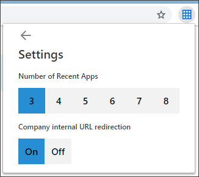
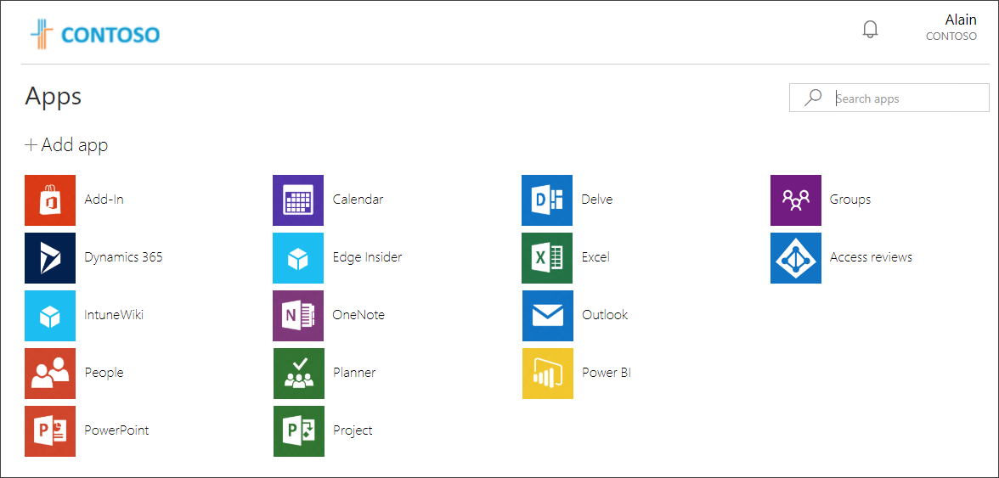
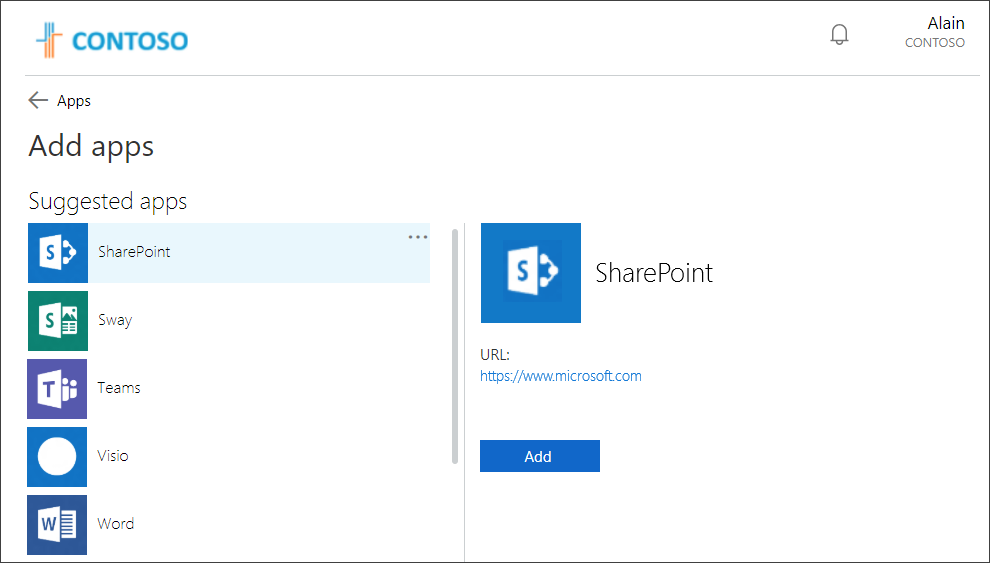
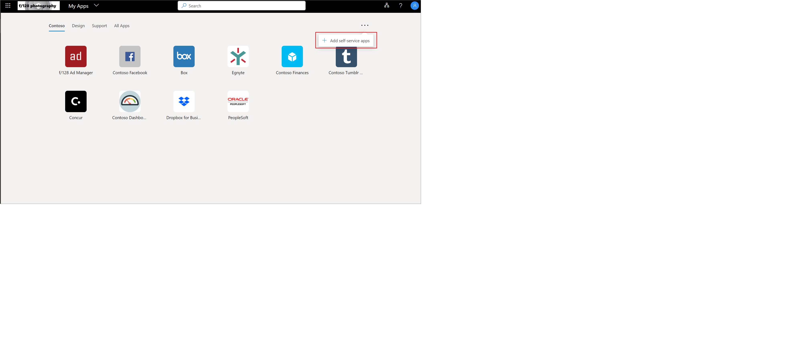

# Sign in and start apps from the My Apps portal

You can use your work or school account with the web-based **My Apps** portal to:

- View and start many of your organization’s cloud-based apps
- Update your profile and account information
- See your **Groups** information
- Perform **access reviews** for your apps and groups

If you don’t have access to the **My Apps** portal, contact your Helpdesk for permission.

[!INCLUDE [preview-notice](../../../includes/active-directory-end-user-my-apps-portal.md)]

> [!Important]
> This content is intended for My Apps users. If you're an administrator, you can find more information about how to set up and manage your cloud-based apps in the [Application Management Documentation](https://docs.microsoft.com/azure/active-directory/manage-apps).

## Supported browsers

You can get to the **My Apps** portal from any of the following web browsers:

- Google Chrome

- Mozilla Firefox, version 26.0 or later

- Microsoft Edge

- Internet Explorer, version 11 (limited support)

## Download and install the My Apps Secure Sign-in Extension

Download and install the My Apps Secure Sign-in Extension, if you're prompted. This extension helps you start any of your organization's cloud apps that require you to use a single sign-on process. If your organization has already set you up for single sign-on, the extension is installed automatically and you can skip this section.

This extension helps you:

- Sign in directly to apps from the sign-in page.

- Start any apps using the **Quick search** feature.

- See the last apps you used in the **Recently Used** section.

- Use internal company URLs while remote with [Application Proxy](https://docs.microsoft.com/azure/active-directory/active-directory-application-proxy-get-started).

### To download and install the extension

Download and install the extension, based on the browser you're using:

- **Google Chrome.** From the Chrome Web Store, go to the [My Apps Secure Sign-in Extension](https://chrome.google.com/webstore/detail/my-apps-secure-sign-in-ex/ggjhpefgjjfobnfoldnjipclpcfbgbhl) feature, and then select **Add to Chrome**.

- **Mozilla Firefox** From the **Firefox Add-ons** page, go to the [My Apps Secure Sign-in Extension](https://addons.mozilla.org/firefox/addon/access-panel-extension/) feature, and then select **Add to Firefox**.

- **Microsoft Edge** From the Microsoft Store, go to the [My Apps Secure Sign-in Extension](https://www.microsoft.com/p/my-apps-secure-sign-in-extension/9pc9sckkzk84?rtc=1&activetab=pivot%3Aoverviewtab) feature, and then select **Get** to get the extension for Microsoft Edge legacy browser.  
If you are using the new Microsoft Edge browser (Edge on Chromium) then you can get the extenion from [Microsoft Edge Addons Store](https://microsoftedge.microsoft.com/addons/category/EdgeExtensionsEditorsPick).

An icon is added to the right of your **Address** bar, letting you sign-in and customize the extension.

## To change your My Apps portal using the extension

You can choose how many apps to view in the **Recently Used** section and decide whether to allow your organization's internal URLs to redirect.

1. Select the new **My Apps Secure Sign-in Extension** icon  to the right of your **Address** bar, and then select **Sign in to get started**.

2. Right-click the **Settings** icon , and then select **Settings**.

3. In the **Settings** box, select the number of recent apps you want to see on the portal, and whether to allow your organization's internal URLs to redirect so you can use them remotely.

    

## Access and use the My Apps portal by device

You can access and use the My Apps portal on your computer, from an Intune-managed browser, or from an iOS or Android mobile device.

### Access and use the My Apps portal on your computer

If you have permission to access and use your organization's cloud-based apps, you can get to them through the **My Apps** portal.

1. Sign in to your work or school account on your computer.

2. In a supported web browser, open and go to https://myapps.microsoft.com, or use the link provided by your organization if they direct you to a customized page, such as `https://myapps.microsoft.com/contoso.com`.

    The **Apps** page appears, showing all the cloud-based apps owned by your organization that are available for you to use.

3. From the **Apps** page, select the app you want to start using.

    A new page opens for the app, where you can sign in (if necessary) or begin using the app.

### Access and use the My Apps portal on an Intune-managed browser

View and use your organization's apps from an Intune Managed Browser on your iOS and Android devices.

1. On your mobile device, download and install the Intune Managed Browser app from the Apple App Store and the Google Play Store.

2. Open the Intune Managed Browser app, go to https://myapps.microsoft.com, or use the link provided by your organization if they direct you to a customized page, such as https://myapps.microsoft.com/contoso.com.

    The **Apps** page appears, showing all the cloud-based apps owned by your organization and available for you to use.

3. From the **Apps** page, select the app you want to start using.

    A new page opens for the app, where you can sign in (if necessary) or begin using the app.

### Access and use the My Apps portal on an iOS device

View and use the **My Apps** portal from an iPhone or iPad device, running iOS version 7 or later. You can also install the [My Apps mobile app](https://itunes.apple.com/us/app/my-apps-azure-active-directory/id824048653?mt=8) to access your organization's apps on your iOS devices.

1. On your mobile device, start a web browser app, such as Safari.

2. Go to https://myapps.microsoft.com, or use the link provided by your organization if they direct you to a customized page, such as https://myapps.microsoft.com/contoso.com.

    The **Apps** page appears, showing all the cloud-based apps owned by your organization that are available for you to use.

3. From the **Apps** page, select the app you want to start using.

    A new page opens for the app, where you can sign in (if necessary) or begin using the app.

### Access and use the My Apps portal on an Android device

View and use the **My Apps** portal on an Android device.

1. On your mobile device, start a web browser app, such as Google Chrome.

2. Go to https://myapps.microsoft.com, or use the link provided by your organization if they direct you to a customized page, such as https://myapps.microsoft.com/contoso.com.

    The **Apps** page appears, showing all the cloud-based apps owned by your organization and available for you to use.

3. From the **Apps** page, select the app you want to start using.

    A new page opens for the app, where you can sign in (if necessary) or begin using the app.

## Add a new app to the My Apps portal

If your administrator has given you permission, you can add a new app to the **Apps** page.

1. From the **Apps** page, do one of the following:
    - If you're in original My Apps experience, select **Add App** as shown.

      

    - If you're in the updated My Apps experience, select **Add self-service apps**.

       

2. Select the app you want to add from the provided list, and then select **Add**.

3. The app is added to the list on the **Apps** page.

    Some apps might require administrator approval before being added. When that happens, the app isn't added to the **Apps** page until the administrator approves it.

## Start a cloud-based app

You can start any of the available cloud-based apps from the **My Apps** portal. You'll only see apps you have permission to use.

- From the **Apps** page, select the app you want to start using.

    A new page opens for the app, where you can sign in (if necessary) or begin using the app.

## Activities in the My Apps portal

After you get to the **My Apps** portal, you can:

- Organize your apps into the various categories created and provided by your organization. For more information, see [Access and use collections in the My Apps portal](my-applications-portal-workspaces.md).

- Review, update, or revoke permissions granted to applications. For more information, see [Edit or revoke application permissions in the My Apps portal](my-applications-portal-permissions-saved-accounts.md).

>[!Note]
>If you don't see any collections or categories available, it means that your administrator hasn't set up or shared any with you. Contact your organization's Helpdesk for additional assistance or permissions to see shared collections.

## Next steps

After you get to the **Apps** page, you can:

- [Change your profile information](my-apps-portal-end-user-update-profile.md)

- [View and update your groups-related information](my-apps-portal-end-user-groups.md)

- [Perform your own access reviews](my-apps-portal-end-user-access-reviews.md)
