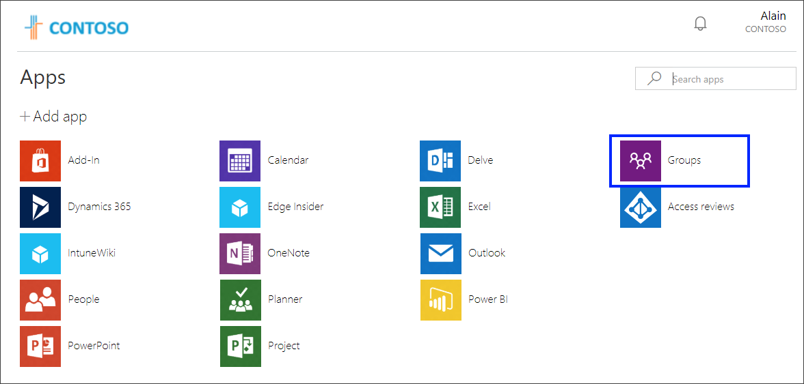
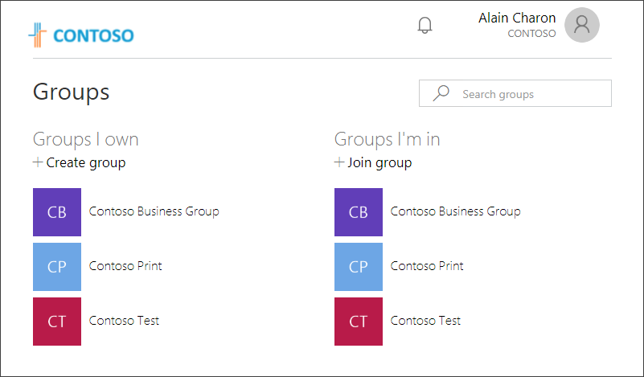
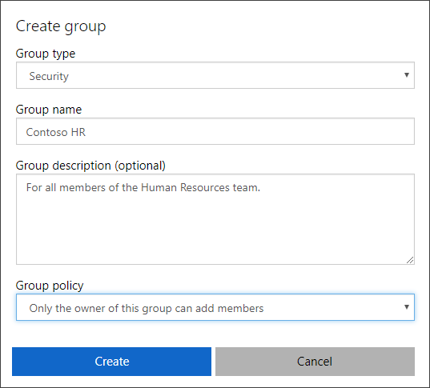
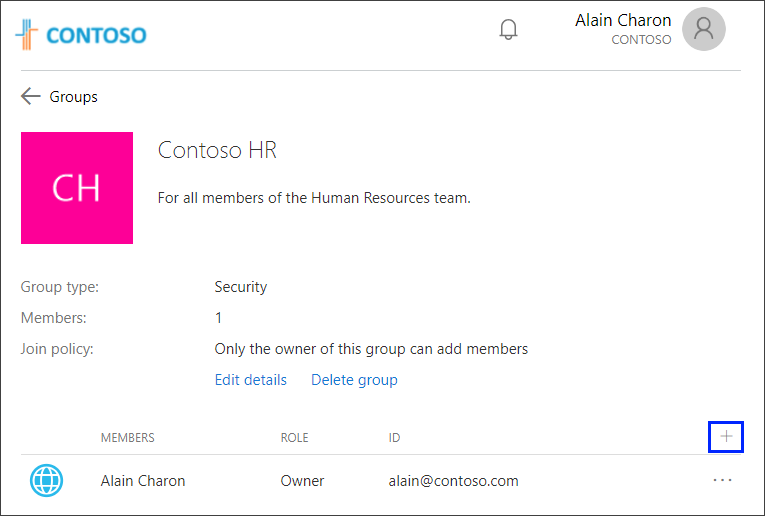
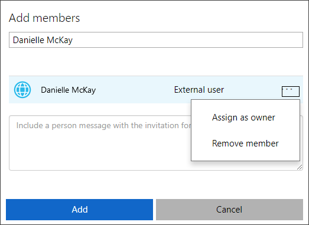
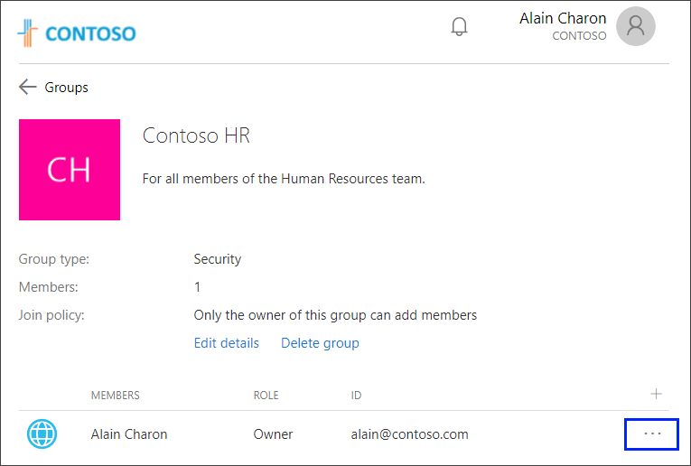
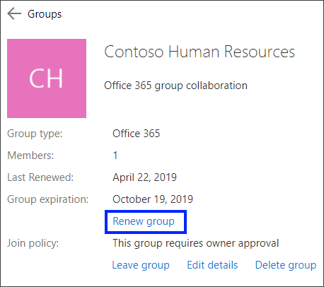
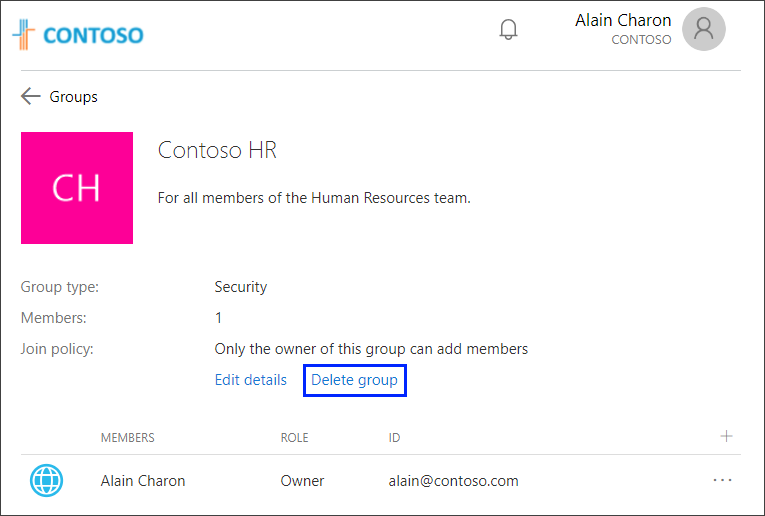
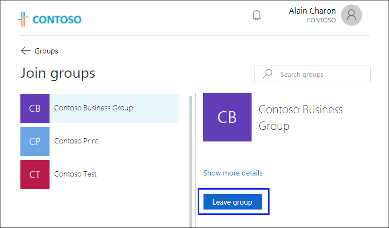

# Update your Groups info from the My Apps portal
You can use your work or school account with the web-based **My Apps** portal, to view and start many of your organization’s cloud-based apps, to update some of your profile and account information, to see your **Groups** information, and to perform **access reviews** for your apps and groups. If you don’t have access to the **My Apps** portal, you must contact your Helpdesk for permission.

[!INCLUDE [preview-notice](../../../includes/active-directory-end-user-my-apps-portal.md)]

>[!Important]
>This content is intended for users. If you're an administrator, you can find more information about how to set up and manage your cloud-based apps in the [Application Management Documentation](https://docs.microsoft.com/azure/active-directory/manage-apps).

## View your Groups information
If your administrator has given you permission to view the **Groups** tile, you can:

- **As a group member.** View details or leave any group.

- **As a group owner.** View details, create a new group, add or remove members, or delete your group.

### To view your Groups information

1.	Sign in to your work or school account.

2.	Open your web browser and go to https://myapps.microsoft.com, or use the link provided by your organization. For example, you might be directed to a customized page for your organization, such as https://myapps.microsoft.com/contoso.com.

    The **Apps** page appears, showing all the cloud-based apps owned by your organization and available for you to use.

    

3. Select the **Groups** tile to see your group-related information.

    

4. Based on your permissions, you can use the **Groups** page to:

    - **Review the groups you own.** View information about any groups you own within your organization from the **Groups I own** area. Selecting a specific group name provides you with more details about the group, including the group type, the number of members, the join policy, and the active members list.

    - **Create a new group.** Create a new group with you as the owner from the **Groups I own** area. For specific steps, see the [Create a new group](#create-a-new-group) section of this article.

    - **Edit an existing group.** Edit the details for any of your own groups. For specific steps, see the [Edit an existing group](#edit-an-existing-group) section of this article.

    - **Add or remove members.** Add or remove members for groups that you own. For specific steps, see the [Add or remove a member](#add-or-remove-a-member) section of this article.

    - **Renew an Office 365 group.** If your organization allows it, you can renew your Office 365 groups. For specific steps, see the [Renew an Office 365 group](#renew-an-office-365-group) section of this article. 

    - **Delete a group.** Delete any groups that you own. For specific steps, see the [Delete a group](#delete-a-group) section of this article.

    - **Review the groups you're a part of.** View the names of any groups to which you're a member from the **Groups I'm in** area. Selecting a specific group name provides you with more details about the group, including the group type, the number of members, the join policy, and the active members list.

    - **Join a group.** Join an existing group, for which you're not already a member, from the **Groups I'm in** area. For specific steps, see the [Join an existing group](#join-an-existing-group).

## Create a new group
1. On the **Groups** page, select **Create a group** from the **Groups I own** area.

    The **Create group** box appears.

    

2. Enter the required information:

    - **Group type:**
        
        - **Security.** Used to manage member and computer access to shared resources for a group of users. For example, you can create a security group for a specific security policy. By doing it this way, you can give a set of permissions to all the members at once, instead of having to add permissions to each member individually.

        - **Office 365.** Provides collaboration opportunities by giving members access to a shared mailbox, calendar, files, SharePoint site, and more. This option also lets you give people outside of your organization access to the group.

    - **Group name.** Add a name for the group, something that you'll remember and that makes sense.

    - **Group description (optional).** Add an optional description to your group.

    - **Group policy.** Choose either to allow everyone to join the group or to only allow the owner of the group to add members.

3. Select **Create**.

    The new group is created with you as the owner and it appears in your **Groups I own** list. Because you're the owner, this group also appears in the **Groups I'm in** list.

## Edit an existing group
After you create a group, you can edit its details, including updating any of the existing information.

### To edit your details
1. Select the group you want to edit from the **Groups** page, and then select **Edit details** on the *&lt;group_name&gt;* page.

    The **Edit details** box appears and you can update the information you added when you initially created the group.

2. Make all of your changes, and then select **Update**.

## Add or remove a member
You can add or remove members for any of your own groups.

### To add or remove a member
1. Select the group you want to add members to, and then select **+** on the *&lt;group_name&gt;* page.

    

2. Search for the member you want to add, from the **Add members** box, and then select **Add**.

    

    An invitation is sent to the new member, to get started accessing the organization's apps.

3. If you added a member by mistake, or if a member has left your organization, you can remove the member by selecting **Remove member** next to the member's name on the *&lt;group_name&gt;* page.

    

## Renew an Office 365 group
If your organization allows it, you can renew an Office 365 group, extending your expiration date.

### To renew a group
1. Select the Office 365 group you want to renew, and then select **Renew group**.

    

2. Click **OK** to close the confirmation message.

    After you refresh the page, you'll see your updated **Last Renewed** and **Group expiration** dates.

## Delete a group
You can delete any of your own groups at any time. However, if you delete a group by mistake you'll have to create it and add members again.

### To delete the group
1. Select the group you want to permanently delete, and then select **Delete group** on the *&lt;group_name&gt;* page.

    

2. Select **Yes** on the confirmation message.

    The group is permanently deleted. 
    
## Join an existing group
You can join an already existing group from the **Groups** page.

### To join or leave a group

1. On the **Groups** page, select **Join group** from the **Groups I'm in** area.

    The **Join groups** page appears.

    

2. On the **Join groups** page, select the name of the group you want to join, view the associated group details, and then if the group is available, select **Join group**.

    If the group requires the group owner to approve membership, you'll be asked to enter a business justification for why you need to join the group, and then select **Request**. If the group doesn't require approval, you're immediately added as a member and the group appears in your **Groups I'm in** list.

3. If you joined a group by mistake or if you no longer need to be part of it, you can select the group name from the **Join groups** page, and then select **Leave group**.

        

## Next steps

- [Access and use apps on the My Apps portal](my-apps-portal-end-user-access.md).

- [Change your profile information](my-apps-portal-end-user-update-profile.md).

- [Perform your own access reviews](my-apps-portal-end-user-access-reviews.md).