# Delegate user management with My Staff (preview)

Your organization can use **My Staff** to delegate user management tasks to figures of authority, such as a store manager or team leader, to help their staff members access the applications that they need. If your team member can't access an application because they forget a password, productivity is lost. This also drives up support costs and causes a bottleneck in your administrative processes.  With My Staff, a team member who can't access their account can regain access in just a couple of clicks, with no administrator help required.

## Manage your staff in My Staff

Managing your team members in My Staff is simple. To start, [go to My Staff](https://aka.ms/mystaff), select a team or location, and then select a user. Locations and the team members in a location are determined by your IT administrator and you can't change them.

If you manage more than one location, when you go to My Staff you must select a location to see the team member who are assigned to the location.

If you don't yet have sufficient permissions to access My Staff, you'll see the following message "Oops, seems you're not authorized to see My Staff at this time. Please contact your admin for more information."

### Find a staff member in My Staff

You must open the profile of a staff member before you can start managing them.

1. [Open My Staff](https://aka.ms/mystaff) and, if needed, select a location.

    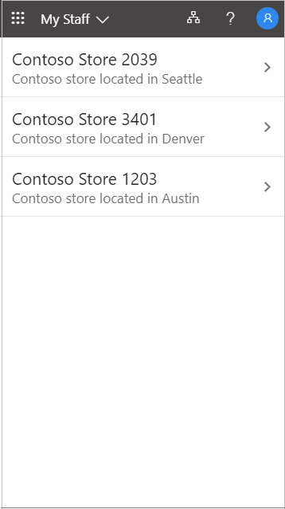

1. Open a team member's profile.

    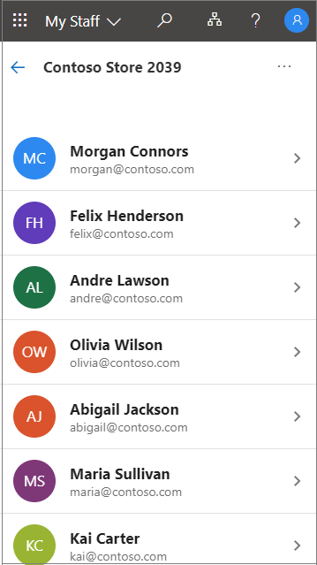

## Reset a user password

If your organization has given you permission, you can reset passwords for your staff members.

1. [Open My Staff](https://aka.ms/mystaff).
1. Open a staff member's profile.
1. Select **Reset password**.

    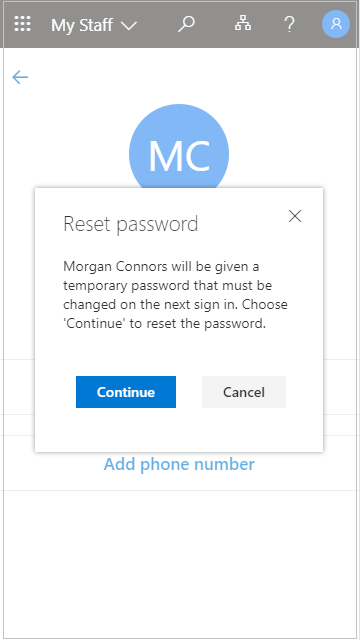

1. Generate or enter the new password. You might be shown an automatically generated temporary password or you might be asked to enter a temporary password for the user.

    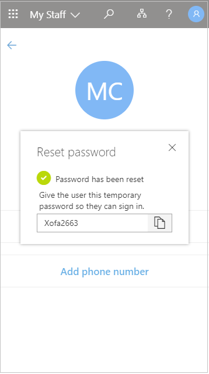

After you have reset the user's password, give the user the temporary password. When the user signs in with their temporary password, they are required to change it.

## Manage a user's phone number

If your organization has given you permission, you can manage phone numbers for your staff members.

### Add a phone number

1. [Open My Staff](https://aka.ms/mystaff).
1. Open a staff member's profile.
1. Select **Add phone number**.

    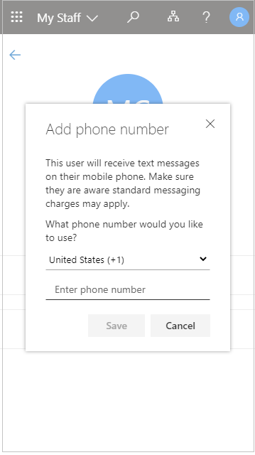

1. Add the phone number and select **Save**.

    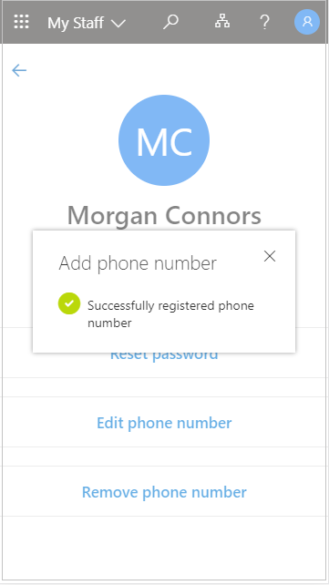

After you register a phone number for a user, they can use it to sign in with SMS, perform two-step verification, or reset their password on their own, depending on your organization's settings.

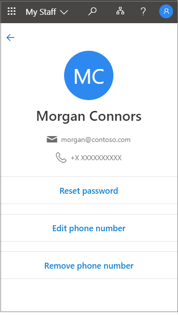

### Edit a phone number

1. [Open My Staff](https://aka.ms/mystaff).
1. Open a staff member's profile.
1. Select **Edit phone number**.

    

1. Enter the new phone number and select **Save**.

    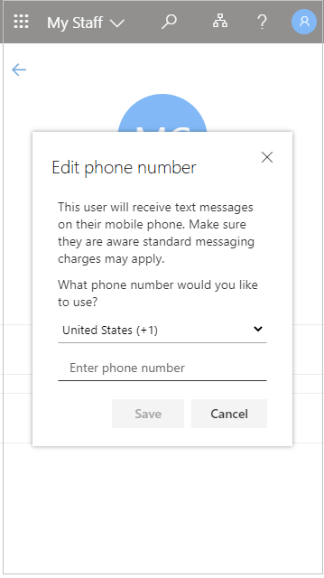

### Enable phone number sign-in for a user

If sign-in using a phone number as a username (SMS sign-in) is enabled in your organization, you can add this authentication to an existing user phone number.

1. [Open My Staff](https://aka.ms/mystaff).
1. Open a staff member's profile.
1. If there's a message at the bottom of the screen saying that signing in with your phone number as a username is available for you, select **Enable** to begin the process. This message appears if the user has been enabled to sign in with their phone number.

    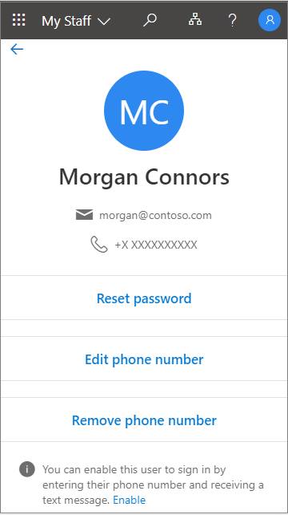

1. Select **OK** when you're done.

    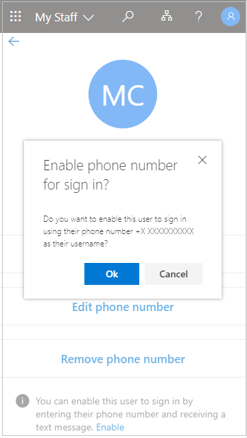

### Remove a phone number

1. [Open My Staff](https://aka.ms/mystaff).
1. Open a staff member's profile.
1. Select **Remove phone number**.
1. Select **Delete** when you're done.

    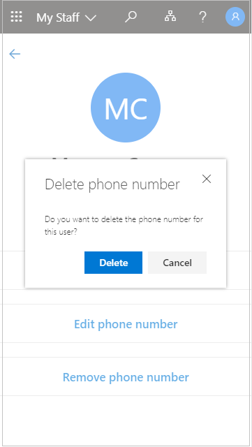
