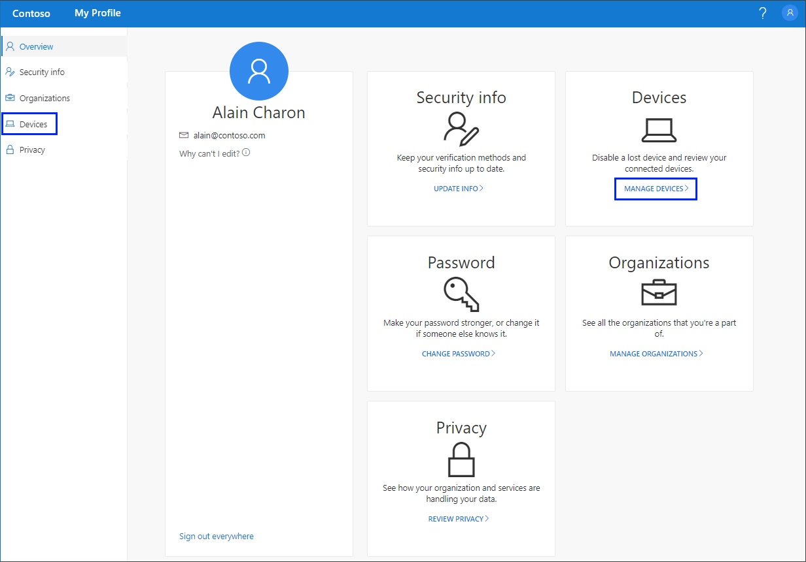
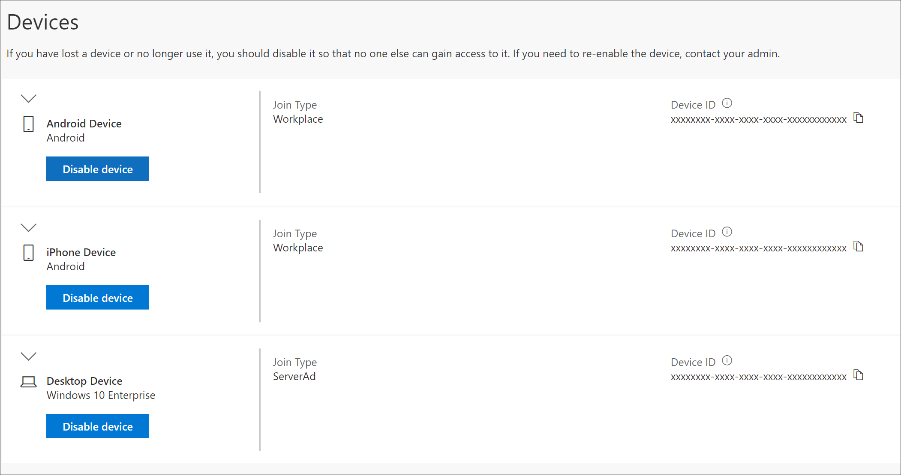

# Manage your connected devices from the My Profile (preview) portal
You can manage the devices you're connected to using your work or school account, disabling any that you no longer own, from the **Devices** page of the **My Profile** portal.

[!INCLUDE [preview-notice](../../../includes/active-directory-end-user-preview-notice-myprofile.md)]

## View your connected devices
1. Sign in to your work or school account and then go to your https://myprofile.microsoft.com/ page.

2. Select **Devices** from the left navigation pane or select the **Manage devices** link from the **Devices** block.

    

3. Review the information for your connected devices, making sure you recognize them all. 

    

## Disable a device
You can disable any of your connected devices at any time. This is especially important if a device isn't familiar to you or if a device is lost or stolen. After you disable a device, it can no longer be authenticated by your organization, and will be unable to access any of your organization's resources.

>[!Important]
>If you disable a device by mistake, there's no way to undo it. You'll have to contact your organization's administrator to add the device again.

1. Select **Disable** from the device you want to remove.

    

2. Select **Yes** to confirm you want to disable the device.

## Next steps

- After viewing your connected devices, you can select to view or manage your [security info](user-help-security-info-overview.md), your [organizations](myprofile-portal-organizations-page.md), or view how your organization [uses your data](myprofile-portal-privacy-page.md).