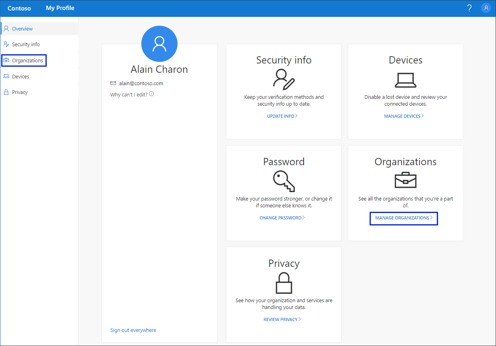
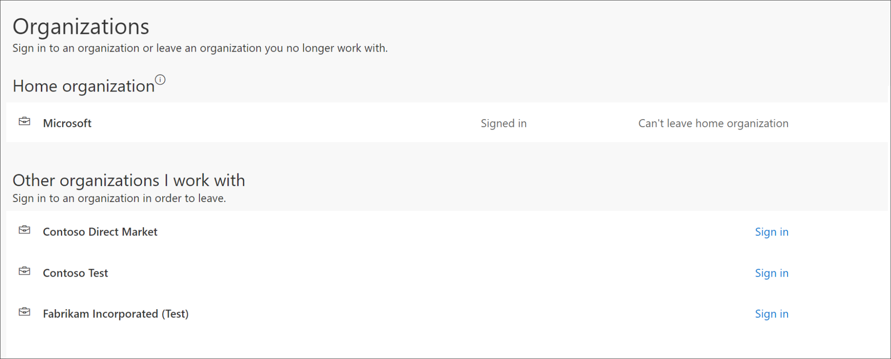
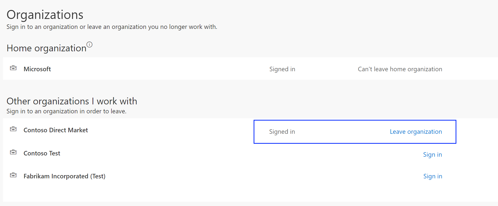

# Manage your organizations from the My Profile (preview) portal
You can manage your organizations from the **Organizations** page of the **My Profile** portal.

There are two types of organizations shown on the **Organizations** page:

- **Home organization.** Your home organization is the organization that owns your work or school account. You can't leave your home organization.

- **Other organizations.** The other organizations are any group that you've signed in to previously using your work or school account. You can leave any of these organizations at any time.

[!INCLUDE [preview-notice](../../../includes/active-directory-end-user-preview-notice-myprofile.md)]

## View your organizations
1. Sign in to your work or school account and then go to your https://myprofile.microsoft.com/ page.

2. Select **Organizations** from the left navigation pane or select the **Manage organizations** link from the **Organizations** block.

    

3. Review the information for your **Home organization**. 

    

3. Review your other associated organizations, making sure you recognize all of the organizations connected to your account.

## Leave an organization
You can leave any organization that isn't your Home organization.

>[!Important]
>If you leave an organization by mistake, there's no way to undo it. You'll have to add the organization again.

1. Sign in to your account from the **Other organizations I work with** area.

2. Select **Leave organization**, and then select **Yes** to confirm you want to leave the organization.

    

## Next steps

- After viewing your organizations, you can select to view or manage your [security info](user-help-security-info-overview.md), connected [devices](myprofile-portal-devices-page.md), or view how your organization [uses your data](myprofile-portal-privacy-page.md).