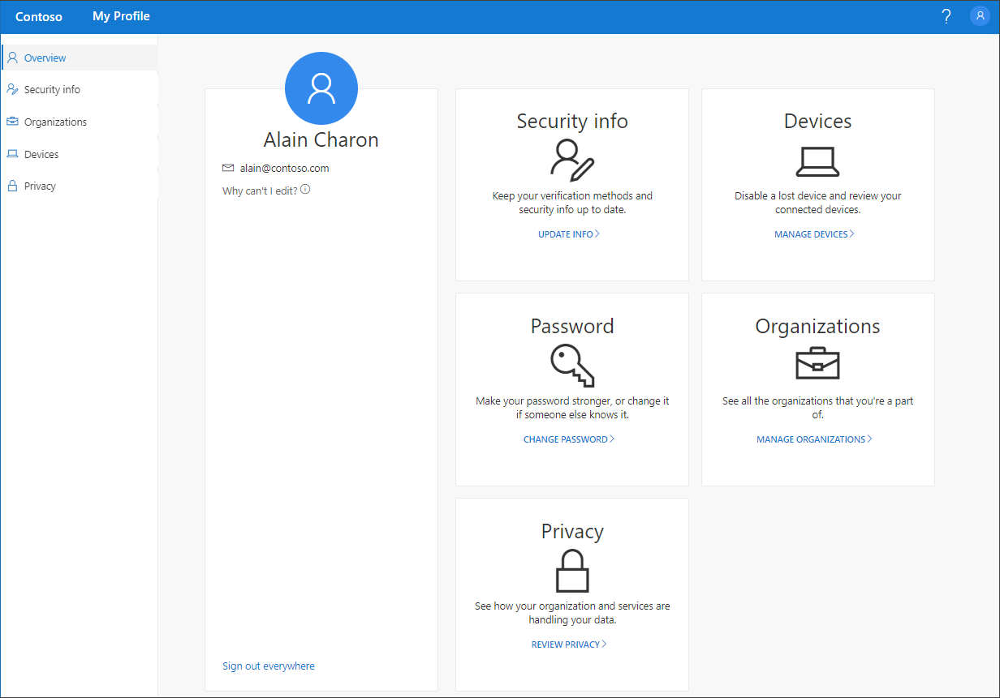

# My Profile (preview) portal overview

[!INCLUDE [preview-notice](../../../includes/active-directory-end-user-preview-notice-myprofile.md)]

The **My Profile** (preview) portal helps you to manage your work or school account by setting up and managing your security info, managing your connected organizations and devices, and viewing how your organization uses your data.

>[!Important]
>This content is intended for users. If you're an administrator, you can find more information about how to set up and manage your Azure Active Directory (Azure AD) environment in the [Azure Active Directory Documentation](https://docs.microsoft.com/azure/active-directory).

## Go to the My Profile portal

You can get to the **My Profile** portal (https://myprofile.microsoft.com), from the current version of any of the following browsers:

- Chrome
- Microsoft Edge
- Safari
- Firefox
- Internet Explorer 11

## My Profile portal articles

For detailed information and instructions about what's available from the **My Profile** portal, see the following articles:

|Article |Description |
|------|------------|
|[Add your security info](user-help-security-info-overview.md)| Several articles with instructions about how to set up the Microsoft Authenticator app, text messaging, or phone calls as your verification method. Also includes articles about how to add an email address or pre-defined security questions so you can reset your own forgotten password, if necessary.|
|[View or leave your connected organizations](myprofile-portal-organizations-page.md)| Instructions about how to view and leave organizations connected to your work or school account.|
|[View or disable your connected devices](myprofile-portal-devices-page.md)| Instructions about how to view or disable any devices you've connected to your work or school account.|
|[View your privacy-related info](myprofile-portal-privacy-page.md)| Instructions about how to view which online services are connected to your work or school account, along with your organization's terms of use statement.|