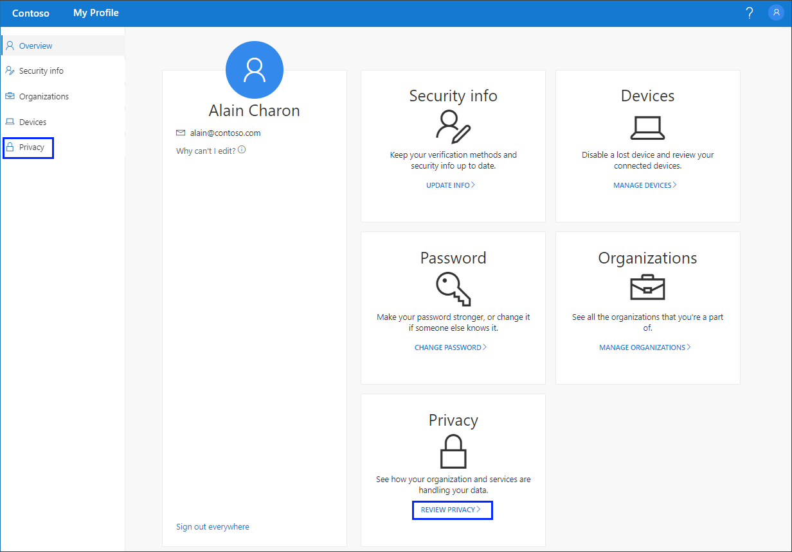

# View your privacy-related info from the My Profile (preview) portal
You can view how your organization uses your data from the **Privacy** page of the **My Profile** portal.

[!INCLUDE [preview-notice](../../../includes/active-directory-end-user-preview-notice-myprofile.md)]

## View your privacy-related info
1. Sign in to your work or school account and then go to your https://myprofile.microsoft.com/ page.

2. Select **Privacy** from the left navigation pane or select the **Review privacy** link from the **Privacy** block.

    

3. Review the information, including:

    - **Services.** A list of online services you're connected to using your work or school account.

    - **Terms of use**. Your organization's terms of use.

## Next steps

- After viewing how your organization uses your data, you can select to view or manage your [security info](user-help-security-info-overview.md), your connected [devices](myprofile-portal-devices-page.md), or your [organizations](myprofile-portal-organizations-page.md).