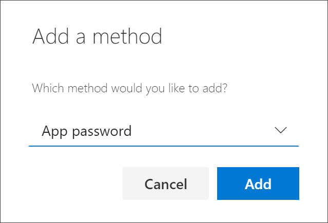
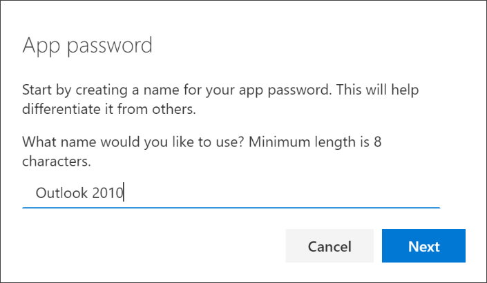
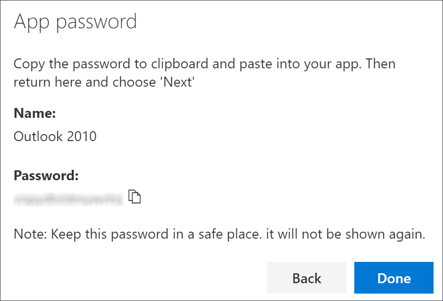
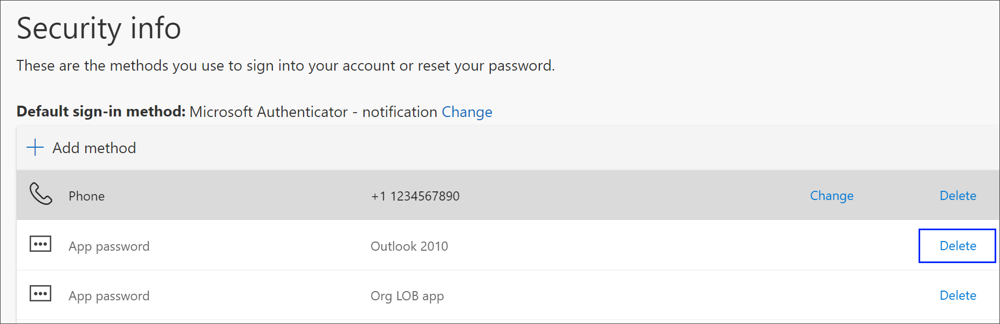

# Create app passwords from the Security info (preview) page

Certain apps, such as Outlook 2010, don't support two-step verification. This lack of support means that if you're using two-step verification in your organization, the app won't work. To get around this problem, you can create an auto-generated password to use with each non-browser app, separate from your normal password.

[!INCLUDE [preview-notice](../../../includes/active-directory-end-user-preview-notice-security-info.md)]

>[!Important]
>Your administrator may not allow you to use app passwords. If you don't see **App passwords** as an option, they're not available in your organization.

When using app passwords, it's important to remember:

- App passwords are auto-generated, and should be created and entered once per app.

- There's a limit of 40 passwords per user. If you try to create one after that limit, you'll be prompted to delete an existing password before being allowed to create the new one.

    >[!Note]
    >Office 2013 clients (including Outlook) support new authentication protocols and can be used with two-step verification. This support means that after two-step verification is turned on, you'll no longer need app passwords for Office 2013 clients. For more info, see the [How modern authentication works for Office 2013 and Office 2016 client apps](https://support.office.com/article/how-modern-authentication-works-for-office-2013-and-office-2016-client-apps-e4c45989-4b1a-462e-a81b-2a13191cf517) article.

## Create new app passwords

If you use two-step verification with your work or school account and your administrator has turned on the security info experience, you can create and delete your app passwords using the **Security info** page.

>[!Note]
>If your administrator hasn't turned on the security info experience, you must follow the instructions and information in the [Manage app passwords for two-step verification](multi-factor-authentication-end-user-app-passwords.md) section.

### To create a new app password

1. Sign in to your work or school account and then go to your https://myprofile.microsoft.com/ page.

    

2. Select **Security info** from the left navigation pane or from the link in the **Security info** block, and then select **Add method** from the **Security info** page.

    

3. On the **Add a method** page, select **App password** from the drop-down list, and then select **Add**.

    

4. Type the name of the app that requires the app password, and then select **Next**.

    

5. Copy the text from the **Password** box, paste the password in the password area of the app (in this example, Outlook 2010), and then select **Done**.

    

    The password is added and you can successfully log in to your app going forward.

## Delete your app passwords

If you no longer need to use an app that requires an app password, you can delete the associated app password. Deleting the app password frees up one of the available app password spots for use in the future.

>[!Important]
>If you delete an app password by mistake, there's no way to undo it. You'll have to create a new app password and re-enter it into the app, following the steps in the [Create new app passwords](#create-new-app-passwords) section of this article.

### To delete an app password

1. On the **Security info** page, select the **Delete** link next to the **App password** option for the specific app.

    

2. Select **Yes** from the confirmation box to delete the **App password**. After the app password is deleted, it's removed from your security info and it disappears from the **Security info** page.

## For more information

- For more information about the **Security info** page and how to set it up, see [Security info overview](user-help-security-info-overview.md)
