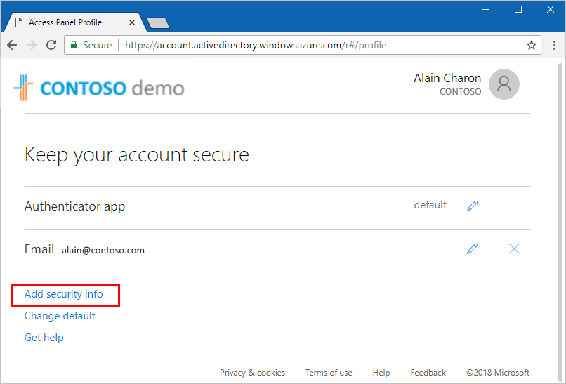
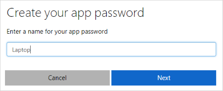
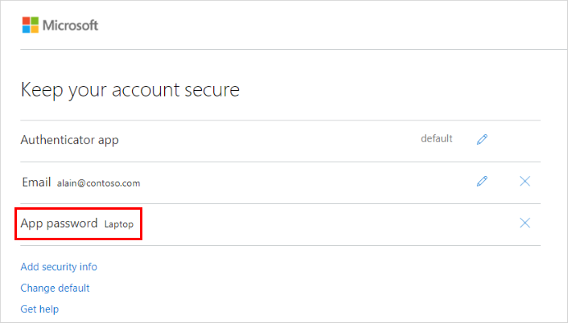
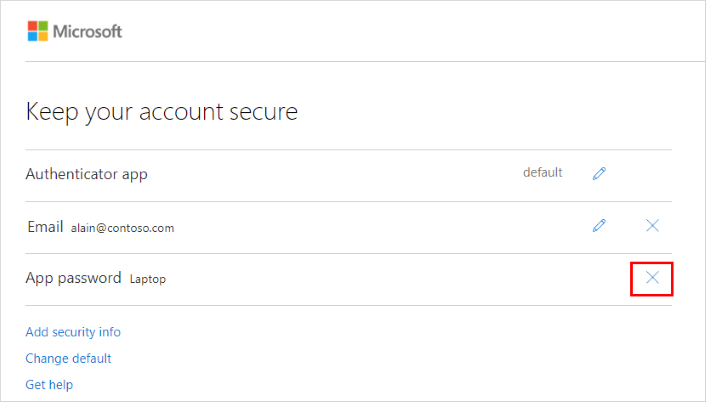
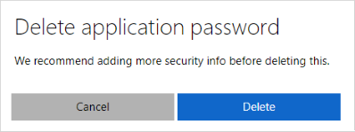

# Manage app passwords using security info (preview)

[!INCLUDE [preview-notice](../../../includes/active-directory-end-user-preview-notice-security-info.md)]

Certain non-browser apps, such as Outlook 2010, doesn't support two-step verification. This lack of support means that if you're using two-step verification, the app won't work. To get around this problem, you can create an auto-generated password to use with each non-browser app, separate from your normal password.

When using app passwords, it's important to remember:

- App passwords are auto-generated and only entered once per app.

- There's a limit of 40 passwords per user. If you try to create one after that limit, you'll be prompted to delete an existing password before being allowed to create the new one.

- Use one app password per device, not per app. For example, create a single password for all the apps on your laptop, and then another single password for all the apps on your desktop.

    >[!Note]
    >Office 2013 clients (including Outlook) support new authentication protocols and can be used with two-step verification. This support means that after two-step verification is turned on, you'll no longer need app passwords for Office 2013 clients. For more info, see the [How modern authentication works for Office 2013 and Office 2016 client apps](https://support.office.com/article/how-modern-authentication-works-for-office-2013-and-office-2016-client-apps-e4c45989-4b1a-462e-a81b-2a13191cf517) article.

## Create and delete app passwords using security info

If you use two-step verification with your work or school account and your administrator has turned on the security info experience, you can create and delete your app passwords using the My Apps portal.

If your administrator hasn't turned on the security info experience, you must follow the instructions and information in the [Manage app passwords for two-step verification](multi-factor-authentication-end-user-app-passwords.md) section.

### To create app passwords using the My Apps portal

1. Sign in to your work or school account.

2. Go to myapps.microsoft.com, select your name from the upper right corner of the page, and then select **Profile**.

3. In the **Manage account** area, select **Edit security info**.

    

4. In the **Keep your account secure** screen, select **Add security info**.

    

5. In the **Add security info** screen, select **App password**.

6. In the **Create your app password** screen, type a name for your app password, and then select **Next**.

    

7. Select **Copy** to copy the password to clipboard, and then select **Next**.

    
    
8. Make sure the app password appears on the **Keep your account secure** screen.

    

### To delete app passwords using the My Apps portal

1. On the **Keep your account secure** screen, select the **X** next to the app password to delete.

    

2. In the **Delete application password** screen, select **Delete**.

    

## Next steps

- If you need to update your security info, follow the instructions in the [Manage your security info](security-info-manage-settings.md) article.

- For more general info about security info and what you can do, see [Security info overview](user-help-security-info-overview.md) 