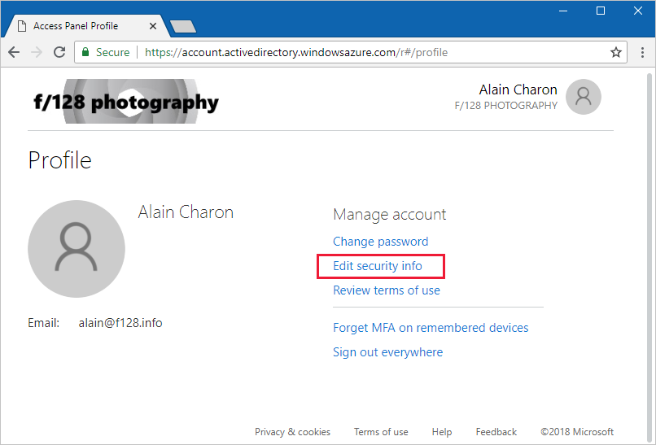
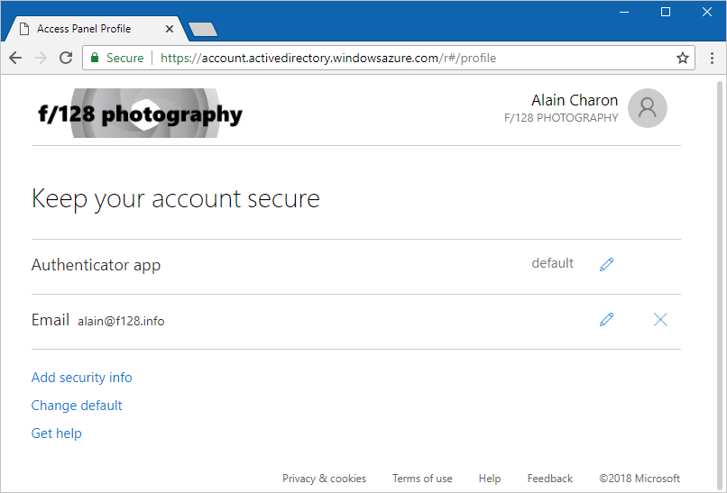
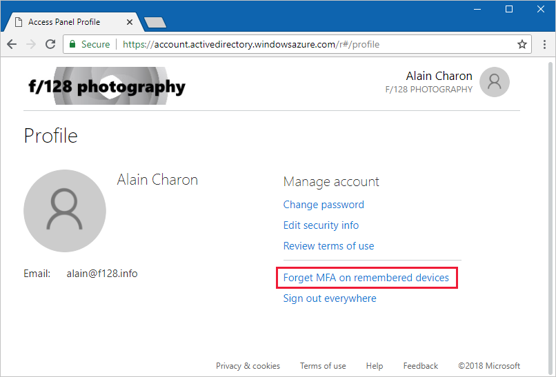

---
title: Manage your security info - Azure Active Directory | Microsoft Docs
description: Learn how to manage your security info, including how to work with your two-step verification settings.
services: active-directory
author: eross-msft
manager: mtillman
ms.reviewer: sahenry

ms.service: active-directory
ms.component: user-help
ms.workload: identity
ms.topic: conceptual
ms.date: 07/30/2018
ms.author: lizross
---

# Manage your security info (preview)

[!INCLUDE [preview-notice](../../../includes/active-directory-end-user-preview-notice-security-info.md)]

You can use your security info to sign in to your work or school account or to reset your password.

When you sign in, depending on your organization's settings, you might see a check box that says, **Don't ask again for X days**. This check box lets you stay signed in to your device for the number of days your administrator allows, without requiring reverification.

## Change your info
You can update or add security info or change your default, based on what's allowed by your administrator and your organization.

### To change your info

1. Sign in to your work or school account.

2. Go to myapps.microsoft.com, select your name from the upper right corner of the page, and then select **Profile**.

3. In the **Manage account** area, select **Edit security info**.

    

4. Use your default method to approve the access and to see your current security info details, if your admin has set up this experience for your organization.

5. On the **Keep your account secure** page, you can:

    - Select **Add security info** to add additional methods.

    - Select **Change default** to change your default method.

    - Select the **pencil** icon next to an existing method to update your info.

    

6. After you make your changes, you can leave the page and your changes will be saved.

If you don't see these options or you're unable to access the myapps.microsoft.com page, it's possible that your organization uses custom options or a custom page. You'll need to contact your administrator for more help.

## Manage your security info for a lost or potentially compromised device

If you lose your device or your device becomes compromised, you'll have to redo the verification process for all of your previously trusted devices.

### To manage your security info for lost or potentially compromised devices

1. Sign in to your work or school account.

2. Go to myapps.microsoft.com, select your name from the upper-right corner of the page, and then select **Profile**.

3. In the **Manage account** area, select **Forget MFA on remembered devices**.
    
    Choosing this option means that you'll have to go through the Multi-Factor Authentication process again after you sign in.

    

## Common problems and solutions with your security info

This article helps you to troubleshoot your security info, including two-step verification-related problems.

|Problem|Solution|
|-------|--------|
|I don't have my phone with me|It's possible that you don't have your phone with you at all times, but that you'll still want to sign in to your work or school account. To fix this problem, you can sign in using a different authentication method that doesn't require your phone, such as your email address or your office phone number. To add additional methods to your security info, you can follow the steps in the [Change your info](#change-your-info) section.|
|I lost my phone or it was stolen|Unfortunately, losing your phone or it being stolen can happen. In this situation, it's highly recommended that you let your organization know so your IT staff can reset your app passwords and clear any remembered devices from your trusted devices list. You can also forget your own trusted devices by following the steps in the [Manage your security info for a lost or potentially compromised device](#manage-your-security-info-for-a-lost-or-potentially-compromised-device) section.|
|I got a new phone number|There are two ways to fix this problem. You can sign in using an alternate authentication method that doesn't require your phone number, such as email, or if that's not an option, you can contact your organization's IT staff and have them clear your settings. To add additional methods to your security info, you can follow the steps in the [Change your info](#change-your-info) section.|
|My default method is wrong|You can update your default method in your security options. For specific details, you can go to the [Change your info](#change-your-info) section.|
|I'm not receiving a text or call on my mobile device|If you've successfully received texts or phone calls to your mobile device in the past, then this issue is most-likely with the phone provider, not your account. Make sure that you have good cell signal, and that you're able to receive text messages and phone calls. You can ask a friend to call or text you as a test.  If you can successfully receive text and phone messages, but you still haven't gotten the notification, you can try using a different method. You can add additional methods to your security info by following the steps in the [Change your info](#change-your-info) section. If you don’t have another method to add, you can contact your company support and ask them to clear your settings so you can set up your methods the next time you sign in.  If you often have problems because of bad cell reception, we recommend you use the Microsoft Authenticator app on your mobile device. The app can generate random security codes that you use to sign in, and these codes don't require any cell signal or internet connection. For more info about the Microsoft Authenticator app, see the [Get started with the Microsoft Authenticator app](https://docs.microsoft.com/azure/multi-factor-authentication/end-user/microsoft-authenticator-app-how-to) article.|
|None of the options in this table has solved my problem|If you've tried these troubleshooting steps, but are still running into problems; contact your company support, they should be able to help you.|

## Next steps

- Learn more about security info in [Security info (preview) overview](user-help-security-info-overview.md).

- Learn about two-step verification in the [Two-step verification overview](user-help-two-step-verification-overview.md) article. 

- Follow one of these how-to articles to learn about how to set up your devices in the security info area:

    - [Set up security info to use an authenticator app](security-info-setup-auth-app.md)

    - [Set up security info to use phone calls](security-info-setup-phone-number.md)

    - [Set up security info to use text messages](security-info-setup-text-msg.md)

    - [Set up security info to use email](security-info-setup-email.md)

    - [Set up security info to use security questions](security-info-setup-questions.md)

- Reset your password if you've lost or forgotten it, from the [Password reset portal](https://passwordreset.microsoftonline.com/) or follow the steps in the [Reset your work or school password](user-help-reset-password.md) article.

- Get troubleshooting tips and help for sign-in problems in the [Can't sign in to your Microsoft account](https://support.microsoft.com/help/12429/microsoft-account-sign-in-cant) article.