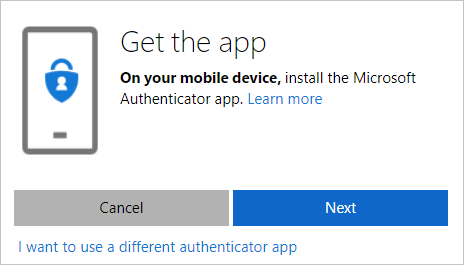
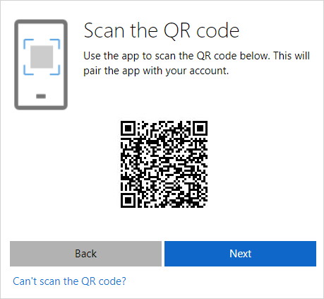

---
title: Set up security info to use an authenticator app - Azure Active Directory | Microsoft Docs
description: Set up your security info to verify your identity using the Microsoft Authenticator app.
services: active-directory
author: eross-msft
manager: mtillman
ms.reviewer: sahenry

ms.service: active-directory
ms.workload: identity
ms.component: user-help
ms.topic: conceptual
ms.date: 07/30/2018
ms.author: lizross
---

# Set up security info to use an authenticator app (preview)

[!INCLUDE [preview-notice](../../../includes/active-directory-end-user-preview-notice-security-info.md)]

Setting up your security info requires you to sign in to your work or school account and then complete the registration process. If you've never set up your security info, you'll be asked to do it now.

## Set up the Microsoft Authenticator app

Depending on your organization’s settings, you may be prompted to set up the Microsoft Authenticator app when you sign in. Otherwise, to begin setting up the Microsoft Authenticator app in security info, follow the steps in [Manage your security info](security-info-manage-settings.md).

To download and learn more about the Microsoft Authenticator app, see [Get started with the Microsoft Authenticator app](microsoft-authenticator-app-how-to.md).

>[!Note]
>If you don't want to use the Microsoft Authenticator app, you can choose a different app during set up. This article uses the Microsoft Authenticator app. If you don't see the authenticator app option, it's possible that your organization doesn't allow you to use an authentication app for verification. If this is the case, you'll need to choose another method or contact your administrator for more help.

### To use the Microsoft Authenticator app

1. Select the **Authenticator app** option.

    The **Get the app** wizard appears.

    

    If you don't want to use the Microsoft Authenticator app, you can click the **I want to use a different authenticator app** link from the **Get the app** screen.

2. After you install the Microsoft Authenticator app, select **Next**.

    If you're prompted, allow notifications, add a new account, and then select **Work or school account**.

3. Select **Next**.

    The **Scan the QR code** screen appears.

    

4. Open the Microsoft Authenticator app, select **Add account** from the **Customize and control** icon in the upper-right, and then select **Work or school account**. 

5. If you have a QR code reader app, scan the provided code. If you don't have a code reader app, you can select the **Can't scan the QR code link** and manually enter the code and URL into the Microsoft Authenticator app.

6. Use the Microsoft Authenticator app to approve the notification to activate the app.

    Your security info is updated to use the Microsoft Authenticator app to verify your identity when using two-step verification or self-service password reset.

    >[!Note]
    >If your organization allows it, you'll also get a verification code along with the Microsoft Authenticator app notification. If you want to make the code your default method, follow the instructions in [Manage your security info](security-info-setup-auth-app.md).

## Additional security info options

You have additional options for how your organization contacts you to verify your identity, based on what's you're trying to do. The options include:

- **Mobile device text.** Enter your mobile device number and get a text a code you'll use for two-step verification or password reset. For step-by-step instructions about how to verify your identity with a text message (SMS), see [Set up security info to use text messaging (SMS)](security-info-setup-text-msg.md).

- **Mobile device or work phone call.** Enter your mobile device number and get a phone call for two-step verification or password reset. For step-by-step instructions about how to verify your identity with a phone number, see [Set up security info to use phone calls](security-info-setup-phone-number.md).

- **Email address.** Enter your work or school email address to get an email for password reset. This option isn't available for two-step verification. For step-by-step instructions about how to set up your email, see [Set up security info to use email](security-info-setup-email.md).

- **Security questions.** Answer some security questions created by your administrator for your organization. This option is only available for password reset and not for two-step verification. For step-by-step instructions about how to set up your security questions, see the [Set up security info to use security questions](security-info-setup-questions.md) article.
    
    >[!Note]
    >If some of these options are missing, it's most likely because your organization doesn't allow those methods. If this is the case, you'll need to choose an available method or contact your administrator for more help.

## Next steps

- If you need to update your security info, follow the instructions in the [Manage your security info](security-info-manage-settings.md) article.

- Reset your password if you've lost or forgotten it, from the [Password reset portal](https://passwordreset.microsoftonline.com/) or follow the steps in the [Reset your work or school password](user-help-reset-password.md) article.

- Get troubleshooting tips and help for sign-in problems in the [Can't sign in to your Microsoft account](https://support.microsoft.com/help/12429/microsoft-account-sign-in-cant) article.