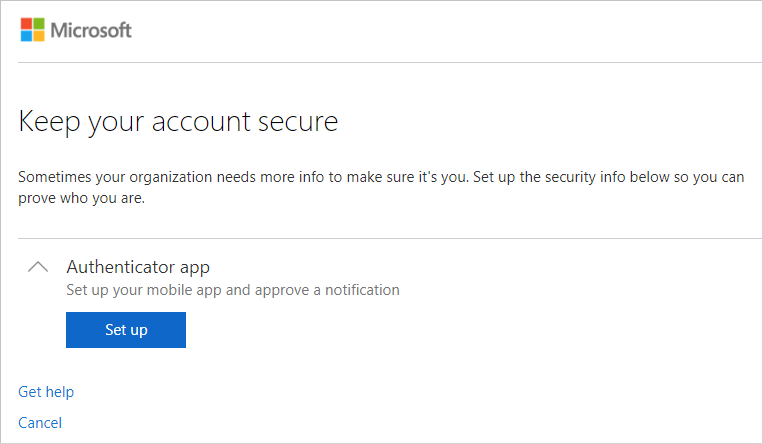

# How to: Set up your security info to use an authenticator app (Preview)

[!INCLUDE[preview-notice](../../../includes/active-directory-end-user-preview-notice-security-info.md)]

Setting up your security info verification method requires you to sign in to your work or school account and then complete the registration process. If you've never set up a verification method for your account, you'll be asked to do it now.

You have options for how your organization contacts you to verify your identity, based on what's you're trying to do. The options include:

- **Authenticator app.** Download and use an authenticator app to get either an approval notification or a randomly generated approval code for two-step verification or self-service password reset verification. For step-by-step instructions about how to verify your identity with the Microsoft Authenticator app, see the [Set your verification method to the Microsoft Authenticator app](#set-your-verification-method-to-the-microsoft-authenticator-app) section of this article.

- **Mobile device text.** Enter your mobile device number and get a text a code you'll use for two-step verification or self-service password reset verification. For step-by-step instructions about how to verify your identity with a text message (SMS), see the [Set up your security info to use a text message (SMS)](security-info-setup-text-msg.md) article.

- **Mobile device or work phone call.** Enter your mobile or work phone number to get a verification call or text message for two-step verification or self-service password reset verification. For step-by-step instructions about how to verify your identity with a phone number, see the [Set up your security info to use a phone number](security-info-setup-phone-number.md) article.

- **Email address.** Enter your work or school email address to get a verification email. This option is only available for self-service password reset and not for two-step verification. For step-by-step instructions about how to set up your email verification, see the [Set up your security info to use email](security-info-setup-email.md) article.

- **Security questions.** Answer some security questions created by your administrator for your organization for verification. This option is only available for self-service password reset and not for two-step verification. For step-by-step instructions about how to set up your security questions, see the [Set up your security info to use security questions](security-info-setup-questions.md) article.

>[!Note]
>If some of these options are missing, it's most likely because your organization doesn't allow those methods for secondary verification. If this is the case, you'll need to choose an available verification method or contact your administrator for more help.

## Set your verification method to the Microsoft Authenticator app

Follow this process to set your security info to use the Microsoft Authenticator app for both two-step verification and self-service password reset. To download and learn more about the Authenticator app, see [Get started with two-step verification](microsoft-authenticator-app-how-to.md).

>[!Note]
>If you don't want to use the Microsoft Authenticator app, you can choose a different app during set up. This article uses the Microsoft Authenticator app.

### To use the Microsoft Authenticator app

1. Sign in to your work or school account.

    The **More information required** box appears.

    

    Depending on your organization, you might be allowed to wait 14 before adding your security info. If you don't see this option, it means that it's not available.

2. Select **Next** to begin setting up your security info.

    The **Keep your account secure** page appears.

     

3. Select **Set up** for the **Authenticator app** option.

    The **Get the app** wizard appears.

    

    If you don't want to use the Microsoft Authenticator app, you can click the **I want to use a different authenticator app** link from the **Get the app** screen.

4. Select **Next**.

    If you're prompted, allow notifications, add a new account, and then select **Work or school account**.

5. Select **Next**.

    The **Scan the QR code** screen appears.

    

6. Open the Microsoft Authenticator app, select **Add account** from the **Customize and control** icon in the upper-right, and then select **Work or school account**. 

7. If you have a QR code reader app, scan the provided code. If you don't have a code reader app, you can select the **Can't scan the QR code link** and manually enter the code and URL into the Microsoft Authenticator app.

8. Use the Microsoft Authenticator app to approve the notification to activate the app.

    Your security info is updated to use the Microsoft Authenticator app to verify your identity when using two-step verification or self-service password reset.

## Next steps

- If you need to update your security info, follow the instructions in the [Manage your security info](security-info-manage-settings.md) article.

- Reset your password if you've lost or forgotten it, from the [Password reset portal](https://passwordreset.microsoftonline.com/) or follow the steps in the [Reset your work or school password](user-help-reset-password.md) article.

- Get troubleshooting tips and help for sign-in problems in the [Can't sign in to your Microsoft account](https://support.microsoft.com/help/12429/microsoft-account-sign-in-cant) article.