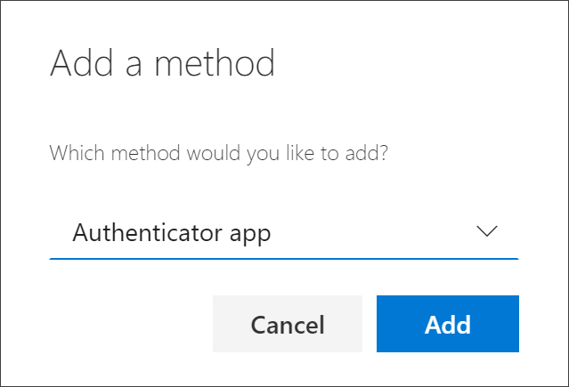
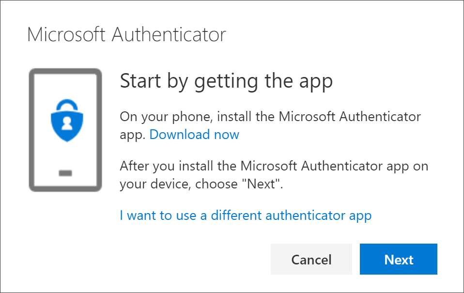
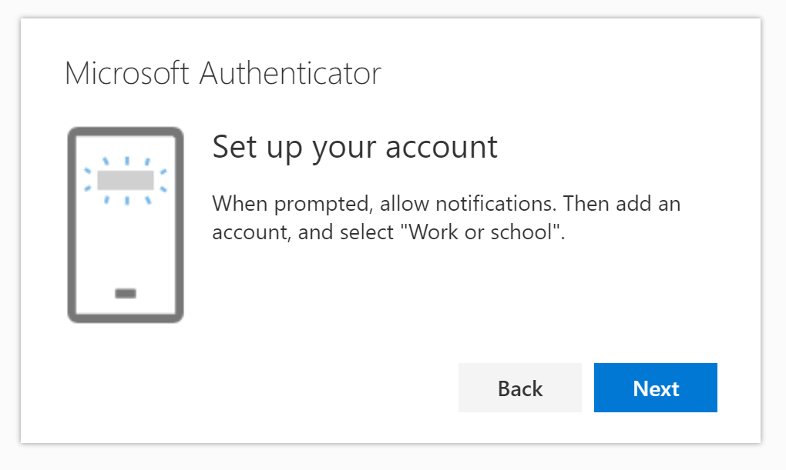
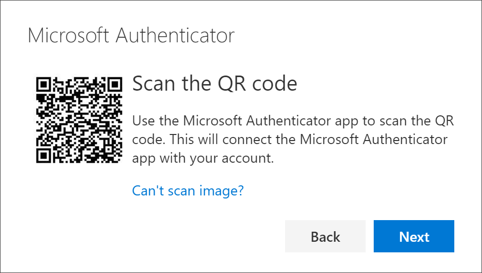
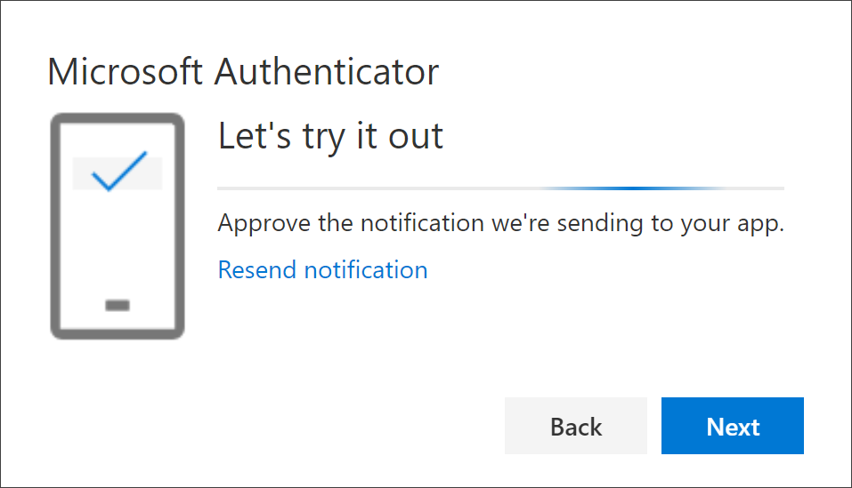
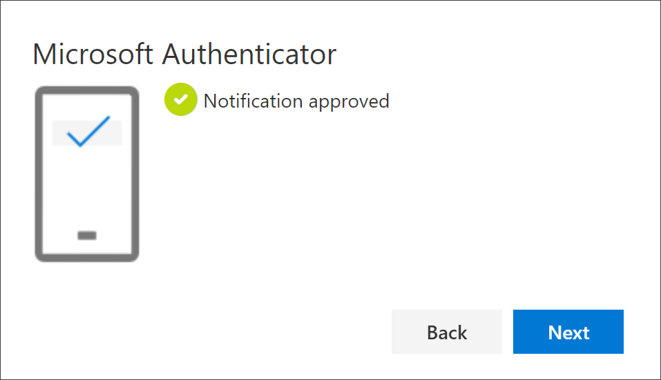
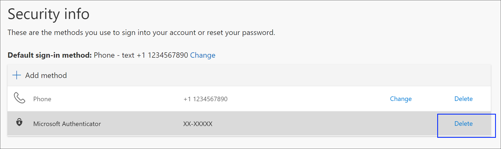
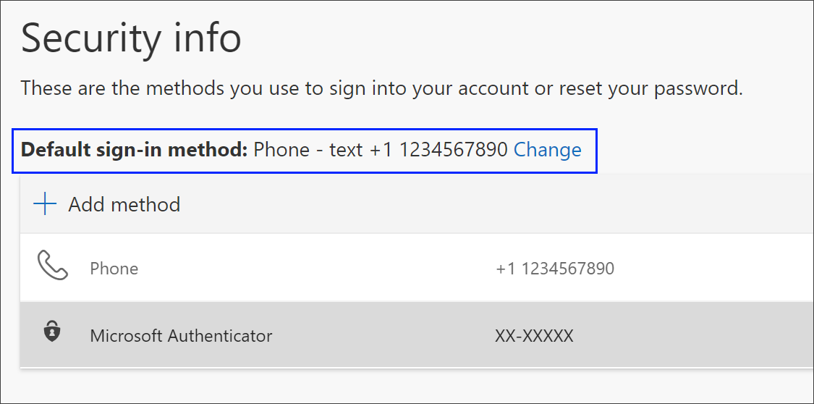
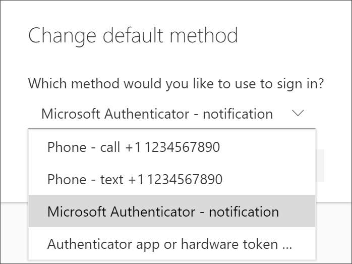

# Set up the Microsoft Authenticator app as your verification method

You can follow these steps to add your two-factor verification and password reset methods. After you've set this up the first time, you can return to the **Security info** page to add, update, or delete your security information.

If you're prompted to set this up immediately after you sign in to your work or school account, see the detailed steps in the [Set up your security info from the sign-in page prompt](security-info-setup-signin.md) article.

[!INCLUDE [preview-notice](../../../includes/active-directory-end-user-preview-notice-security-info.md)]

>[!Note]
> If you don't see the authenticator app option, it's possible that your organization doesn't allow you to use this option for verification. In this case, you'll need to choose another method or contact your organization's help desk for more assistance.

## Security vs password reset verification

Security info methods are used for both two-factor security verification and for password reset. However, not all methods can be used for both.

| Method | Used for |
| ------ | -------- |
| Authenticator app | Two-factor verification and password reset authentication. |
| Text messages | Two-factor verification and password reset authentication. |
| Phone calls | Two-factor verification and password reset authentication. |
| Security key | Two-factor verification and password reset authentication. |
| Email account | Password reset authentication only. You'll need to choose another method for two-factor verification. |
| Security questions | Password reset authentication only. You'll need to choose another method for two-factor verification. |

## Set up the Microsoft Authenticator app from the Security info page

Depending on your organization’s settings, you might be able to use an authentication app as one of your security info methods. You aren't required to use the Microsoft Authenticator app, and you can choose a different app during the set up process. However, this article uses the Microsoft Authenticator app.

### To set up the Microsoft Authenticator app

1. Sign in to your work or school account and then go to your https://myprofile.microsoft.com/ page.

    

2. Select **Security info** from the left navigation pane or from the link in the **Security info** block, and then select **Add method** from the **Security info** page.

    

3. On the **Add a method** page, select **Authenticator app** from the drop-down list, and then select **Add**.

    

4. On the **Start by getting the app** page, select **Download now** to download and install the Microsoft Authenticator app on your mobile device, and then select **Next**.

    For more information about how to download and install the app, see [Download and install the Microsoft Authenticator app](user-help-auth-app-download-install.md).

    

   > [!Note]
   > If you want to use an authenticator app other than the Microsoft Authenticator app, select the **I want to use a different authenticator app** link.
   >
   > If your organization lets you choose a different method besides the authenticator app, you can select the **I want to set up a different method link**.

5. Remain on the **Set up your account** page while you set up the Microsoft Authenticator app on your mobile device.

    

6. Open the Microsoft Authenticator app, select to allow notifications (if prompted), select **Add account** from the **Customize and control** icon on the upper-right, and then select **Work or school account**.

    >[!Note]
    >If this is the first time you're setting up the Microsoft Authenticator app, you might receive a prompt asking whether to allow the app to access your camera (iOS) or to allow the app to take pictures and record video (Android). You must select **Allow** so the authenticator app can access your camera to take a picture of the QR code in the next step. If you don't allow the camera, you can still set up the authenticator app, but you'll need to add the code information manually. For information about how to add the code manually, see see [Manually add an account to the app](user-help-auth-app-add-account-manual.md).

7. Return to the **Set up your account** page on your computer, and then select **Next**.

    The **Scan the QR code** page appears.

    

8. Scan the provided code with the Microsoft Authenticator app QR code reader, which appeared on your mobile device after you created your work or school account in Step 6.

    The authenticator app should successfully add your work or school account without requiring any additional information from you. However, if the QR code reader can't read the code, you can select the **Can't scan the QR code link** and manually enter the code and URL into the Microsoft Authenticator app. For more information about manually adding a code, see [Manually add an account to the app](user-help-auth-app-add-account-manual.md).

9. Select **Next** on the **Scan the QR code** page on your computer.

    A notification is sent to the Microsoft Authenticator app on your mobile device, to test your account.

    

10. Approve the notification in the Microsoft Authenticator app, and then select **Next**.

     

     Your security info is updated to use the Microsoft Authenticator app by default to verify your identity when using two-step verification or password reset.

## Delete your authenticator app from your security info methods

If you no longer want to use your authenticator app as a security info method, you can remove it from the **Security info** page. This works for all authenticator apps, not just the Microsoft Authenticator app. After you delete the app, you'll have to go into the authenticator app on your mobile device and delete the account.

>[!Important]
>If you delete the authenticator app by mistake, there's no way to undo it. You'll have to add the authenticator app again, following the steps in the [Set up the authenticator app](#set-up-the-microsoft-authenticator-app-from-the-security-info-page) section of this article.

### To delete the authenticator app

1. On the **Security info** page, select the **Delete** link next to the Authenticator app.

    

2. Select **Yes** from the confirmation box to delete the authenticator app. After the authenticator app is deleted, it's removed from your security info and it disappears from the **Security info** page. If the authenticator app is your default method, the default will change to another available method.

3. Open the authenticator app on your mobile device, select **Edit accounts**, and then delete your work or school account from the authenticator app.

    Your account is completely removed from the authenticator app for two-factor verification and password reset requests.

## Change your default security info method

If you want the authenticator app to be the default method used when you sign-in to your work or school account using two-factor verification or for password reset requests, you can set it from the Security **info** page.

### To change your default security info method

1. On the **Security info** page, select the **Change** link next to the **Default sign-in method** information.

    

2. Choose **Microsoft Authenticator - notification** from the drop-down list of available methods. If you're not using the Microsoft Authenticator app, select the **Authenticator app or hardware token** option.

    

3. Select **Confirm**.

    The default method used for sign-in changes to the Microsoft Authenticator app.

## Additional security info methods

You have additional options for how your organization contacts you to verify your identity, based on what's you're trying to do. The options include:

- **Mobile device text.** Enter your mobile device number and get a text a code you'll use for two-step verification or password reset. For step-by-step instructions about how to verify your identity with a text message (SMS), see [Set up security info to use text messaging (SMS)](security-info-setup-text-msg.md).

- **Mobile device or work phone call.** Enter your mobile device number and get a phone call for two-step verification or password reset. For step-by-step instructions about how to verify your identity with a phone number, see [Set up security info to use phone calls](security-info-setup-phone-number.md).

- **Security key.** Register your Microsoft-compatible security key and use it along with a PIN for two-step verification or password reset. For step-by-step instructions about how to verify your identity with a security key, see [Set up security info to use a security key](security-info-setup-security-key.md).

- **Email address.** Enter your work or school email address to get an email for password reset. This option isn't available for two-step verification. For step-by-step instructions about how to set up your email, see [Set up security info to use email](security-info-setup-email.md).

- **Security questions.** Answer some security questions created by your administrator for your organization. This option is only available for password reset and not for two-step verification. For step-by-step instructions about how to set up your security questions, see the [Set up security info to use security questions](security-info-setup-questions.md) article.

    >[!Note]
    >If some of these options are missing, it's most likely because your organization doesn't allow those methods. If this is the case, you'll need to choose an available method or contact your administrator for more help.

## Next steps

- Sign-in using the Microsoft Authenticator app, following steps in the [Sign in using two-step verification or security info](security-info-setup-signin.md) article.

- Reset your password if you've lost or forgotten it, from the [Password reset portal](https://passwordreset.microsoftonline.com/) or follow the steps in the [Reset your work or school password](active-directory-passwords-update-your-own-password.md) article.

- Get troubleshooting tips and help for sign-in problems in the [Can't sign in to your Microsoft account](https://support.microsoft.com/help/12429/microsoft-account-sign-in-cant) article.
