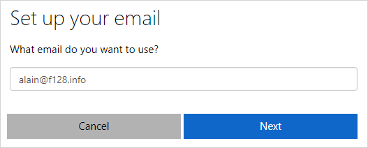
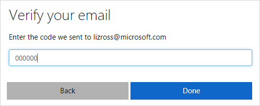

---
title: Set up security info to use email - Azure Active Directory | Microsoft Docs
description: Set up your security info to verify your identity using your work or school email address.
services: active-directory
author: eross-msft
manager: mtillman
ms.reviewer: sahenry

ms.service: active-directory
ms.workload: identity
ms.component: user-help
ms.topic: conceptual
ms.date: 07/30/2018
ms.author: lizross
---

# Set up security info to use email (preview)

[!INCLUDE [preview-notice](../../../includes/active-directory-end-user-preview-notice-security-info.md)]

Setting up your security info requires you to sign in to your work or school account and then complete the registration process. If you've never set up your security info, you'll be asked to do it now.

## Set up email

Depending on your organization’s settings, you may be prompted to add an email address to your security info when you sign in. Otherwise, to begin setting up email in security info, follow the steps in [Manage your security info](security-info-manage-settings.md).

>[!Note]
>We recommend using an email account that doesn't require your network password to access. If you don't see the email option, it's possible that your organization doesn't allow you to use an email for verification. If this is the case, you'll need to choose another method or contact your administrator for more help.

### To use your email address

1. Select the **Email** option, and then type your email address into the box. This email address can't be your work or school email.

     

2. Check for an email from Microsoft for your organization, type the included verification code into the **Verify your email** box, and then select **Done**.

     

    >[!Note]
    >If you don't see an email from Microsoft on behalf of your organization, make sure you typed your email address correctly, and then check your Junk or Spam folders.

3. In the **Keep your account secure** page, select **Done**.

    Your security info is updated to use your email address to verify your identity when using password reset.

## Additional security info options

You have options for how your organization contacts you to verify your identity, based on what's you're trying to do. The options include:

- **Authenticator app.** Download and use an authenticator app to get either an approval notification or a randomly generated approval code for two-step verification or password reset. For step-by-step instructions about how to set up and use the Microsoft Authenticator app, see [Set up security info to use an authenticator app](security-info-setup-auth-app.md).

- **Mobile device text.** Enter your mobile device number and get a text a code you'll use for two-step verification or password reset. For step-by-step instructions about how to verify your identity with a text message (SMS), see [Set up security info to use text messaging (SMS)](security-info-setup-text-msg.md).

- **Mobile device or work phone call.** Enter your mobile device number and get a phone call for two-step verification or password reset. For step-by-step instructions about how to verify your identity with a phone number, see [Set up security info to use phone calls](security-info-setup-phone-number.md).

- **Security questions.** Answer some security questions created by your administrator for your organization. This option is only available for password reset and not for two-step verification. For step-by-step instructions about how to set up your security questions, see the [Set up security info to use security questions](security-info-setup-questions.md) article.
    
    >[!Note]
    >If some of these options are missing, it's most likely because your organization doesn't allow those methods. If this is the case, you'll need to choose an available method or contact your administrator for more help.

## Next steps

- If you need to update your security info, follow the instructions in the [Manage your security info](security-info-manage-settings.md) article.

- Reset your password if you've lost or forgotten it, from the [Password reset portal](https://passwordreset.microsoftonline.com/) or follow the steps in the [Reset your work or school password](user-help-reset-password.md) article.

- Get troubleshooting tips and help for sign-in problems in the [Can't sign in to your Microsoft account](https://support.microsoft.com/help/12429/microsoft-account-sign-in-cant) article.
