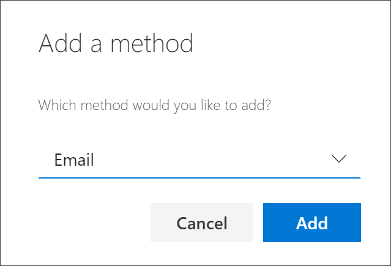
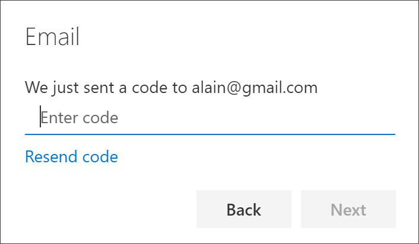
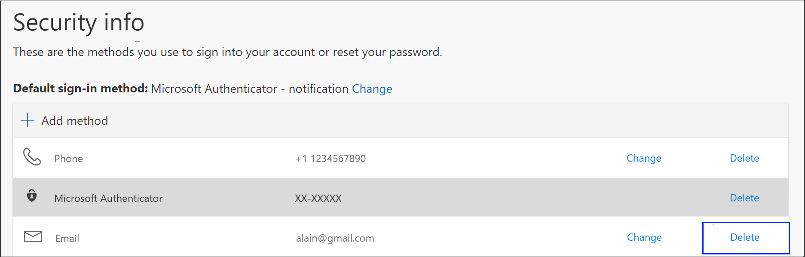

# Set up security info (preview) to use your email address
You can follow these steps to add your password reset method. After you've set this up the first time, you can return to the **Security info** page to add, update, or delete your security information.

After you set up your password reset method, you must also set up your two-factor verification method, using an [authenticator app](security-info-setup-auth-app.md), [text messaging](security-info-setup-text-msg.md), or a [phone call](security-info-setup-phone-number.md).

[!INCLUDE [preview-notice](../../../includes/active-directory-end-user-preview-notice-security-info.md)]

## Set up your email address from the Security info page
Depending on your organization’s settings, you might be able to use your email address as one of your security info methods.

>[!Note]
>We recommend using an email address that doesn't require your network password to access. If you don't see the email option, it's possible that your organization doesn't allow you to use an email for verification. If this is the case, you'll need to choose another method or contact your administrator for more help.

### To set up your email address

1. Sign in to your work or school account and then go to your https://myprofile.microsoft.com/ page.

    

2. Select **Security info** from the left navigation pane or from the link in the **Security info** block, and then select **Add method** from the **Security info** page.

    

3. On the **Add a method** page, select **Email** from the drop-down list, and then select **Add**.

    

4. On the **Email** page, type your email address (for example, alain@gmail.com), and then select **Next**.

    

    >[!Important]
    >This email address can't be your work or school email.

5. Type the code sent to your specified email address, and then select **Next**.

    

    Your security info is updated and you can use your email address to verify your identity when using password reset.

## Delete your email address from your security info methods
If you no longer want to use your email address as a security info method, you can remove it from the **Security info** page.

>[!Important]
>If you delete your email address by mistake, there's no way to undo it. You'll have to add the method again, following the steps in the [Set up your email address](#set-up-your-email-address-from-the-security-info-page) section of this article.

### To delete your email address

1. On the **Security info** page, select the **Delete** link next to the **Email** option.

    

2. Select **Yes** from the confirmation box to delete the **Email** account. After the email account is deleted, it's removed from your security info and it disappears from the **Security info** page.

## Additional security info methods
You have additional options for how your organization contacts you to verify your identity, based on what's you're trying to do. The options include:

- **Authenticator app.** Download and use an authenticator app to get either an approval notification or a randomly generated approval code for two-step verification or password reset. For step-by-step instructions about how to set up and use the Microsoft Authenticator app, see [Set up security info to use an authenticator app](security-info-setup-auth-app.md).

- **Mobile device text.** Enter your mobile device number and get a text a code you'll use for two-step verification or password reset. For step-by-step instructions about how to verify your identity with a text message (SMS), see [Set up security info to use text messaging (SMS)](security-info-setup-text-msg.md).

- **Mobile device or work phone call.** Enter your mobile device number and get a phone call for two-step verification or password reset. For step-by-step instructions about how to verify your identity with a phone number, see [Set up security info to use phone calls](security-info-setup-phone-number.md).

- **Security questions.** Answer some security questions created by your administrator for your organization. This option is only available for password reset and not for two-step verification. For step-by-step instructions about how to set up your security questions, see the [Set up security info to use security questions](security-info-setup-questions.md) article.
    
    >[!Note]
    >If some of these options are missing, it's most likely because your organization doesn't allow those methods. If this is the case, you'll need to choose an available method or contact your administrator for more help.

## Next steps

- Reset your password if you've lost or forgotten it, from the [Password reset portal](https://passwordreset.microsoftonline.com/) or follow the steps in the [Reset your work or school password](user-help-reset-password.md) article.

- Get troubleshooting tips and help for sign-in problems in the [Can't sign in to your Microsoft account](https://support.microsoft.com/help/12429/microsoft-account-sign-in-cant) article.
