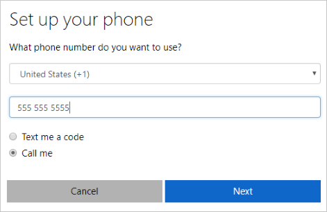
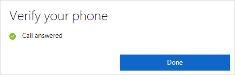

---
title: Set up security info to use phone calls - Azure Active Directory| Microsoft Docs
description: Set up your security info to verify your identity using a mobile device or work phone number.
services: active-directory
author: eross-msft
manager: mtillman
ms.reviewer: sahenry

ms.service: active-directory
ms.workload: identity
ms.component: user-help
ms.topic: conceptual
ms.date: 07/30/2018
ms.author: lizross
---

# Set up security info to use phone calls (preview)

[!INCLUDE [preview-notice](../../../includes/active-directory-end-user-preview-notice-security-info.md)]

Setting up your security info requires you to sign in to your work or school account and then complete the registration process. If you've never set up your security info, you'll be asked to do it now.

## Set up phone calls

Depending on your organization’s settings, you may be prompted to add a phone number to your security info when you sign in. Otherwise, to begin setting up phone calls in security info, follow the steps in [Manage your security info](security-info-manage-settings.md).

>[!Note]
>Security info doesn't support using phone extensions. Even if you add the proper format, +1 4255551234X12345, the extensions are removed before the call is placed. If you don't see the phone option, it's possible that your organization doesn't allow you to use phone calls for verification. If this is the case, you'll need to choose another method or contact your administrator for more help.

### To use your phone number

1. Select the **Phone** option.

    The **Set up your phone** wizard appears.

    

2. Pick your **Country or Region** from the drop-down box, type your phone number (including area code, if applicable) into the **Phone Number** box, select the **Call me** option, and then select **Next**.

    You'll receive a phone call to make sure you typed the right phone number. At that time, you'll be asked to push the pound (#) key to confirm and to complete your setup.

    

    Your security info is updated to use your phone number to verify your identity when using two-step verification or self-service password reset.

    >[!Note]
    >If you want to receive a text message instead of a phone call to your mobile device, follow the steps in the [Set up security info to use text messaging (SMS)](security-info-setup-text-msg.md) article.

## Additional security info options

You have additional options for how your organization contacts you to verify your identity, based on what's you're trying to do. The options include:

- **Authenticator app.** Download and use an authenticator app to get either an approval notification or a randomly generated approval code for two-step verification or password reset. For step-by-step instructions about how to set up and use the Microsoft Authenticator app, see [Set up security info to use an authenticator app](security-info-setup-auth-app.md).

- **Mobile device text.** Enter your mobile device number and get a text a code you'll use for two-step verification or password reset. For step-by-step instructions about how to verify your identity with a text message (SMS), see [Set up security info to use text messaging (SMS)](security-info-setup-text-msg.md).

- **Email address.** Enter your work or school email address to get an email for password reset. This option isn't available for two-step verification. For step-by-step instructions about how to set up your email, see [Set up security info to use email](security-info-setup-email.md).

- **Security questions.** Answer some security questions created by your administrator for your organization. This option is only available for password reset and not for two-step verification. For step-by-step instructions about how to set up your security questions, see the [Set up security info to use security questions](security-info-setup-questions.md) article.
    
    >[!Note]
    >If some of these options are missing, it's most likely because your organization doesn't allow those methods. If this is the case, you'll need to choose an available method or contact your administrator for more help.

## Next steps

- If you need to update your security info, follow the instructions in the [Manage your security info](security-info-manage-settings.md) article.

- Reset your password if you've lost or forgotten it, from the [Password reset portal](https://passwordreset.microsoftonline.com/) or follow the steps in the [Reset your work or school password](user-help-reset-password.md) article.

- Get troubleshooting tips and help for sign-in problems in the [Can't sign in to your Microsoft account](https://support.microsoft.com/help/12429/microsoft-account-sign-in-cant) article.