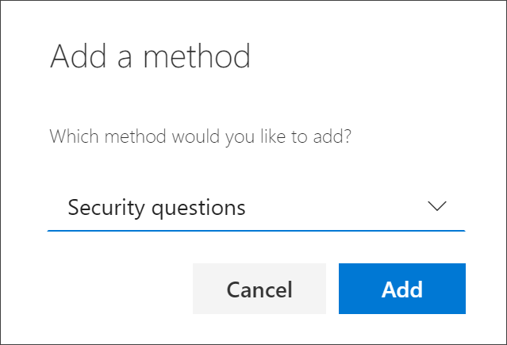
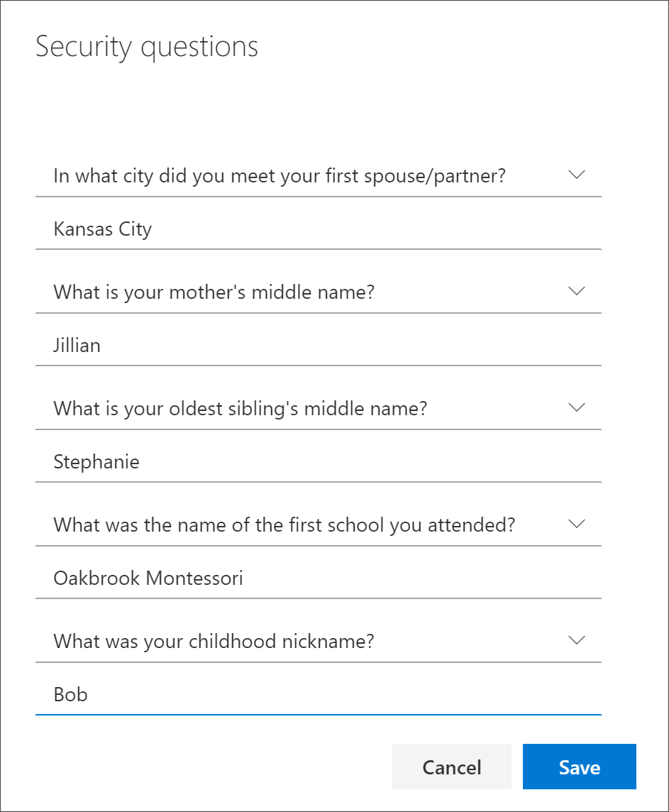
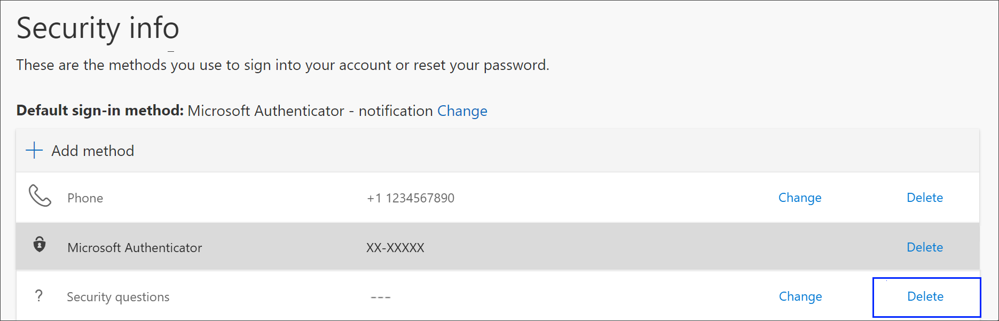

# Set up security questions as your verification method

You can follow these steps to add your password reset method. After you've set this up the first time, you can return to the **Security info** page to add, update, or delete your security information.

[!INCLUDE [preview-notice](../../../includes/active-directory-end-user-preview-notice-security-info.md)]

>[!Note]
>If you don't see the security questions option, it's possible that your organization doesn't allow you to use this option for your password reset method. In this case, you'll need to choose another method or contact your organization's help desk for more help.

## Security verification versus password reset authentication

Security info methods are used for both two-factor security verification and for password reset. However, not all methods can be used for both.

| Method | Used for |
| ------ | -------- |
| Authenticator app | Two-factor verification and password reset authentication. |
| Text messages | Two-factor verification and password reset authentication. |
| Phone calls | Two-factor verification and password reset authentication. |
| Security key | Two-factor verification and password reset authentication. |
| Email account | Password reset authentication only. You'll need to choose another method for two-factor verification. |
| Security questions | Password reset authentication only. You'll need to choose another method for two-factor verification. |

## Set up your security questions from the Security info page

Depending on your organization’s settings, you might be able to choose and answer a few security questions as one of your security info methods. Your administrator sets up the number of security questions you're required to choose and answer.

If you use security questions, we recommend using them in conjunction with another method. Security questions can be less secure than other methods because some people might know the answers to your questions.

> [!Note]
> Security questions are stored privately and securely on a user object in the directory and can only be answered by you during registration. There is no way for your administrator to read or modify your questions or answers.
>
> If you don't see the security questions option, it's possible that your organization doesn't allow you to use security questions for verification. If this is the case, you'll need to choose another method or contact your administrator for more help.
>
> Administrator accounts are not allowed to use Security Questions as a password reset method. If you are logged in as an admin level account you will not see these options.

### To set up your security questions

1. Sign in to your work or school account and then go to your https://myprofile.microsoft.com/ page.

    

2. Select **Security info** from the left navigation pane or from the link in the **Security info** block, and then select **Add method** from the **Security info** page.

    

3. On the **Add a method** page, select **Security questions** from the drop-down list, and then select **Add**.

    

4. On the **Security questions** page, choose and answer your security questions, and then select **Save**.

    

    Your security info is updated and you can use your security questions to verify your identity when using password reset.

## Delete security questions from your security info methods

If you no longer want to use your security questions as a security info method, you can remove them from the **Security info** page.

>[!Important]
>If you delete your security questions by mistake, there's no way to undo it. You'll have to add the method again, following the steps in the [Set up your security questions](#set-up-your-security-questions-from-the-security-info-page) section of this article.

### To delete your security questions

1. On the **Security info** page, select the **Delete** link next to the **Security questions** option.

    

2. Select **Yes** from the confirmation box to delete your **Security questions**. After your security questions are deleted, the method is removed from your security info and it disappears from the **Security info** page.

## Additional security info methods

You have additional options for how your organization contacts you to verify your identity, based on what's you're trying to do. The options include:

- **Authenticator app.** Download and use an authenticator app to get either an approval notification or a randomly generated approval code for two-step verification or password reset. For step-by-step instructions about how to set up and use the Microsoft Authenticator app, see [Set up security info to use an authenticator app](security-info-setup-auth-app.md).

- **Mobile device text.** Enter your mobile device number and get a text a code you'll use for two-step verification or password reset. For step-by-step instructions about how to verify your identity with a text message (SMS), see [Set up security info to use text messaging (SMS)](security-info-setup-text-msg.md).

- **Mobile device or work phone call.** Enter your mobile device number and get a phone call for two-step verification or password reset. For step-by-step instructions about how to verify your identity with a phone number, see [Set up security info to use phone calls](security-info-setup-phone-number.md).

- **Security key.** Register your Microsoft-compatible security key and use it along with a PIN for two-step verification or password reset. For step-by-step instructions about how to verify your identity with a security key, see [Set up security info to use a security key](security-info-setup-security-key.md).

- **Email address.** Enter your work or school email address to get an email for password reset. This option isn't available for two-step verification. For step-by-step instructions about how to set up your email, see [Set up security info to use email](security-info-setup-email.md).

    >[!Note]
    >If some of these options are missing, it's most likely because your organization doesn't allow those methods. If this is the case, you'll need to choose an available method or contact your administrator for more help.

## Next steps

- Reset your password if you've lost or forgotten it, from the [Password reset portal](https://passwordreset.microsoftonline.com/) or follow the steps in the [Reset your work or school password](active-directory-passwords-update-your-own-password.md) article.

- Get troubleshooting tips and help for sign-in problems in the [Can't sign in to your Microsoft account](https://support.microsoft.com/help/12429/microsoft-account-sign-in-cant) article.
