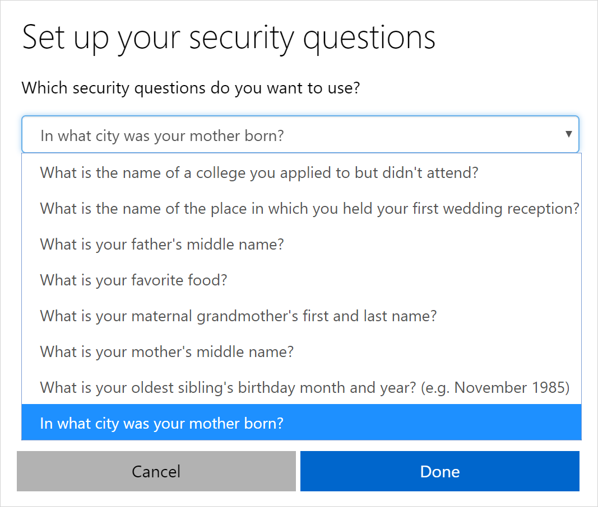

---
title: Set up security info to use security questions - Azure Active Directory | Microsoft Docs
description: Set up your security info to verify your identity using pre-defined security questions.
services: active-directory
author: eross-msft
manager: mtillman
ms.reviewer: sahenry

ms.service: active-directory
ms.workload: identity
ms.component: user-help
ms.topic: conceptual
ms.date: 07/30/2018
ms.author: lizross
---

# Set up security info to use pre-defined security questions (preview)

[!INCLUDE [preview-notice](../../../includes/active-directory-end-user-preview-notice-security-info.md)]

Setting up your security info requires you to sign in to your work or school account and then complete the registration process. If you've never set up your security info, you'll be asked to do it now.

## Set up security questions

Depending on your organization’s settings, you may be prompted to add security questions to your security info when you sign in. Otherwise, to begin setting up security questions in security info, follow the steps in [Manage your security info](security-info-manage-settings.md).

If you use security questions, we recommend using them in conjunction with another method. Security questions can be less secure than other methods because some people might know the answers to another person's questions.

>[!Note]
>Security questions are stored privately and securely on a user object in the directory and can only be answered by you during registration. There is no way for your administrator to read or modify your questions or answers. If you don't see the security questions option, it's possible that your organization doesn't allow you to use security questions for verification. If this is the case, you'll need to choose another method or contact your administrator for more help.

### To choose and answer your security questions

1. Select **Security questions**, and then choose which security questions you want to answer. 

    The number of security questions you have to pick are determined by your administrator.

    

2. Provide answers for your selected questions, and then select **Done**.

## Additional security info options

You have options for how your organization contacts you to verify your identity, based on what's you're trying to do. The options include:

- **Authenticator app.** Download and use an authenticator app to get either an approval notification or a randomly generated approval code for two-step verification or password reset. For step-by-step instructions about how to set up and use the Microsoft Authenticator app, see [Set up security info to use an authenticator app](security-info-setup-auth-app.md).

- **Mobile device text.** Enter your mobile device number and get a text a code you'll use for two-step verification or password reset. For step-by-step instructions about how to verify your identity with a text message (SMS), see [Set up security info to use text messaging (SMS)](security-info-setup-text-msg.md).

- **Mobile device or work phone call.** Enter your mobile device number and get a phone call for two-step verification or password reset. For step-by-step instructions about how to verify your identity with a phone number, see [Set up security info to use phone calls](security-info-setup-phone-number.md).

- **Email address.** Enter your work or school email address to get an email for password reset. This option isn't available for two-step verification. For step-by-step instructions about how to set up your email, see [Set up security info to use email](security-info-setup-email.md).
   
    >[!Note]
    >If some of these options are missing, it's most likely because your organization doesn't allow those methods. If this is the case, you'll need to choose an available method or contact your administrator for more help.

## Next steps

- If you need to update your security info, follow the instructions in the [Manage your security info](security-info-manage-settings.md) article.

- Reset your password if you've lost or forgotten it, from the [Password reset portal](https://passwordreset.microsoftonline.com/) or follow the steps in the [Reset your work or school password](user-help-reset-password.md) article.

- Get troubleshooting tips and help for sign-in problems in the [Can't sign in to your Microsoft account](https://support.microsoft.com/help/12429/microsoft-account-sign-in-cant) article.