# Set up your Security info (preview) from a sign-in prompt

You can follow these steps if you're prompted to set up your security info immediately after you sign-in to your work or school account.

You'll only see this prompt if you haven’t set up the security info required by your organization. If you've previously set up your security info, but you want to make changes, you can follow the steps in the various method-based how-to articles. For more information, see [Add or update your security info overview](security-info-add-update-methods-overview.md).

[!INCLUDE [preview-notice](../../../includes/active-directory-end-user-preview-notice-security-info.md)]

## Security verification versus password reset authentication

Security info methods are used for both two-factor security verification and for password reset. However, not all methods can be used for both.

| Method | Used for |
| ------ | -------- |
| Authenticator app | Two-factor verification and password reset authentication. |
| Text messages | Two-factor verification and password reset authentication. |
| Phone calls | Two-factor verification and password reset authentication. |
| Security key | Two-factor verification and password reset authentication. |
| Email account | Password reset authentication only. You'll need to choose another method for two-factor verification. |
| Security questions | Password reset authentication only. You'll need to choose another method for two-factor verification. |

## Sign in to your work or school account

After you sign in to your work or school account, you'll see a prompt that asks you to provide more information before it lets you access your account.

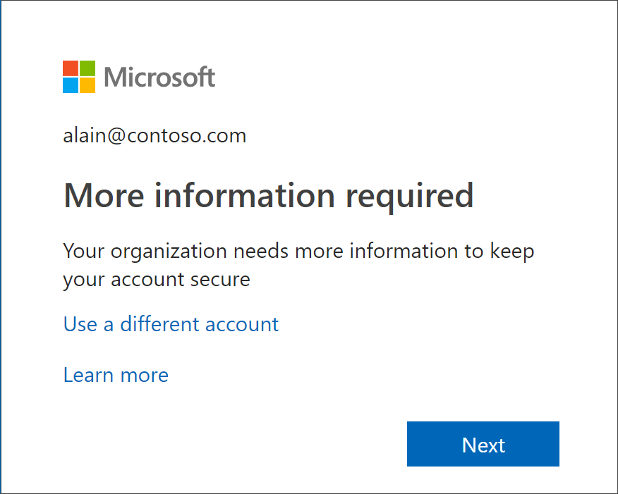

## Set up your security info using the wizard

Follow these steps to set up your security info for your work or school account from the prompt.

>[!Important]
>This is only an example of the process. Depending on your organization's requirements, your administrator might have set up different verification methods that you'll need to set up during this process. For this example, we're requiring two methods, the Microsoft Authenticator app and a mobile phone number for verification calls or text messages.

1. After you select **Next** from the prompt, a **Keep your account secure wizard** appears, showing the first method your administrator and organization require you to set up. For this example, it's the Microsoft Authenticator app.

   > [!Note]
   > If you want to use an authenticator app other than the Microsoft Authenticator app, select the **I want to use a different authenticator app** link.
   >
   > If your organization lets you choose a different method besides the authenticator app, you can select the **I want to set up a different method link**.

    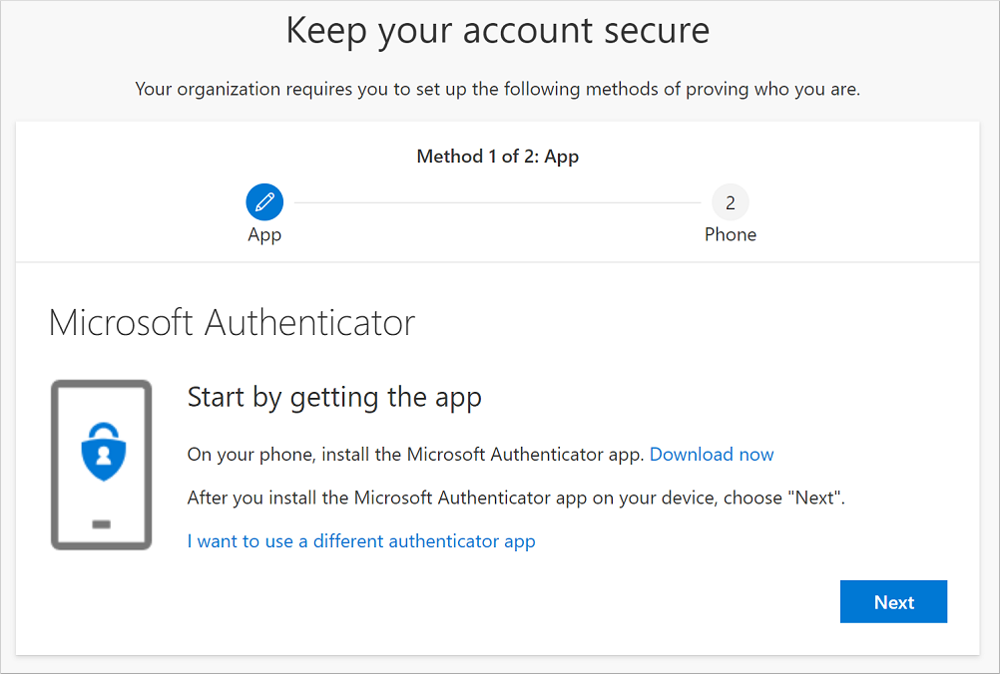

2. Select **Download now** to download and install the Microsoft Authenticator app on your mobile device, and then select **Next**. For more information about how to download and install the app, see [Download and install the Microsoft Authenticator app](user-help-auth-app-download-install.md).

    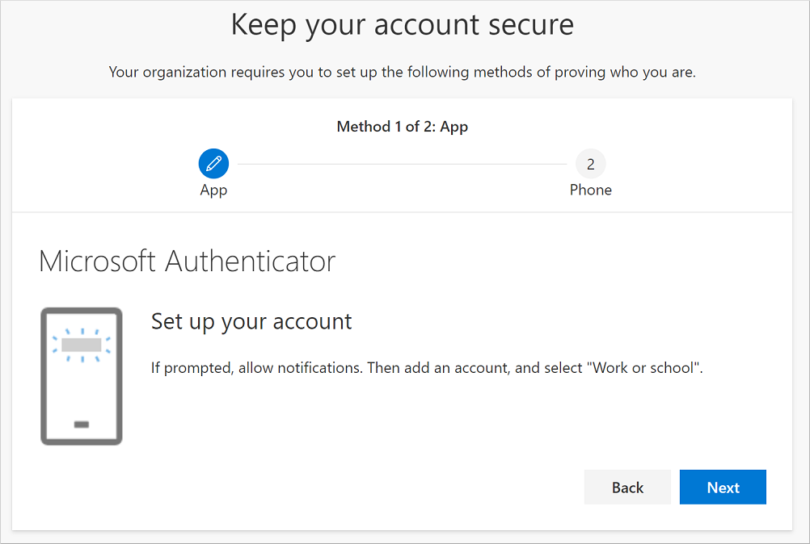

3. Remain on the **Set up your account** page while you set up the Microsoft Authenticator app on your mobile device.

4. Open the Microsoft Authenticator app, select to allow notifications (if prompted), select **Add account** from the **Customize and control** icon on the upper-right, and then select **Work or school account**.

    >[!Note]
    >If this is the first time you're setting up the Microsoft Authenticator app, you might receive a prompt asking whether to allow the app to access your camera (iOS) or to allow the app to take pictures and record video (Android). You must select **Allow** so the authenticator app can access your camera to take a picture of the QR code in the next step. If you don't allow the camera, you can still set up the authenticator app, but you'll need to add the code information manually. For information about how to add the code manually, see see [Manually add an account to the app](user-help-auth-app-add-account-manual.md).

5. Return to the **Set up your account** page on your computer, and then select **Next**.

    The **Scan the QR code** page appears.

    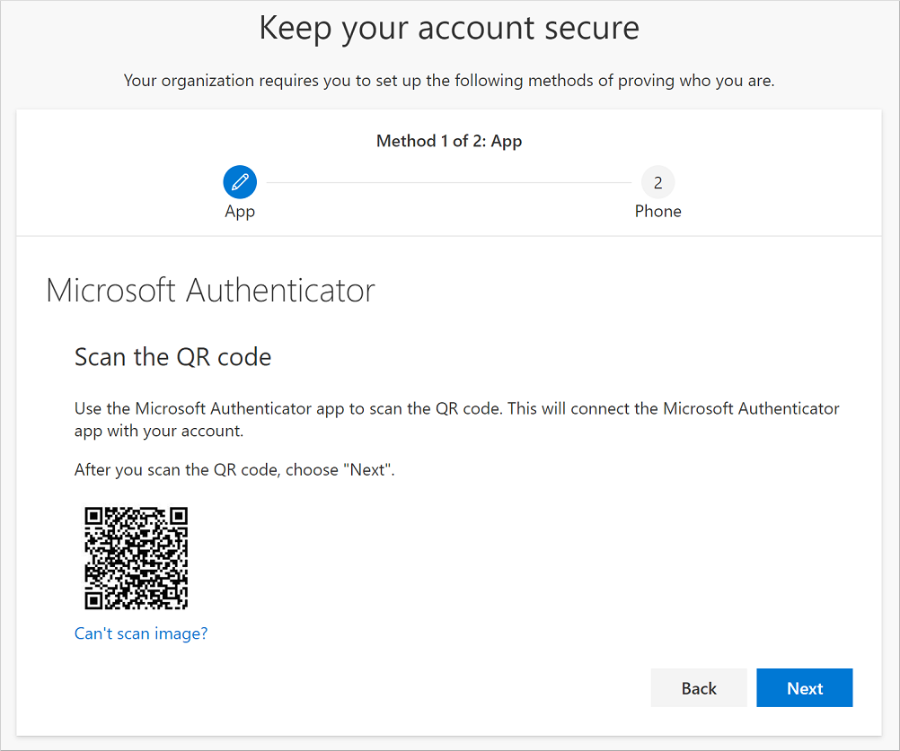

6. Scan the provided code with the Microsoft Authenticator app QR code reader, which appeared on your mobile device after you created your work or school account in Step 5.

    The authenticator app should successfully add your work or school account without requiring any additional information from you. However, if the QR code reader can't read the code, you can select the **Can't scan the QR image** and manually enter the code and URL into the Microsoft Authenticator app. For more information about manually adding a code, see [Manually add an account to the app](user-help-auth-app-add-account-manual.md).

7. Select **Next** on the **Scan the QR code** page on your computer.

    A notification is sent to the Microsoft Authenticator app on your mobile device, to test your account.

    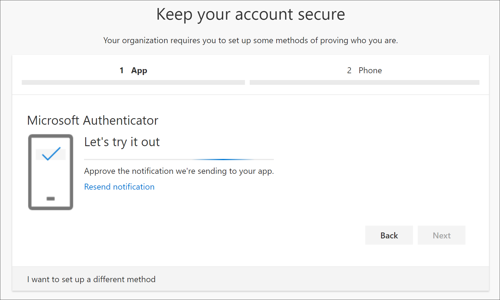

8. Approve the notification in the Microsoft Authenticator app, and then select **Next**.

    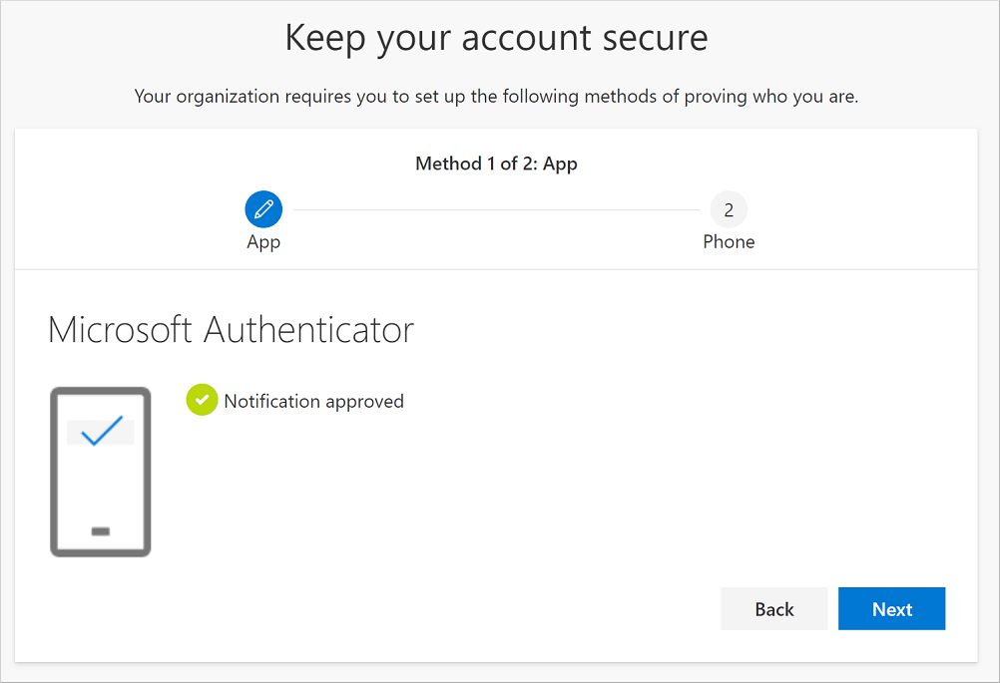

    Your security info is updated to use the Microsoft Authenticator app by default to verify your identity when using two-step verification or password reset.

9. On the **Phone** set up page, choose whether you want to receive a text message or a phone call, and then select **Next**. For the purposes of this example, we're using text messages, so you must use a phone number for a device that can accept text messages.

    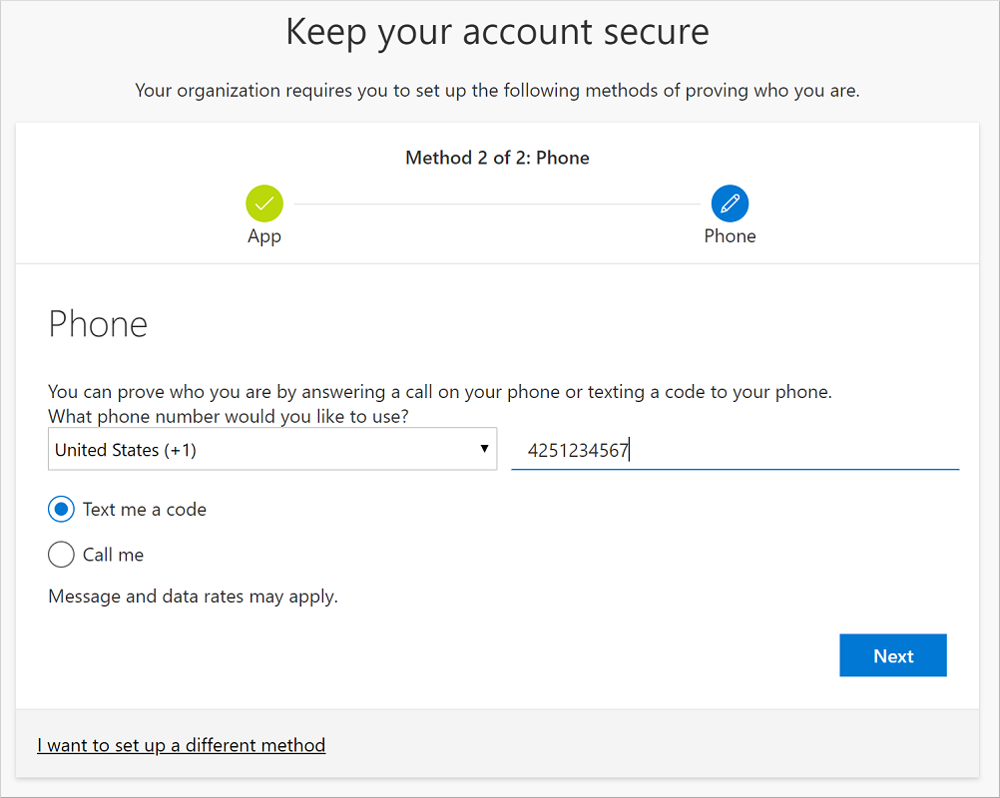

    A text message is sent to your phone number. If would prefer to get a phone call, the process is the same. However, you'll receive a phone call with instructions, instead of a text message.

10. Enter the code provided by the text message sent to your mobile device, and then select **Next**.

    

11. Review the success notification, and then select **Done**.

    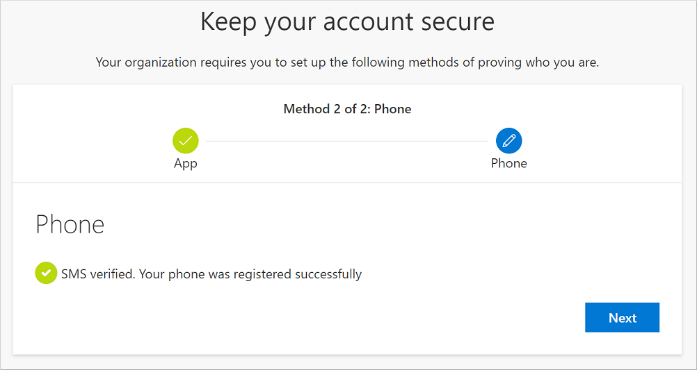

    Your security info is updated to use text messaging as a backup method to verify your identity when using two-step verification or password reset.

12. Review the **Success** page to verify that you've successfully set up both the Microsoft Authenticator app and a phone (either text message or phone call) method for your security info, and then select **Done**.

    

    >[!Note]
    >If your organization requires you to use app passwords, you might see an additional section in this wizard, where you can set it up. If you see a third section, called **App passwords**, you must fill it out before you will be able to complete the wizard. For steps about how to add an app password, see the [Manage your app passwords](#manage-your-app-passwords) section of this article.

### Manage your app passwords

Certain apps, such as Outlook 2010, don't support two-step verification. This lack of support means that if you're using two-step verification in your organization, the app won't work. To get around this problem, you can create an autogenerated password to use with each non-browser app, separate from your normal password.

>[!Note]
>If you don't see this option in the wizard, it means that your administrator hasn't set it up. If this isn't set up, but you know you need to use app passwords, you can follow the steps in the [Set up app passwords from the Security info (preview) page](security-info-app-passwords.md).

When using app passwords, it's important to remember:

- App passwords are autogenerated and only entered once per app.

- There's a limit of 40 passwords per user. If you try to create one after that limit, you'll be prompted to delete an existing password before being allowed to create the new one.

- Use one app password per device, not per app. For example, create a single password for all the apps on your laptop, and then another single password for all the apps on your desktop.

#### To add app passwords in the sign-in wizard

1. After finishing the previous sections of the wizard, select **Next** and complete the **App password** section.

2. Type the name of the app that needs the password, for example `Outlook 2010`, and then select **Next**.

    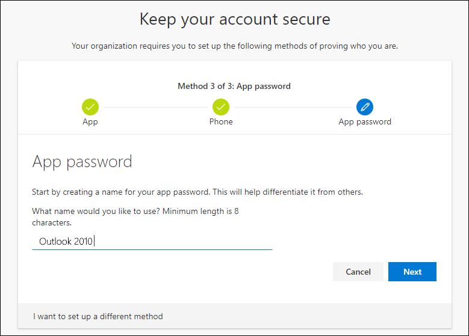

3. Copy the password code from the **App password** screen and paste it into the **Password** area of the app (in this example, Outlook 2010).

    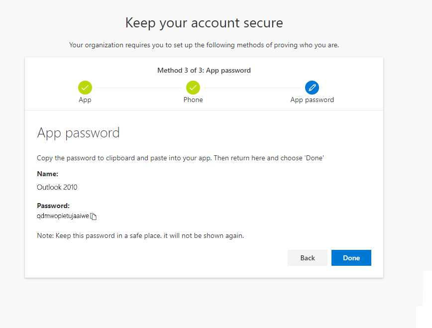

4. After you copy the password and paste it in the app, return to this wizard to make sure all of your sign-in method information is accurate, and then select **Done**.

    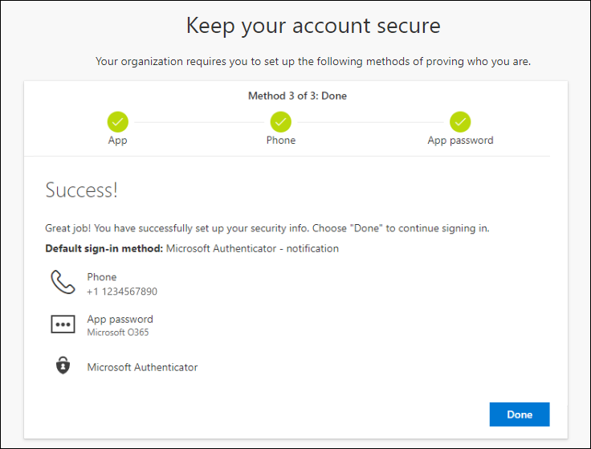

## Next steps

- To change, delete, or update default security info methods, see:

    - [Set up security info for an authenticator app](security-info-setup-auth-app.md).

    - [Set up security info for text messaging](security-info-setup-text-msg.md).

    - [Set up security info to use phone calls](security-info-setup-phone-number.md).

    - [Set up security info to use email](security-info-setup-email.md).

    - [Set up security info to use pre-defined security questions](security-info-setup-questions.md).

- For information about how to sign in using your specified method, see [How to sign in](user-help-sign-in.md).

- Reset your password if you've lost or forgotten it, from the [Password reset portal](https://passwordreset.microsoftonline.com/) or follow the steps in the [Reset your work or school password](active-directory-passwords-update-your-own-password.md) article.

- Get troubleshooting tips and help for sign-in problems in the [Can't sign in to your Microsoft account](https://support.microsoft.com/help/12429/microsoft-account-sign-in-cant) article.
