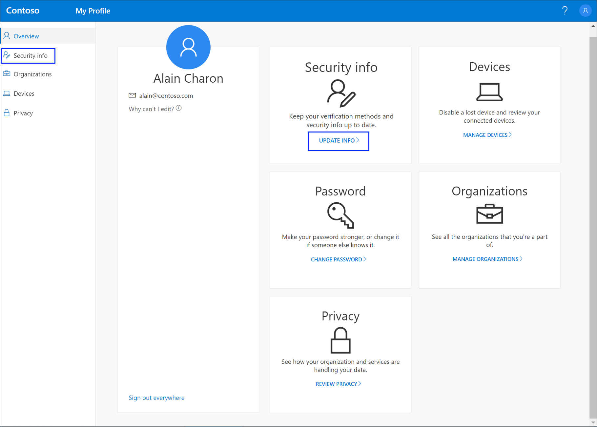
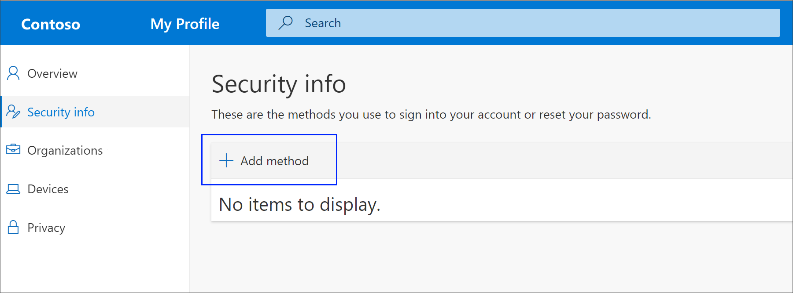
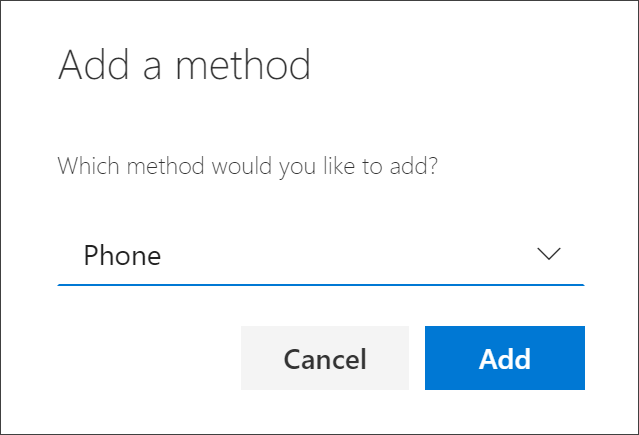
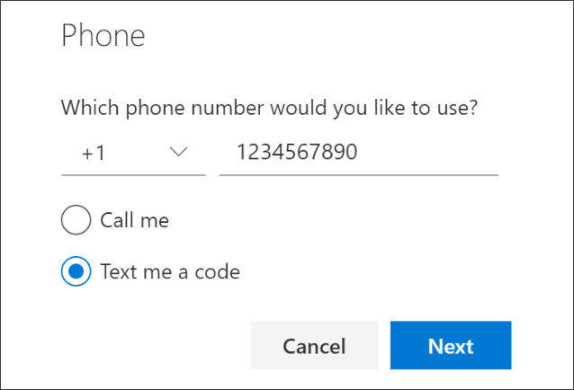
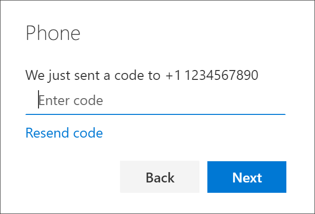
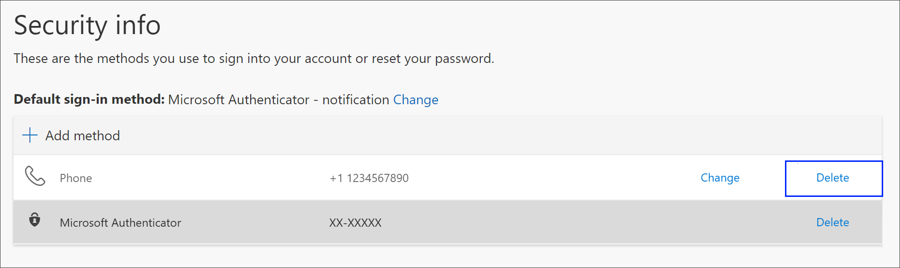
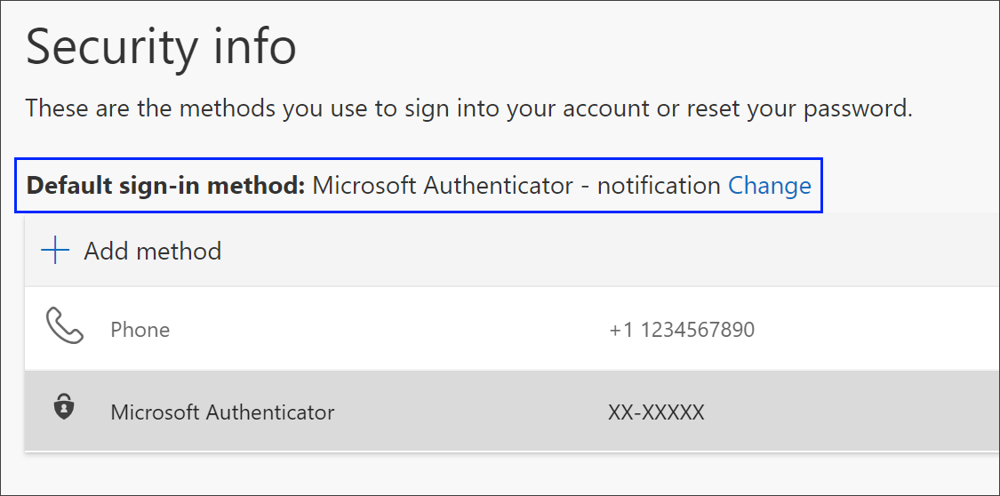
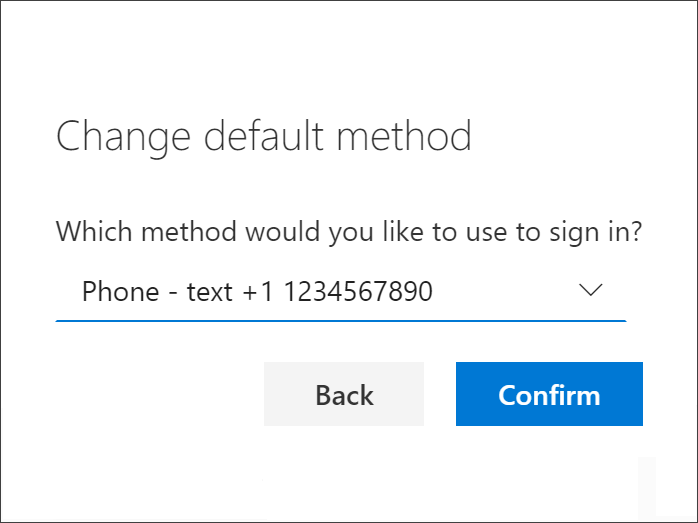

# Set up text messaging as your verification method

You can follow these steps to add your two-factor verification and password reset methods. After you've set this up the first time, you can return to the **Security info** page to add, update, or delete your security information.

If you're prompted to set this up immediately after you sign in to your work or school account, see the detailed steps in the [Set up your security info from the sign-in page prompt](security-info-setup-signin.md) article.

[!INCLUDE [preview-notice](../../../includes/active-directory-end-user-preview-notice-security-info.md)]

>[!Note]
>If you don't see a phone option, it's possible that your organization doesn't allow you to use this option for verification. In this case, you'll need to choose another method or contact your organization's help desk for more assistance.

## Set up text messages from the Security info page

Depending on your organization’s settings, you might be able to use text messaging as one of your security info methods. The text message option is a part of the phone option, so you'll set everything up the same way you would for your phone number, but instead of having Microsoft call you, you'll choose to use a text message.

>[!Note]
>If you want to receive a phone call instead of a text message, follow the steps in the [Set up security info to use phone calls](security-info-setup-phone-number.md) article.

### To set up text messages

1. Sign in to your work or school account and then go to your https://myaccount.microsoft.com/ page.

    

2. Select **Security info** from the left navigation pane or from the link in the **Security info** block, and then select **Add method** from the **Security info** page.

    

3. On the **Add a method** page, select **Phone** from the drop-down list, and then select **Add**.

    

4. On the **Phone** page, type the phone number for your mobile device, choose **Text me a code**, and then select **Next**.

    

5. Type the code sent to you through text message to your mobile device, and then select **Next**.

    

    The page changes to show your success.

    

    Your security info is updated and you can use text messaging to verify your identity when using two-step verification or password reset. If you want to make text messaging your default method, see the [Change your default security info method](#change-your-default-security-info-method) section of this article.

## Delete text messaging from your security info methods

If you no longer want to use text messages as a security info method, you can remove it from the **Security info** page.

>[!Important]
>If you delete text messaging by mistake, there's no way to undo it. You'll have to add the method again, following the steps in the [Set up text messages](#set-up-text-messages-from-the-security-info-page) section of this article.

### To delete text messaging

1. On the **Security info** page, select the **Delete** link next to the **Phone** option.

    

2. Select **Yes** from the confirmation box to delete the **Phone** number. After your phone number is deleted, it's removed from your security info and it disappears from the **Security info** page. If **Phone** is your default method, the default will change to another available method.

## Change your default security info method

If you want text messaging to be the default method used when you sign in to your work or school account using two-factor verification or for password reset requests, you can set it from the **Security info** page.

### To change your default security info method

1. On the **Security info** page, select the **Change** link next to the **Default sign-in method** information.

    

2. Select **Phone - text (*_your_phone_number_*)** from the drop-down list of available methods, and then select **Confirm**.

    

    The default method used for sign-in changes to **Phone - text (*_your_phone_number_*)**.

## Additional security info methods

You have additional options for how your organization contacts you to verify your identity, based on what's you're trying to do. The options include:

- **Authenticator app.** Download and use an authenticator app to get either an approval notification or a randomly generated approval code for two-step verification or password reset. For step-by-step instructions about how to set up and use the Microsoft Authenticator app, see [Set up security info to use an authenticator app](security-info-setup-auth-app.md).

- **Mobile device or work phone call.** Enter your mobile device number and get a phone call for two-step verification or password reset. For step-by-step instructions about how to verify your identity with a phone number, see [Set up security info to use phone calls](security-info-setup-phone-number.md).

- **Security key.** Register your Microsoft-compatible security key and use it along with a PIN for two-step verification or password reset. For step-by-step instructions about how to verify your identity with a security key, see [Set up security info to use a security key](security-info-setup-security-key.md).

- **Email address.** Enter your work or school email address to get an email for password reset. This option isn't available for two-step verification. For step-by-step instructions about how to set up your email, see [Set up security info to use email](security-info-setup-email.md).

- **Security questions.** Answer some security questions created by your administrator for your organization. This option is only available for password reset and not for two-step verification. For step-by-step instructions about how to set up your security questions, see the [Set up security info to use security questions](security-info-setup-questions.md) article.

    >[!Note]
    >If some of these options are missing, it's most likely because your organization doesn't allow those methods. If this is the case, you'll need to choose an available method or contact your administrator for more help.

## Next steps

- Reset your password if you've lost or forgotten it, from the [Password reset portal](https://passwordreset.microsoftonline.com/) or follow the steps in the [Reset your work or school password](active-directory-passwords-update-your-own-password.md) article.

- Get troubleshooting tips and help for sign-in problems in the [Can't sign in to your Microsoft account](https://support.microsoft.com/help/12429/microsoft-account-sign-in-cant) article.
