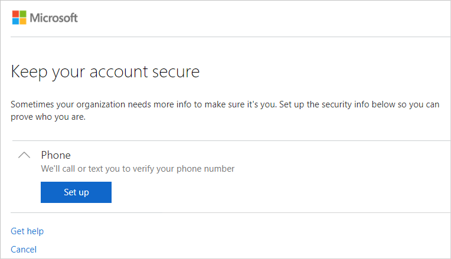
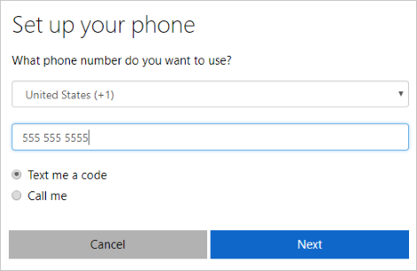
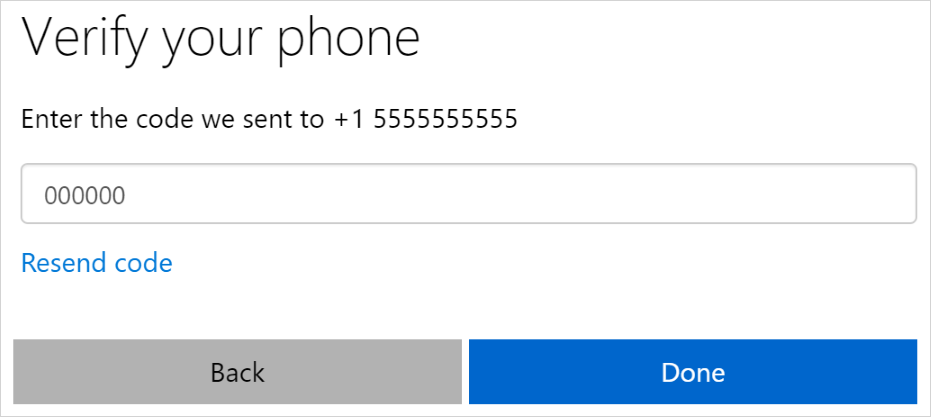

# How to: Set up your security info to use a text (SMS) message (Preview)

[!INCLUDE[preview-notice](../../../includes/active-directory-end-user-preview-notice-security-info.md)]

Setting up your security info verification method requires you to sign in to your work or school account and then complete the registration process. If you've never set up your verification methods, you'll be asked to do it now.

You have options for how your organization contacts you to verify your identity, based on what's you're trying to do. The options include:

- **Mobile device text.** Enter your mobile device number and get a text a code you'll use for two-step verification or self-service password reset verification. For step-by-step instructions about how to verify your identity with a text message (SMS), see the [Set your verification method to a text message](#set-your-verification-method-to-a-text-message) section of this article.

- **Authenticator app.** Download and use an authenticator app to get either an approval notification or a randomly generated approval code for two-step verification or self-service password reset verification. For step-by-step instructions about how to verify your identity with the Microsoft Authenticator app, see the [Set your security info to use an authenticator app](security-info-setup-auth-app.md) article.

- **Mobile device or work phone call.** Enter your mobile or work phone number to get a verification call or text message for two-step verification or self-service password reset verification. For step-by-step instructions about how to verify your identity with a phone number, see the [Set up your security info to use a phone number](security-info-setup-phone-number.md) article.

- **Email address.** Enter your work or school email address to get a verification email for self-service password reset. For step-by-step instructions about how to set up your email verification, see the [Set up your security info to use email](security-info-setup-email.md) article.

- **Security questions.** Answer some security questions created by your administrator for your organization for self-service password reset. For step-by-step instructions about how to set up your security questions, see the [Set up your security info to use security questions](security-info-setup-questions.md) article.

>[!Note]
>If some of these options are missing, it's most likely because your organization doesn't allow those methods for secondary verification. If this is the case, you'll need to choose an available verification method or contact your administrator for more help.

## Set your verification method to a text message

Follow this process to set your security info to use your phone number for both two-step verification and self-service password reset.

>[!Note]
>The text message option is a part of the phone option, so you'll set everything up the same way you would for your phone number, but instead of having Microsoft call you, you'll choose to use a text message. If you don't see the phone option, it's possible that your organization doesn't allow you to use a phone number for verification. If this is the case, you'll need to choose another verification method or contact your administrator for more help.

### To use a text message

1. Sign in to your work or school account.

    The **More information required** box appears.

    

    Depending on your organization, you might be allowed to wait 14 before adding your security info. If you don't see this option, it means that it's not available.

2. Select **Next** to begin setting up your security info.

    The **Keep your account secure** page appears.

     

3. Select **Set up** for the **Phone** option.

    The **Setup your phone** wizard appears.

    

4. Pick your **Country or Region** from the drop-down box, type your phone number (including area code, if applicable) into the **Phone Number** box, select the **Text me a code** option, and then select **Next**.

    You'll receive a text message with a code you'll need to enter into a verification page.

    

    Your security info updates to send you a text message to verify your identity when using two-step verification or self-service password reset.

    >[!Note]
    >If you want to receive a phone call instead of a text message, follow the steps in the [Set up your security info to use your phone number](security-info-setup-phone-number.md) article.

## Next steps

- If you need to update your security info, follow the instructions in the [Manage your security info](security-info-manage-settings.md) article.

- Reset your password if you've lost or forgotten it, from the [Password reset portal](https://passwordreset.microsoftonline.com/) or follow the steps in the [Reset your work or school password](user-help-reset-password.md) article.

- Get troubleshooting tips and help for sign-in problems in the [Can't sign in to your Microsoft account](https://support.microsoft.com/help/12429/microsoft-account-sign-in-cant) article.