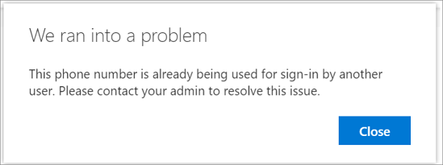
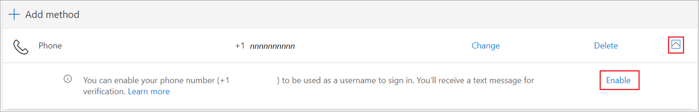
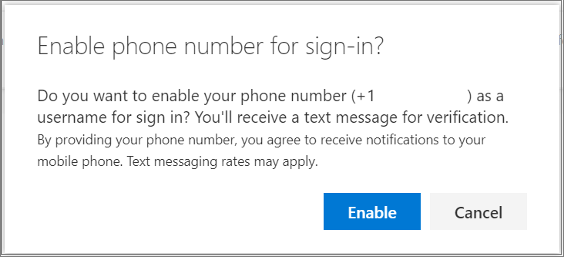
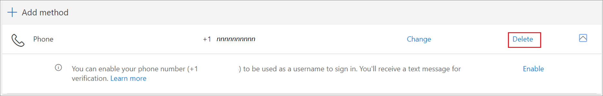

# Use your phone number as a user name (preview)

Registering a device gives your phone access to your organization's services and doesn't allow your organization access to your phone. If you're an administrator, you can find more information in [Configure and enable users for SMS-based authentication](../authentication/howto-authentication-sms-signin.md).

If your organization hasn't made SMS sign-in available, you won't see an option for it when registering a phone with your account.  

## When you have a new phone number

If you get a new phone or new number and you register it with an organization for which SMS sign-in is available, you experience the normal phone registration process:

1. Select **Add method**.
1. Select **Phone**.
1. Enter phone number and select **Text me a code**.
1. After you enter the code, select **Next**.
1. You will see a prompt that says "SMS verified. Your phone was registered successfully."

> [!Important]
> Due to a known issue in the preview, for a short time adding phone number will not register the number for SMS sign-in. You'll have to sign in with the added number and then follow the prompts to register the number for SMS sign-in.

### When the phone number is in use

If you try to use a phone number that someone else in your organization is using, you'll see the following message:

Reach out to your admin to remediate the problem.

## When you have an existing number

If you are already using a phone number with an organization, and using your phone number as a user name becomes available, the following steps can help you sign in.

1. When SMS sign-in is available, a banner is displayed asking if you'd like to enable the phone number for SMS sign-in:

    

1. Also, an **Enable** button appears if you select the caret on the phone method tile:

    

1. To enable the method, select **Enable**. You are prompted to confirm the action:

    

1. Select **Enable**.

## When you remove your phone number

1. To delete the phone number, select the delete button on the SMS sign-in phone method tile.

    

2. When prompted to confirm the action, select **OK**.

You can't remove a phone number that is in use as the default sign-in method. To remove the number, you would have to change the default sign-in method, then remove the phone number again.
