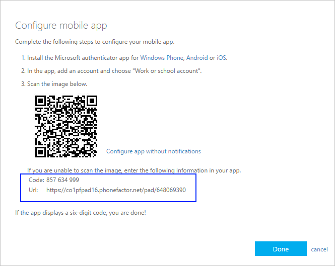
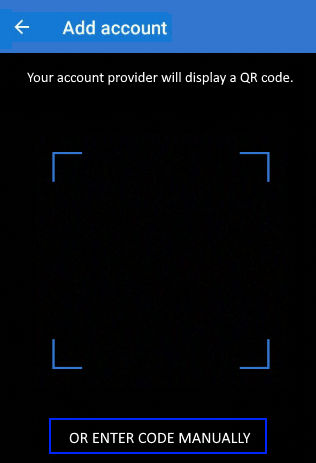
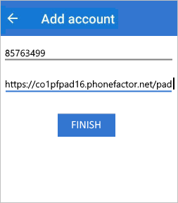

# Manually add an account to the app

If your camera is unable to capture the QR code, you can manually add your account information to the Microsoft Authenticator app for two-factor verification. This works for work or school accounts and non-Microsoft accounts.

The codes provided for your accounts aren't case-sensitive and don't require spaces when added into the Microsoft Authenticator app.

>[!Important]
>Before you can add your account, you must download and install the Microsoft Authenticator app. If you haven't done that yet, follow the steps in the [Download and install the app](user-help-auth-app-download-install.md) article.

## Add your work or school account

1. On your computer, note the **Code** and **Url** information on the **Configure mobile app** page. Keep this page open so you can see the code and URL.

    

2. Open the Microsoft Authenticator app, select **Add account** from the **Customize and control** icon in the upper-right, and then select **Work or school account**.

3. Select **OR ENTER CODE MANUALLY**.

    

4. Enter the **Code** and **URL** from Step 1, and then select **Finish**.

    

    The **Accounts** screen of the app shows you your account name and a six-digit verification code. For additional security, the verification code changes every 30 seconds preventing someone from using a code multiple times.

## Add your Google account

1. On your computer, select **CAN'T SCAN IT** from the **Set up Authenticator** page with the QR code.

    The **Can't scan barcode** page appears with the secret code. Keep this page open so you can see the secret code.

2. Open the Microsoft Authenticator app, select **Add account** from the **Customize and control** icon in the upper-right, select **Other account (Google, Facebook, etc.)**, and then select **OR ENTER CODE MANUALLY**.

3. Enter an **Account name** (for example, Google) and type the **Secret key** from Step 1, and then select **Finish**.

4. On the **Set up Authenticator** page on your computer, type the six-digit verification code provided in the app for your Google account, and then select **Verify**.

    The **Accounts** screen of the app shows you your account name and a six-digit verification code. For additional security, the verification code changes every 30 seconds preventing someone from using a code multiple times.

    >[!NOTE]
    >For more information about two-factor verification and your Google account, see [Turn on 2-Step Verification](https://support.google.com/accounts/answer/185839) and [Learn more about 2-Step Verification](https://www.google.com/landing/2step/help.html).

## Add your Facebook account

1. On the **Set up via Third Party Authenticator** page, which includes the QR code, and a code written out for entry into your app. Keep this page open so you can see the code.

2. Open the Microsoft Authenticator app, select **Add account** from the **Customize and control** icon in the upper-right, select **Other account (Google, Facebook, etc.)**, and then select **OR ENTER CODE MANUALLY**.

3. Enter an **Account name** (for example, Facebook) and type the **Secret key** from Step 1, and then select **Finish**.

4. On the **Two-Factor Authenticator** page on your computer, type the six-digit verification code provided in the app for your Facebook account, and then select **Verify**.

    The **Accounts** screen of the app shows you your account name and a six-digit verification code. For additional security, the verification code changes every 30 seconds preventing someone from using a code multiple times.

    >[!NOTE]
    >For more information about two-factor verification and your Facebook account, see [What is two-factor authentication and how does it work?](https://www.facebook.com/help/148233965247823).

## Add your Amazon account

You can add your Amazon account by turning on two-factor verification and then adding the account to the app.

1. On your computer, select **Can't scan the barcode** from the **Choose how you'll receive codes** page with the QR code.

    The **Can't scan the barcode** message appears with the secret code. Keep this message open so you can see the secret code.

2. Open the Microsoft Authenticator app, select **Add account** from the **Customize and control** icon in the upper-right, select **Other account (Google, Facebook, etc.)**, and then select **OR ENTER CODE MANUALLY**.

3. Enter an **Account name** (for example, Amazon) and type the **Secret key** from Step 1, and then select **Finish**.

4. Complete the rest of the sign-up process, including adding a backup verification method such as a text message, and then select **Send code**.

5. On the **Add a backup verification method** page on your computer, type the six-digit verification code provided by your backup verification method for your Amazon account, and then select **Verify code and continue**.

6. On the Almost done page, decide whether to make your computer a trusted device, and then select **Got it. Turn on Two-Step Verification**.

    The **Advanced Security Settings** page appears, showing your updated two-factor verification details.

    >[!NOTE]
    >For more information about two-factor verification and your Amazon account, see [About Two-Step Verification](https://www.amazon.com/gp/help/customer/display.html?nodeId=201596330) and [Signing in with Two-Step Verification](https://www.amazon.com/gp/help/customer/display.html?nodeId=201962440).    

## Next steps

- After you add your accounts to the app, you can sign in using the Microsoft Authenticator app on your device. For more information, see [Sign in using the app](user-help-auth-app-sign-in.md).

- If you're having trouble getting your verification code for your personal Microsoft account, see the **Troubleshooting verification code issues** section of the [Microsoft account security info & verification codes](https://support.microsoft.com/help/12428/microsoft-account-security-info-verification-codes) article.

- For devices running iOS, you can also back up your account credentials and related app settings, such as the order of your accounts, to the cloud. For more information, see [Backup and recover with Microsoft Authenticator app](user-help-auth-app-backup-recovery.md).
