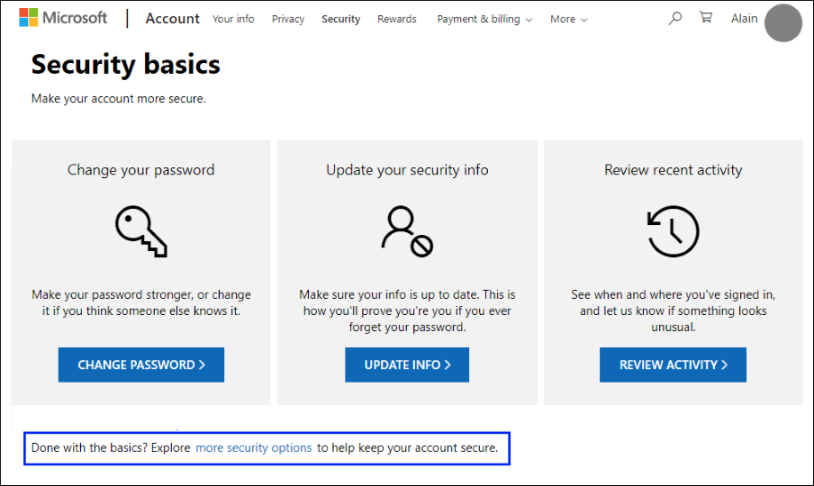
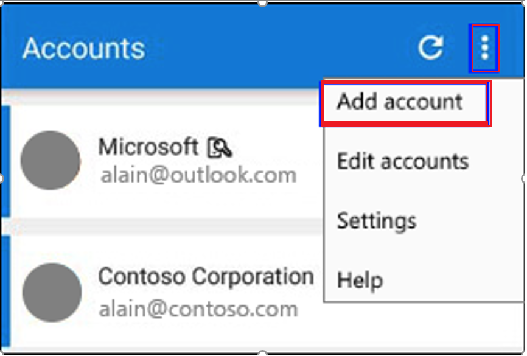
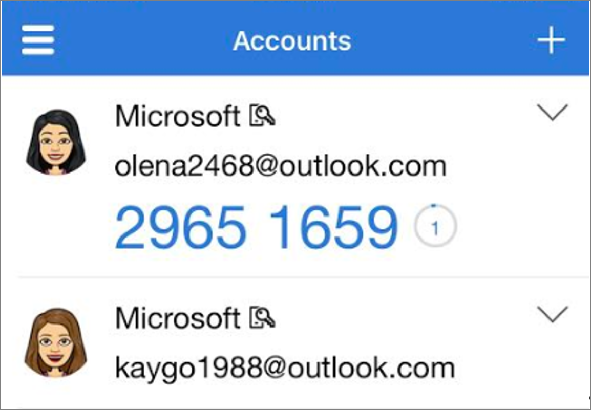
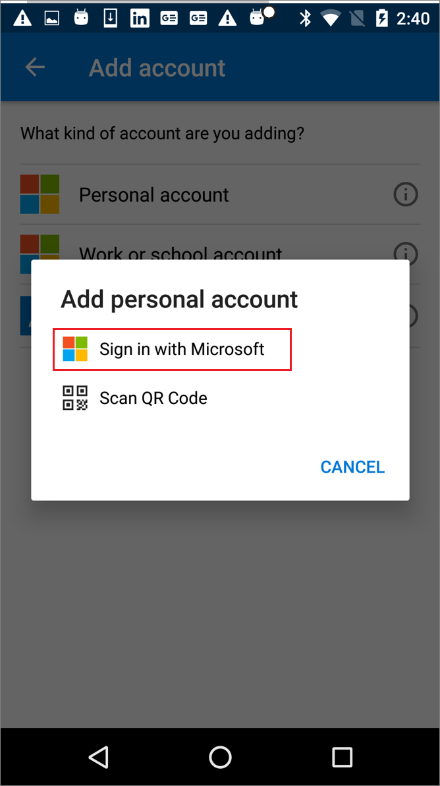

# Add personal Microsoft accounts to the Microsoft Authenticator app

Add your personal Microsoft accounts, such as for Outlook.com and Xbox LIVE accounts, to the Microsoft Authenticator app for both the standard two-factor verification process and passwordless phone sign-in.

- **Standard two-factor verification method.** Type your username and password into the device you're signing in to, and then choose whether the Microsoft Authenticator app sends a notification or if you'd prefer to copy the associated verification code from the **Accounts** screen of the Microsoft Authenticator app.

- **Passwordless sign-in method.** Type your username into the device you're signing in to using your personal Microsoft account, and then use your mobile device to verify that it's you using your fingerprint, face, or PIN. For this method, you don't need to enter your password.

>[!Important]
>Before you can add your account, you must download and install the Microsoft Authenticator app. If you haven't done that yet, follow the steps in the [Download and install the app](user-help-auth-app-download-install.md) article.

You can add your personal Microsoft account by first turning on two-factor verification, and then by adding the account to the app. You don't have to turn on two-factor verification to only use passwordless phone sign-in for your account, but we strongly recommend that you turn on two-factor verification for additional account security.

## Turn on two-factor verification

1. On your computer, go to your [Security basics](https://account.microsoft.com/security) page and sign-in using your personal Microsoft account. For example, alain@outlook.com.

2. At the bottom of the **Security basics** page, choose the **more security options** link.

    

3. Go to the **Two-step verification** section and choose to turn the feature **On**. You can also turn it off here if you no longer want to use it with your personal account.

## Add your Microsoft account to the app

1. Open the Microsoft Authenticator app on your mobile device.

1. On Android, select **Add account** from the **Customize and Control** icon in the upper right.

    

    On iOS, select the plus icon in the upper right.

    

1. In the **Add account** page, choose **Personal account**.

1. Select **Sign in with Microsoft** to add your account. A QR code can be used when available, but you can always add your account by signing in with your username and password.

    

1. Sign in to your personal account, using the appropriate email address (such as alain@outlook.com), and then select **Next**.

    >[!Note]
    >If you don't have a personal Microsoft account, [you can create one](https://account.microsoft.com/account/Account?refd=www.bing.com&ru=https%3A%2F%2Faccount.microsoft.com%2F%3Frefd%3Dwww.bing.com&destrt=home-index).

1. Enter your password, and then select **Sign in**. Your personal account is added to the Microsoft Authenticator app.

## Next steps

- After you add your accounts to the app, you can sign in using the Authenticator app on your device. For more information, see [Sign in using the app](user-help-auth-app-sign-in.md).

- If you're having trouble getting your verification code for your personal Microsoft account, see the **Troubleshooting verification code issues** section of the [Microsoft account security info & verification codes](https://support.microsoft.com/help/12428/microsoft-account-security-info-verification-codes) article.

- For devices running iOS, you can also back up your account credentials and related app settings, such as the order of your accounts, to the cloud. For more information, see [Backup and recover with Microsoft Authenticator app](user-help-auth-app-backup-recovery.md).
