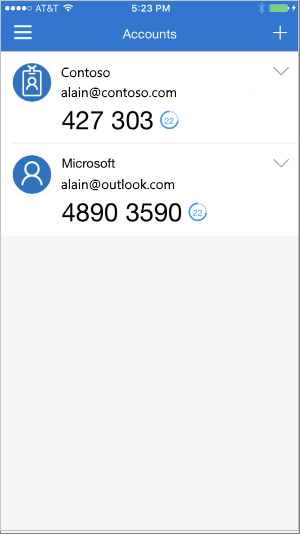

# Add your work or school account to the Microsoft Authenticator app

If your organization uses two-factor verification, you can set up your work or school account to use the Microsoft Authenticator app as one of the verification methods.

>[!Important]
>Before you can add your account, you must download and install the Microsoft Authenticator app. If you haven't done that yet, follow the steps in the [Download and install the app](user-help-auth-app-download-install.md) article.

## Add your work or school account

You can add your work or school account to the Microsoft Authenticator app by doing one of the following:

- Sign-in with your work or school account credentials (Preview)
- Scan a QR Code

### Sign in with your credentials

To add an account by signing into your work or school account using your credentials:

1. Open the Microsoft Authenticator app and navigate to the Customize and Control button on the top right (+ symbol?) and tap on Add work or school Account. Select “Sign in (Preview)”.

Enter your work or school account credentials. If you have a Temporary Access Pass (TAP) you can use that to sign-in. At this point, you might be blocked from proceeding by one of three conditions:

1. If you don’t have enough authentication methods on your account to get a strong authentication token, you will not be able to proceed to add an account.

1. Users who are not blocked by the security info registration CA block can add an account through this flow. “You might be signing in from a location that is restricted by your admin” message

If you are enabled by your admin to add a phone sign-in credential, you’ll be able to asked to go through device registration and you’ll then be setup for passwordless phone sign-in and Azure Multi-Factor Authentication (MFA).

1. Scan a QR Code – On-premises MFA Server users might be required to scan a QR Code provided by their organization to setup on-prem MFA account in the app. Users can skip this screen if they don’t have MFA server.

1. On your device, tap the account and verify in the full-screen view that your account is correct and that there's an associated six-digit verification code. Make sure . For additional security, the verification code changes every 30 seconds preventing someone from using a code multiple times.

## Sign in with a QR code

To add an account by scanning a QR Code do the following:

1. On your computer, go to the **Additional security verification** page.

>[!Note]
>If you don't see the **Additional security verification** page, it's possible that your administrator has turned on the security info (preview) experience. If that's the case, you should follow the instructions in the [Set up security info to use an authenticator app](security-info-setup-auth-app.md) section. If that's not the case, you will need to contact your organization's Help Desk for assistance. For more information about security info, see [Set up your Security info from a sign-in prompt](security-info-setup-signin.md).
1. Select the checkbox next to Authenticator app, and then select **Configure**. The **Configure mobile app** page appears.

   

1. Open the Microsoft Authenticator app, select **Add account** from the Customize and control icon in the upper-right, and then select **Work or school account** > **Scan a QR Code**.

   >[!Note]
   >If prompted whether to allow the app to access your camera (iOS) or to allow the app to take pictures and record video (Android), select **Allow** so that Authenticator can access your camera to take a picture of the QR code. If you don't allow the camera, you can still set up the authenticator app, but you'll need to add the code information manually. For information about how to add the code manually, see [Manually add an account to the app].

1. Use your device's camera to scan the QR code from the Configure mobile app screen on your computer, and then choose Done.

   >[!Note]
   >If your camera is unable to capture the QR code, you can manually add your account information to the Microsoft Authenticator app for two-factor verification. For more information and how to do it, see [Manually add your account](user-help-auth-app-add-account-manual.md).

1. On your device, tap the account to review the full-screen view of the account. Ensure that your account is correct and that you have an associated six-digit verification code. For additional security, the verification code changes every 30 seconds preventing someone from using a code multiple times.

    

## Next steps

- After you add your accounts to the app, you can sign in using the Authenticator app on your device. For more information, see [Sign in using the app](user-help-auth-app-sign-in.md).

- For devices running iOS, you can also back up your account credentials and related app settings, such as the order of your accounts, to the cloud. For more information, see [Backup and recover with Microsoft Authenticator app](user-help-auth-app-backup-recovery.md).