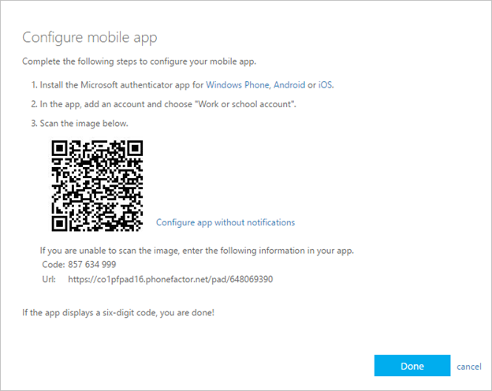

# Add your work or school account to the Microsoft Authenticator app

If your organization uses two-factor verification, you can set up your work or school account to use the Microsoft Authenticator app as one of the verification methods.

>[!Important]
>Before you can add your account, you must download and install the Microsoft Authenticator app. If you haven't done that yet, follow the steps in the [Download and install the app](user-help-auth-app-download-install.md) article.

## Add your work or school account

You can add your work or school account to the Microsoft Authenticator app by doing one of the following:

- Sign in with your work or school account credentials (preview)
- Scan a QR Code

### Sign in with your credentials

>[!Note]
>This feature is usable only by users whose admins have enabled phone sign-in using the Authenticator app for them.

To add an account by signing into your work or school account using your credentials:

1. Open the Microsoft Authenticator app and select to the **+** button and tap **Add work or school account**. Select **Sign in**.

1. Enter your work or school account credentials. If you have a Temporary Access Pass (TAP) you can use that to sign in. At this point, you could potentially be blocked from proceeding by one of the following conditions:

   - If you don’t have enough authentication methods on your account to get a strong authentication token, you will not be able to proceed to add an account.

   - If you receive the message `You might be signing in from a location that is restricted by your admin`, you are blocked and need an administrator to unblock you in [Security info](https://mysignins.microsoft.com/security-info).

   - If you're not blocked for phone sign-in using the Authenticator app by your admin, you'll be able to go through device registration to get set up for passwordless phone sign-in and Azure Multi-Factor Authentication (MFA).

1. At this point, you could be asked to scan a QR Code provided by your organization to set up an on-premises multi-factor authentication account in the app. You're required to do this only if your organization uses on-premises MFA Server.

1. On your device, tap the account and verify in the full-screen view that your account is correct and that there's an associated six-digit verification code. For additional security, the verification code changes every 30 seconds preventing someone from using a code multiple times.

## Sign in with a QR code

To add an account by scanning a QR Code, do the following:

1. On your computer, go to the **Additional security verification** page.

   >[!Note]
   >If you don't see the **Additional security verification** page, it's possible that your administrator has turned on the security info (preview) experience. If that's the case, you should follow the instructions in the [Set up security info to use an authenticator app](security-info-setup-auth-app.md) section. If that's not the case, you will need to contact your organization's Help Desk for assistance. For more information about security info, see [Set up your Security info from a sign-in prompt](security-info-setup-signin.md).

1. Select the checkbox next to Authenticator app, and then select **Configure**. The **Configure mobile app** page appears.

   

1. Open the Microsoft Authenticator app, select the plus icon  and select **Add account**, and then select **Work or school account,** followed by **Scan a QR Code**.
   If you don't have an account set up in the Authenticator app, you'll see a large blue button that says **Add account**.

If you aren't prompted to use your camera to scan a QR Code, in your phone's settings, ensure that the Authenticator app has access to the phone camera.

## Next steps

- After you add your accounts to the app, you can sign in using the Authenticator app on your device. For more information, see [Sign in using the app](user-help-auth-app-sign-in.md).

- For devices running iOS, you can also back up your account credentials and related app settings, such as the order of your accounts, to the cloud. For more information, see [Backup and recover with Microsoft Authenticator app](user-help-auth-app-backup-recovery.md).
